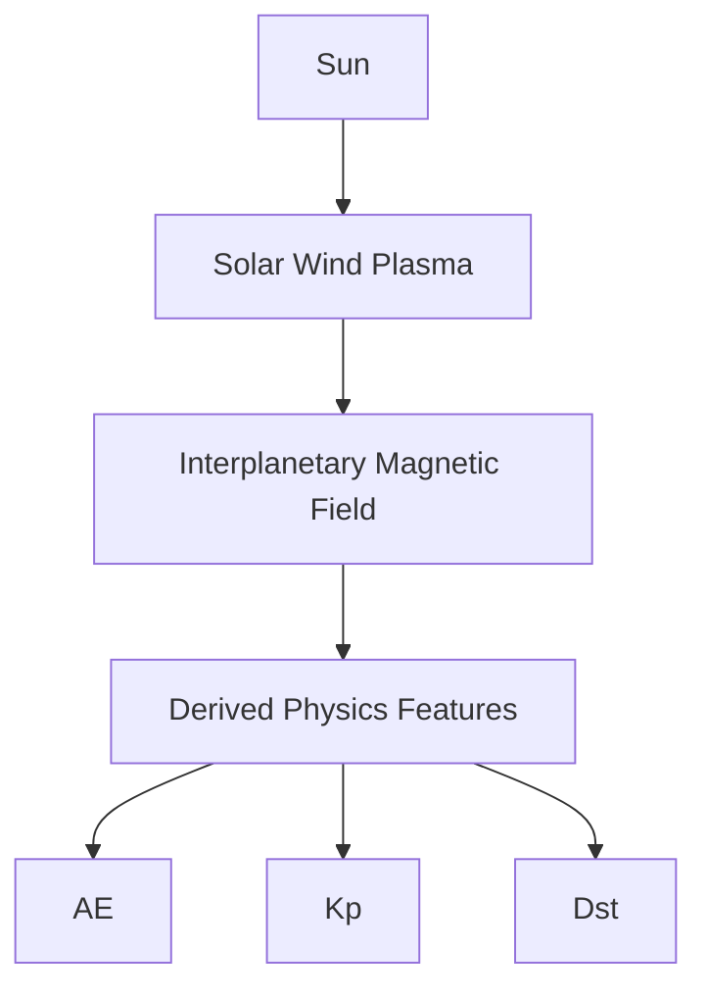

# Space Weather Dashboard

**SW-DSS — Space Weather Decision Support System**

An end-to-end data engineering, machine learning, and scientific visualization project that ingests live NOAA / NASA DONKI space weather data, analyzes Sun-Earth coupling, and runs a continuous, self-evaluating forecasting engine — all inside a custom-themed Streamlit application.

Built as a portfolio project to practice professional software development, data pipeline design, applied machine learning, and dashboard engineering using real scientific datasets.

---

## Table of Contents

* [Overview](#overview)
* [Space Weather Background](#space-weather-background)
* [Physics-Informed Features](#physics-informed-features)
* [Prediction Philosophy](#prediction-philosophy)
* [Scientific Motivation](#scientific-motivation)
* [Space Weather Prediction Pipeline](#space-weather-prediction-pipeline)
* [Key Features](#key-features)
* [Architecture](#architecture)
  * [AE Data Pipeline](#ae-data-pipeline)
  * [AE Prediction & Verification Pipeline](#ae-prediction--verification-pipeline)
* [Project Structure](#project-structure)
* [Live Prediction Engine](#live-prediction-engine)
  * [Combined Sun-Earth Forecasting (Analytics page)](#combined-sun-earth-forecasting-analytics-page)
* [Dashboard Pages](#dashboard-pages)
* [Technology Stack](#technology-stack)
* [Running the Project](#running-the-project)
* [Research & Exploratory Analysis](#research--exploratory-analysis)
* [Known Limitations](#known-limitations)
* [Development Roadmap](#development-roadmap)
  * [AE Index Integration](#ae-index-integration)
* [Concepts & Skills Demonstrated](#concepts--skills-demonstrated)
* [Author](#author)

---

## ⚠️ Testing Phase Notice

**This project is currently in active testing and development.** Core features are functional and working, but the system is still being stress-tested, validated, and refined. If you're reviewing this:

- Live prediction jobs, research labs, and verification pipelines are operational but may have rough edges
- Some features (AE Quicklook, Kyoto WDC verification, Kp/AE Research Labs, and the new Bz/Kp/AE Optimization Studies) are newly built and under active validation
- Data displayed is real — pulled from NOAA SWPC, NASA DONKI, and Kyoto WDC — not mocked or simulated
- If something looks off or broken, it is likely being actively worked on

Feedback is welcome. Full public deployment is a planned next step once testing is complete.

---

## Overview

The project tracks the full Sun-to-Earth space weather chain — solar activity, solar wind, the interplanetary magnetic field, and the resulting geomagnetic response — using real NOAA SWPC and NASA DONKI data. It started as a series of exploratory Jupyter notebooks and has since grown into:

1. A **continuous ingestion pipeline** that refreshes seven independent datasets on their own real-world cadences.
2. A **multi-page Streamlit dashboard** with a deliberate retro/vintage UI, live status terminals, event tracing, and a heliographic event map.
3. A **live, self-evaluating machine learning forecasting engine** for Solar Wind and IMF variables, with automatic model selection and forecast-vs-actual accuracy tracking.

---

## Space Weather Background

Geomagnetic activity on Earth is the end of a physical chain that starts at the Sun:

```text
Sun
  ↓
Solar Wind + Interplanetary Magnetic Field (IMF)
  ↓
Magnetic Reconnection (Southward Bz)
  ↓
Energy Transfer (Ey, VBz)
  ↓
Auroral Electrojets (AE)
  ↓
Global Geomagnetic Activity (Kp)
  ↓
Ring Current Development (Dst)
```

The Sun continuously ejects charged plasma (the solar wind), carrying an embedded magnetic field (the IMF) outward. When that field points southward at Earth, it can reconnect with Earth's own magnetic field, opening a pathway for solar wind energy to pour into the magnetosphere. That energy first shows up in the fast-reacting auroral electrojets (AE, within minutes), then in the broader geomagnetic index Kp (within hours), and finally in the slower-building ring current measured by Dst. This dashboard ingests the real-time observations at every link in that chain and uses machine learning to forecast where it's headed next.

---

## Physics-Informed Features

This isn't a generic time-series forecasting app pointed at space weather data — several of its engineered inputs are established heliophysical quantities, not arbitrary statistical transforms:

* **Solar Wind Electric Field (Ey)** — the interplanetary dawn-dusk electric field driving reconnection.
* **VBz Coupling Function** — Speed × southward Bz (Burton et al. 1975), the standard proxy for how much solar wind energy is actually available to couple into the magnetosphere.
* **Solar Wind Dynamic Pressure** — the ram pressure the solar wind exerts on the magnetopause, which compresses or expands it.
* **Lag Features (1h/3h/6h/12h/24h)** — the Sun-Earth chain has real physical delay, not an instant response. This project's own lag-correlation analysis (see [Research & Exploratory Analysis](#research--exploratory-analysis)) found Kp responds most strongly to a Bz change after ~1 hour and Dst after ~3 hours — lag features let the models see exactly the delayed values that actually correlate with the target.
* **Rolling Mean / Rolling Standard Deviation (24h)** — a single instantaneous reading doesn't say whether conditions are trending up, trending down, or unusually volatile; rolling statistics give the model that recent context.
* **Rate-of-Change (first difference)** — a sudden southward turn in Bz is far more geoeffective than a slow drift to the same value — rate-of-change captures how fast conditions are changing, not just where they currently are.

These variables represent known mechanisms for how solar wind energy actually gets transferred into Earth's magnetosphere — the models are given physics-motivated inputs, not just raw numbers.

---

## Prediction Philosophy

The dashboard deliberately separates two concerns that are easy to accidentally blend together:

**Production Models** (Analytics page)
* Independent prediction pipelines per variable
* Stable, operational workflow
* Observed variables only — no predicted value is ever fed into another model

**Research Lab**
* Cascaded prediction architectures (a predicted value feeding forward as another model's input)
* Formal physics hypothesis testing (Supported / Not Supported / Inconclusive, from measured data)
* Experimental model comparison, explainability, and rule-based physics interpretation

This separation means a new forecasting idea can be built, run, and evaluated against real data in the Research Lab without ever touching — or risking — the operational Production system.

---

## Scientific Motivation

The project exists to investigate a concrete question: **does incorporating established space weather physics actually improve machine learning forecasts, or does it just look elegant?** Specific hypotheses under active or planned investigation (see [Hypothesis Testing](#dashboard-pages)):

* Does predicted AE improve Kp forecasting?
* Does Dynamic Pressure improve Dst prediction?
* Which coupling functions (VBz, Ey) contribute most to geomagnetic activity?
* Do cascaded, physics-inspired architectures outperform independent prediction models?

Every answer is required to come from measured, verified prediction accuracy — never an assumption, and never an LLM-generated claim.

---

## Space Weather Prediction Pipeline



Unlike many machine learning dashboards that treat forecasting as purely a statistical problem, this project combines real-time heliophysical observations, physics-derived coupling functions, and machine learning to investigate how physical understanding can improve space weather forecasting.

---

## Key Features

* Continuous, per-dataset live ingestion from NOAA SWPC and NASA DONKI (own cadence per dataset — see [Architecture](#architecture))
* Minute-resolution storage for Solar Wind/IMF so true extremes aren't smoothed away by hourly aggregation
* Live status terminal with plain-language Meaning + Risk per variable
* Forward + reverse **Event Explorer** tracing a Sun-to-Earth causal chain, plus an auto-playing **Event Storyboard**
* **Heliomap** — real heliographic Solar Event / CME positions plotted over an NASA SDO solar-disk image
* 6-panel synced **Sun-to-Earth Overview** chart with click-to-inspect readout
* Saved Events bookmarking and a Space Weather Concepts document library, both JSON-backed
* **Live Prediction Engine**: continuous, self-refining forecasting jobs for Solar Wind and IMF, with automatic model selection, live drift tracking, and forecast-vs-actual accuracy evaluation (see below)
* **Combined Sun-Earth Forecasting (Analytics page)**: Kp and Dst predicted from a single physics-informed model spanning Solar Wind + IMF + geomagnetic history (including observed AE) + derived coupling features (VBz, Ey, Dynamic Pressure) — Kp follows NOAA's real 3-hour publishing cadence rather than an arbitrary hourly horizon
* **AE Predictor**: AE forecast independently from Solar Wind + IMF + derived physics, with delayed official verification against Kyoto WDC and an approximate, immediate Quicklook cross-check
* **Experimental (Physics Cascaded) Predictor**: a research-only model that feeds *predicted* AE forward into Kp/Dst as an extra feature, benchmarked live against the production model
* **Research Lab**: an isolated environment for comparing forecasting architectures, rule-based physics interpretation, model explainability, and formal hypothesis testing
* **Bz / Kp / AE Optimization Studies**: one-button AutoML pipelines (8-10 structured experiments each, AE run independently across all 5 production horizons) that reproduce the production baseline, benchmark it against persistence, search feature sets and coupling physics, sweep all 12 model types, extract feature importance/SHAP/permutation importance, and issue a guarded, human-confirmed promote-to-production recommendation
* Retro/vintage UI theme applied consistently across every table, chart, dialog, and button

---

## Architecture

### Data Pipeline

```text
NOAA SWPC / NASA DONKI
        ↓
raw JSON snapshots (data/raw/)
        ↓
per-dataset cleaning (src/swdss/features/build_master.py)
        ↓
processed parquet (data/processed/) — minute-level for Solar Wind/IMF,
                                       native cadence for everything else
        ↓
master_df_v1.parquet — hourly-merged Sun-Earth feature table
        ↓
dashboard/home.py
```

`src/swdss/features/live_update.py` keeps every dataset refreshed independently, on its own real-world cadence:

| Dataset | Cadence | Notes |
| --- | --- | --- |
| Solar Wind | 1 minute | retained at native minute resolution |
| IMF | 1 minute | retained at native minute resolution |
| Dst | 5 minutes | NOAA publishes updates roughly every few minutes; polling at 5 min catches new values quickly |
| Kp | 15 minutes | NOAA publishes a new official Kp every 3 hours; 15-min polling reduces the delay before a freshly-published value is fetched |
| Solar Events | 30 minutes | appended + deduplicated (NOAA only returns a recent snapshot per call) |
| CME (DONKI) | 1 hour | rolling 30-day fetch each cycle |
| F10.7 | 24 hours | NOAA's own file already covers a monthly window |
| AE | No live NOAA cadence | NOAA/DONKI publish no AE product at all — "live" AE is a forward-filled historical value; official verification instead comes from Kyoto WDC once daily, ~10-20 day publication lag (see [AE Prediction & Verification Pipeline](#ae-prediction--verification-pipeline)) |

**Design note:** `master_df_v1.parquet` resamples Solar Wind/IMF to hourly means so they can be merged with the inherently-hourly Kp/Dst series for combined Earth-response analysis. That averaging is necessary for that purpose, but it quietly smooths away genuine short-lived spikes. Anywhere the dashboard reports a "true extreme" (Strongest Value cards, Current Analysis tabs, the prediction engine's live features), it reads from the **minute-level processed file directly**, never from the hourly-merged table.

### AE Data Pipeline

AE follows a different path than every other dataset above, because it has no live NOAA/DONKI feed at all:

```text
Kyoto World Data Center
        ↓
official digital AE (swdss.ingest.kyoto_ae)         real-time graph (swdss.ingest.kyoto_ae_quicklook)
        ↓                                                    ↓
checked once/day, ~10-20 day publication lag         approximate pixel-read estimate, available immediately
        ↓                                                    ↓
authoritative "Verified" result                      non-official "Quicklook" cross-check
```

Both branches are read-only verification sources — neither ever feeds into or overwrites the other, and neither is NOAA. See [AE Prediction & Verification Pipeline](#ae-prediction--verification-pipeline) for how this pairs with the live prediction side.

**Minute-resolution AE archival (additive, non-production).** Every Kyoto WDC day-file actually contains 60 one-minute AE values per hour, plus a trailing hourly mean — but until this addition, only that trailing mean was ever kept; the 60 minute values were parsed into memory and discarded the instant the parser moved to the next line, so every day that passed before this change is lost permanently (Kyoto's real-time page is continuously overwritten, not a permanent archive). `swdss.ingest.kyoto_ae` now also archives, on every fetch: the raw day-file text verbatim (`data/raw/kyoto_ae_minute/`) and a parsed, deduplicated minute-resolution parquet (`data/processed/kyoto_ae_minute/`), via the same append-and-deduplicate convention already used for Solar Events/CME. This is purely additive — `fetch_kyoto_ae_hour()`'s return value, used by the AE verification workflow above, is completely unchanged, and any failure while archiving minute data is swallowed rather than raised, so it can never break hourly verification. Nothing in Production or any Research Lab Optimization Study reads this archive yet; it exists so a genuinely different future research question — substorm onset timing, minute-scale AE dynamics, event detection — is *answerable* later, without deciding now whether minute-scale AE forecasting is even worthwhile.

### Live Prediction Pipeline

```text
NOAA live minute-level data
        ↓
hourly resample + interpolation (matches training preprocessing exactly)
        ↓
lag / rolling-mean / rolling-std / rate-of-change feature generation
        ↓
trained model lookup (best algorithm per variable × horizon)
        ↓
forecast + drift logging (SQLite)
        ↓
forecast-vs-actual evaluation once the target hour is observed
```

### AE Prediction & Verification Pipeline

AE reuses the same job engine above (checkpoints, SQLite persistence, live console) but splits "prediction" and "verification" into two fully independent processes, since there's no live AE observation to evaluate against directly:

```text
Live NOAA (Solar Wind + IMF) + last known historical AE
        ↓
AE model inference, refined every NOAA minute (same engine as Live Prediction Pipeline)
        ↓
Job completes once the reference feed's own live data reaches the target hour —
not pure wall-clock, which could otherwise skip the final pre-target minutes
        ↓
   ┌─────────────────────────────┴─────────────────────────────┐
   ↓                                                            ↓
Kyoto WDC official digital AE                        Kyoto WDC Quicklook graph
checked once/day (swdss.ingest.kyoto_ae)             read immediately (swdss.ingest.kyoto_ae_quicklook)
   ↓                                                            ↓
"Verified" — Official AE, Absolute Error,            "Quicklook Estimated AE" — approximate,
Percentage Error (authoritative)                     never overwrites the Verified result
```

Prediction never waits on either verification branch, and the two branches never influence each other — see [AE Data Pipeline](#ae-data-pipeline) and [AE Index Integration](#ae-index-integration) for the data sources and staged rollout behind this.

---

## Project Structure

```text
Space Weather Dashboard V2/
│
├── data/
│   ├── raw/                            # Exact NOAA / DONKI API responses, one file per dataset per fetch
│   │   ├── omni_refresh_2026.csv       # Parsed NASA OMNI2 2026 hourly data (Jan–Jun); input to the refresh pipeline
│   │   └── kyoto_ae_minute/            # Raw Kyoto WDC day-file text, one file per UT day (verbatim archival copy)
│   ├── processed/                      # Cleaned per-dataset parquet (minute-level for Solar Wind/IMF,
│   │   │                               #   native cadence for everything else)
│   │   ├── solar_wind/
│   │   ├── imf/
│   │   ├── kp/
│   │   ├── dst/
│   │   ├── ae/                         # Historical AE from Kyoto WDC — no live NOAA feed exists
│   │   ├── kyoto_ae_minute/            # NEW: parsed minute-resolution AE archive (see AE Data Pipeline) —
│   │   │                               #   purely additive, not read by Production or any Optimization Study
│   │   ├── f107/
│   │   ├── cme/
│   │   ├── solar_events/
│   │   ├── master_omni.csv             # Original versioned OMNI2 archive (2023–2025, 26,304 rows)
│   │   └── master_omni_v2.csv          # Extended versioned archive (2023–Jun 2026, 30,648 rows)
│   ├── features/
│   │   ├── master_df_v1.parquet        # Hourly-merged Sun-Earth feature table (rebuilt by live_update.py)
│   │   ├── training/                   # Active training CSVs — what production models and research labs read
│   │   │   ├── solar_wind_features.csv
│   │   │   ├── imf_features.csv
│   │   │   ├── kp_features.csv
│   │   │   ├── dst_features.csv
│   │   │   ├── analytics_features.csv      # Solar Wind + IMF + Kp + Dst + observed AE; used by Analytics production models
│   │   │   ├── ae_features.csv             # AE self-referential only; superseded by ae_analytics_features.csv
│   │   │   ├── ae_analytics_features.csv   # Solar Wind + IMF + AE (no Kp/Dst); used by AE V1 production model + AE Research Lab
│   │   │   └── experimental_features.csv   # Solar Wind + IMF + Kp + Dst + Predicted AE (from frozen AE 1h model); used by Experimental production models + Experimental Predictions tab
│   │   └── training_v2/                # v2 versions of all 7 training CSVs (2023–Jun 2026); produced by the refresh pipeline
│   │       ├── solar_wind_features.csv
│   │       ├── imf_features.csv
│   │       ├── kp_features.csv
│   │       ├── dst_features.csv
│   │       ├── analytics_features.csv
│   │       ├── ae_analytics_features.csv
│   │       └── experimental_features.csv
│   ├── predictions/
│   │   ├── predictions.db              # SQLite: live forecast jobs, tick history, hypothesis records
│   │   ├── imf_research_runs.json / imf_hypothesis_tests.json / imf_optimization_studies.json
│   │   ├── kp_research_runs.json / kp_hypothesis_tests.json / kp_optimization_studies.json
│   │   └── ae_research_runs.json / ae_hypothesis_tests.json / ae_optimization_studies.json
│   │       # Per-lab JSON registries for the Research Lab engines and their Optimization Study
│   │       # runs — entirely separate from models/{dataset}/metrics.json; created on first use
│   └── saved_events.json / library_index.json
│
├── src/swdss/
│   ├── paths.py                        # Centralized path constants
│   ├── ingest/
│   │   ├── noaa_client.py              # NOAA SWPC + NASA DONKI API client
│   │   ├── kyoto_ae.py                 # Kyoto WDC official digital AE — the sole authoritative AE verification source;
│   │   │                               #   also archives the full minute-resolution AE data every fetch discards down
│   │   │                               #   to an hourly mean (raw text + parsed parquet), purely for future research
│   │   └── kyoto_ae_quicklook.py       # Kyoto WDC real-time graph — pixel-based approximate AE estimate (immediate cross-check)
│   ├── transform/                      # Per-dataset raw-JSON → cleaned-DataFrame cleaning logic
│   │   ├── solar_wind.py
│   │   ├── imf.py
│   │   ├── kp.py
│   │   └── dst.py
│   ├── features/
│   │   ├── build_master.py             # One-shot fetch + clean + merge all datasets
│   │   └── live_update.py              # Continuous per-dataset updater (own cadences); also ticks active prediction jobs
│   └── models/                         # Prediction engine — training, inference, research, and job lifecycle
│       ├── registry.py                 # Shared config: dataset keys, variables, horizons, model paths, scale factors
│       ├── features.py                 # Lag / rolling-mean / rolling-std / rate-of-change + derived physics feature engineering
│       ├── train.py                    # Multi-algorithm training (LR / RF / XGBoost) + automatic best-model selection
│       ├── predict.py                  # Live feature pipeline + single-point inference for all datasets
│       ├── jobs.py                     # Continuous forecast job lifecycle: create / tick / complete / verify (SQLite-backed)
│       ├── experimental.py             # One-time Predicted_AE column generation from frozen AE 1h model (cascade training data)
│       ├── explainability.py           # SHAP (TreeExplainer / LinearExplainer) + permutation-sensitivity fallback
│       ├── physics_interpretation.py   # Rule-based (no LLM) Sun-Earth coupling narrative from live readings
│       ├── hypothesis.py               # Hypothesis Testing: CRUD, statistics, auto-conclusion engine (Supported/Not Supported/Inconclusive)
│       ├── imf_research.py             # IMF Research Lab engine: multi-horizon, multi-model, physics experiments, run
│       │                               #   tracking, + the 8-experiment Bz Optimization Study AutoML orchestrator
│       ├── imf_research_keras_worker.py  # Isolated subprocess for LSTM/GRU training — prevents scikit-learn / Keras import collision
│       ├── imf_physics_features.py     # IMF-specific physics features for the Research Lab (Clock Angle, IMF Rotation, etc.)
│       ├── kp_research.py              # Kp Research Lab engine: model comparison, feature ablation, physics experiments,
│       │                               #   hypothesis testing, + the 10-experiment Kp Optimization Study AutoML orchestrator
│       ├── kp_physics_features.py      # Kp-specific physics features (Southward Duration, Integrated Ey/VBz, Storm Phase, etc.)
│       ├── ae_research.py              # AE Research Lab engine: model comparison, multi-horizon, physics experiments,
│       │                               #   hypothesis testing, + the 10-experiment × 5-horizon AE Optimization Study
│       │                               #   (the flagship cross-horizon scientific study — see Development Roadmap)
│       └── ae_physics_features.py      # AE-specific physics features (Newell Coupling, Akasofu ε, Boyle Index, Alfvén Mach Number,
│                                       #   Strong Southward Duration, etc.)
│
├── dashboard/
│   ├── home.py                         # Full multi-page Streamlit application (all pages, dialogs, and research lab UIs)
│   └── assets/                         # Static imagery (magnetosphere background, NASA SDO solar disk)
│
├── models/                             # Trained model artifacts (.joblib + metrics.json per dataset)
│   ├── solar_wind/                     # Production Solar Wind models (Speed / Density / Temperature × 5 horizons)
│   ├── solar_wind_v2/                  # v2 Solar Wind models — versioned backup from the July 2026 refresh
│   ├── imf/                            # Production IMF models (Bt / Bx / By / Bz × 5 horizons)
│   ├── imf_v2/                         # v2 IMF models — versioned backup
│   ├── kp/                             # Standalone self-referential Kp model — baseline only, not exposed in UI
│   ├── kp_v2/                          # v2 standalone Kp model — versioned backup
│   ├── dst/                            # Standalone self-referential Dst model — baseline only, not exposed in UI
│   ├── dst_v2/                         # v2 standalone Dst model — versioned backup
│   ├── analytics/                      # Production combined Sun-Earth models (Kp / Dst × 5 horizons + kp_interval)
│   │   └── kp_interval.joblib          # Single model targeting NOAA's next official 3-hour Kp interval
│   ├── analytics_v2/                   # v2 analytics models — versioned backup
│   ├── ae/                             # Production AE V1 models (Solar Wind + IMF + physics only, × 5 horizons)
│   ├── ae_v2/                          # v2 AE models — versioned backup
│   ├── experimental/                   # Production AE V3 cascaded models (Predicted AE → Kp/Dst, × 5 horizons); trained on 2023–Jun 2026
│   ├── experimental_v2/                # v2 experimental models — versioned backup from the July 2026 refresh
│   ├── imf_research/                   # IMF Research Lab run artifacts (UUID per run, .joblib + run metadata)
│   ├── kp_research/                    # Kp Research Lab run artifacts (UUID per run)
│   └── ae_research/                    # AE Research Lab run artifacts (UUID per run)
│
├── scripts/
│   └── refresh/                        # Production Model Refresh pipeline (run every ~6 months)
│       ├── 01_download_parse_2026.py   # Step 1: download + parse NASA OMNI2 annual file, save to data/raw/
│       ├── 02_build_v2_datasets.py     # Step 2: merge with existing archive, build all 7 v2 training CSVs
│       ├── 03_train_v2.py              # Step 3: retrain all 62 production models, write to models/{dataset}_v2/
│       ├── 04_benchmark.py             # Step 4: compare v1 vs v2 R²/MAE/RMSE, write reports/refresh_v2/report.txt
│       └── run_all.py                  # Master runner — calls all 4 steps in sequence
│
├── reports/
│   └── refresh_v2/
│       ├── report.txt                  # Human-readable v1 vs v2 benchmark (PROMOTE / KEEP CURRENT / LARGE SWING per model)
│       └── benchmark.json              # Machine-readable full benchmark results
│
├── notebooks/                          # Original exploratory research notebooks
├── docs/                               # Day-by-day research notes
├── requirements.txt
└── README.md
```

---

## Live Prediction Engine

The Heliosphere page's **Solar Wind** and **IMF** tabs each have a Predictions sub-tab backed by a real, continuously-running forecasting system — not a one-shot "click to predict" demo.

### How a prediction works

1. **Pick a variable and horizon, click Start Prediction.** Solar Wind supports Speed, Density, and Temperature; IMF supports Bt, Bx, By, and Bz — each at 1, 3, 6, 12, or 24-hour horizons.
2. **A forecast job starts**, anchored to a fixed target time (e.g. start at 17:15, horizon 3h → target 20:00).
3. **The job keeps refining its forecast** every time a new NOAA minute-level reading arrives, for as long as it takes the target time's actual observation to be published — not a fixed window. Since only five discrete horizon models are trained (1/3/6/12/24h), a long-horizon job refines at "checkpoints": the moments when the remaining time to target exactly matches one of those trained horizons (e.g. a 24h job refines at remaining = 24, 12, 6, 3, and 1 hour before target), switching to the correspondingly-trained model each time.
4. **The job completes automatically** once NOAA publishes the actual value for the target hour, and is immediately evaluated against it.

### Model training and selection

For each variable, at each horizon, three algorithms are trained and benchmarked on a held-out time-ordered split — **Linear Regression**, **Random Forest**, and **XGBoost** — and the best performer (by R²) is automatically selected and saved. The user never picks an algorithm.

Training features (identical between training and live inference, by construction — both call the same `swdss.models.features` functions):

* Lag features at 1h, 3h, 6h, 12h, 24h
* 24-hour rolling mean and rolling standard deviation
* Rate-of-change (first difference)

### What each job shows

* **Live cards** — current NOAA reading, model confidence (derived from the model's R²), expected change & trend, and a prediction-stability indicator (variance across recent ticks)
* **Pipeline-style terminal log** — every tick rendered as `NOAA reading → Features Generated → Model Loaded → Prediction → Waiting for Next Update`, newest first
* **Drift chart** — how the forecast for the fixed target has moved over time
* **Job Summary** — initial vs. final prediction, actual NOAA observation, mean error across all ticks, model used, and R²
* **Final accuracy block** (once completed) — Absolute Error and a qualitative accuracy label (Excellent / Good / Fair / Poor)

Multiple jobs (any mix of variables and horizons) can run concurrently, each as its own card. Completed jobs can be **saved** (kept permanently, exempt from the recent-jobs display cap) or **deleted**. A **Prediction Queue** widget summarizes Running jobs, jobs Completed Today, and Average MAE across every completed job for that dataset.

### Persistence

All jobs and their full tick history are stored in `data/predictions/predictions.db` (SQLite) — chosen over JSON specifically because tick history accumulates indefinitely (a job can run for 24+ hours, logging a tick roughly every NOAA-update minute during each checkpoint window), and SQLite supports incremental writes without rewriting a growing file on every update. Jobs, ticks, and saved/completed state all survive a dashboard restart.

A job can also be stopped manually at any time (`⏹ Stop Prediction`), which marks it `stopped` rather than `completed` — an honest distinction, since a stopped job never got compared against a real NOAA observation.

### Combined Sun-Earth Forecasting (Analytics page)

Kp and Dst aren't predicted as isolated, self-referential time series. Instead, the **Analytics → Combined Earth Analysis → Prediction** tab runs a single physics-informed model per target, trained on the full causal chain:

```text
Sun → Solar Wind → IMF → Earth Response (Dst, Kp)
```

**Inputs** (all engineered with lag-1h/3h/6h/12h/24h, 24h rolling mean, 24h rolling std, and rate-of-change):

* Solar Wind: Speed, Density, Temperature
* IMF: Bt, Bx, By, Bz
* Geomagnetic history: previous Kp, previous Dst, **previous AE** (observed only — see [AE Index Integration, Version 2](#ae-index-integration); AE has no live NOAA feed, so this is the last known historical value, forward-filled — never the AE Predictor's own predicted output)
* Derived coupling features, computed in memory from the merged frame (never as separate datasets, so training and live inference can never drift apart):
  * **VBz** = Speed × min(Bz, 0) — the geoeffective driver (Burton et al. 1975); positive Bz is clipped to 0
  * **Ey** = −Speed × Bz × 1e-3 (mV/m) — interplanetary dawn-dusk electric field
  * **Dynamic Pressure** = 1.6726e-6 × Density × Speed² (nPa) — solar wind ram pressure on the magnetopause

**Dst** keeps the familiar 1h/3h/6h/12h/24h horizon dropdown, same checkpoint-based drift mechanism as the standalone engine.

**Kp** is handled differently on purpose: NOAA only publishes an official Kp value every 3 hours (00, 03, 06, ... UTC), so the model always targets the *next official interval* rather than an arbitrary hourly horizon — e.g. starting at 16:10 UTC (inside the 15:00–18:00 interval) continuously refines a forecast for 18:00–21:00 UTC as new Solar Wind/IMF minutes arrive, with no horizon to pick.

Both share a dedicated dialog UI distinct from the standalone engine's pipeline-style log:

* **Live Forecast Console** — a real scrolling terminal table (black background, monospace, green-on-black), one row per NOAA minute, columns for every live input plus a dynamic `Forecast (target time)` column — never preloads historical rows; the first row is always timestamped at job start
* **Forecast Summary** (once completed or stopped) — Final Prediction (the operational forecast — last tick before the target arrived) vs. Average Prediction (mean across the whole session, a stability indicator only), both compared against the actual observation with separate error metrics, plus Forecast Drift (how far the prediction moved from first tick to last) and Model Quality

---

## Dashboard Pages

* **Home** — mission-control view: a live status terminal (Speed/Density/Temperature/Bz/Kp/Dst with plain-language Meaning + Risk), six Strongest Value cards (each with a reverse Solar-Event lookup), the Sun-to-Earth Overview chart, a severity/recency-filterable Solar Activity News Feed, the Event Storyboard, Top 5 Recorded Conditions tables, the Heliomap, and a rotating reference-table panel.
* **Photosphere** — Solar Events / CME / F10.7 tabs, each with Current Analysis + Predictions sub-tabs, an Event Animations grid, and its own reference panel.
* **Heliosphere** — Solar Wind and IMF Current Analysis (true-extreme cards) and the **Live Prediction Engine**, plus Dynamic Pressure and a Speed/Density/Temperature/Bz reference panel.
* **Geospace** — Kp and Dst Current Analysis with their own reference panel. (Prediction lives exclusively on the Analytics page now — see below — since the combined model strictly outperforms each variable's standalone, self-referential version.)
* **Analytics** — Combined Earth Analysis, with **Current Analysis** (correlation explorer across Solar Wind, IMF, Kp, and Dst), **Prediction** (the combined Sun-Earth forecasting engine for Kp and Dst — see [Combined Sun-Earth Forecasting](#combined-sun-earth-forecasting-analytics-page)), **AE Predictions** (the independent AE V1 forecasting engine), and **Experimental Predictions** (the AE V3 cascaded research pipeline, with a live Production-vs-Experimental comparison) — see [AE Index Integration](#ae-index-integration) — as four sub-tabs.
* **Research Lab** — an experimental environment, fully isolated from the production pipeline, for comparing forecasting architectures. **Forecasting Architectures** reuses the existing AE/Kp/Dst and Experimental prediction infrastructure across four sub-tabs: **Independent Models**, **Physics Cascaded Models**, **Model Comparison** (aggregated MAE/success-rate comparison with a per-variable verdict), and **Prediction Pipeline** (a live diagram of both architectures, nodes highlighting green while a matching job runs). **Physics Interpretation** is a rule-based (no LLM) narrative of current Sun-Earth coupling — Solar Wind state, IMF orientation, magnetic coupling, auroral activity, ring current response, geomagnetic activity — each a reproducible function of live readings (`swdss.models.physics_interpretation`). **Hypothesis Testing** is a full experiment-management system: researchers create hypotheses pairing a baseline architecture against an experimental one; the dashboard automatically computes MAE/RMSE/R²/MAPE/Bias/Max Error/Median Error/Drift/Stability/Storm-vs-Quiet performance from every verified prediction and reports **Supported / Not Supported / Inconclusive** with a confidence level that scales with sample size — never a claim of "true," and never an LLM (`swdss.models.hypothesis`). Every prediction job dialog (production and Research Lab alike) also has a **"Why did the model predict this?"** explainability section — SHAP (TreeExplainer/LinearExplainer, covering every algorithm this project trains) with a permutation-sensitivity fallback (`swdss.models.explainability`).

### Key dashboard features

* **Event Explorer** — given a solar event, finds its nearest associated CME (if any), estimates Earth-arrival via a constant-speed transit heuristic, and reports the actual recorded Solar Wind/IMF/Kp/Dst response at that time. A **reverse mode** starts from an effect (e.g. the week's lowest Dst) and traces back to a plausible solar cause.
* **Event Storyboard** — an auto-playing, step-by-step animated retelling of one event's Sun-to-Earth journey.
* **Heliomap** — Solar Events and CMEs at their real heliographic positions over an actual NASA SDO solar-disk image.
* **Saved Events & Space Weather Concepts Library** — JSON-backed local persistence for bookmarking events and organizing reference documents.

---

## Technology Stack

| Category | Tools |
| --- | --- |
| Language | Python 3.11 |
| Data Science | Pandas, NumPy |
| Machine Learning | scikit-learn (Linear Regression, Random Forest), XGBoost, joblib |
| Explainability | SHAP (`TreeExplainer`, `LinearExplainer`), permutation-sensitivity fallback |
| Data Acquisition | Requests, NOAA SWPC API, NASA DONKI API, Kyoto World Data Center (official + real-time AE) |
| Image Processing | Pillow, NumPy (pixel-based Kyoto Quicklook AE estimation) |
| Visualization | Plotly (Graph Objects & Subplots), Mermaid (documentation diagrams) |
| Dashboard | Streamlit, streamlit-autorefresh |
| Persistence | SQLite (prediction jobs, hypotheses), JSON (saved events, document library) |
| Dev Tools | Git, GitHub, VS Code, Jupyter Notebook |

---

## Running the Project

Open two terminal windows from the project root.

**Terminal 1 — Live data updater** (keep this running at all times):
```bash
PYTHONPATH=src venv/bin/python3 -m swdss.features.live_update
```

Refreshes all 7 datasets on their own cadences (Solar Wind/IMF every 60s, Dst every 5 min, Kp every 15 min, Solar Events every 30 min, CME every 1h, F10.7 every 24h), rebuilds the master feature table, and ticks all active prediction jobs in the background — jobs advance even if the dashboard is on a different page or closed entirely.

**Terminal 2 — Dashboard**:
```bash
venv/bin/python3 -m streamlit run dashboard/home.py
```

To (re)train the prediction models from scratch:

```bash
PYTHONPATH=src venv/bin/python3 -m swdss.models.train
```

This retrains all 62 production models (Solar Wind × 3, IMF × 4, Kp, Dst, AE, Analytics, Experimental — all 5 horizons each), benchmarks Linear Regression / Random Forest / XGBoost per combination, and writes the selected models plus `metrics.json` into `models/<dataset>/`.

---

## Production Model Refresh (run every ~6 months)

The production models are trained on a static historical archive (NASA OMNI2 hourly data). Every ~6 months, run the refresh pipeline to incorporate new historical observations and retrain all models.

**Last refresh:** July 2026 — models now cover 2023–2025 + Jan–Jun 2026.
**Next refresh:** December 2026.

### How to run the refresh

```bash
# Run all steps in sequence (download → merge → retrain → benchmark)
PYTHONPATH=src venv/bin/python3 scripts/refresh/run_all.py
```

Or run individual steps:

```bash
# Step 1 — Download and parse new OMNI2 data
PYTHONPATH=src venv/bin/python3 scripts/refresh/01_download_parse_2026.py

# Step 2 — Merge with existing archive, build v2 training CSVs
PYTHONPATH=src venv/bin/python3 scripts/refresh/02_build_v2_datasets.py

# Step 3 — Retrain all production models (can specify datasets)
PYTHONPATH=src venv/bin/python3 scripts/refresh/03_train_v2.py
PYTHONPATH=src venv/bin/python3 scripts/refresh/03_train_v2.py solar_wind imf  # specific datasets only

# Step 4 — Benchmark v1 vs v2 and generate promotion report
PYTHONPATH=src venv/bin/python3 scripts/refresh/04_benchmark.py
```

### Before the December 2026 refresh

Open `scripts/refresh/01_download_parse_2026.py` and update one line:

```python
# Change this:
DOY_MAX = 181   # June 30 (day 181 of 2026)

# To this for full-year 2026:
DOY_MAX = 365   # December 31
```

Everything else runs identically. The pipeline will automatically download the full 2026 annual file, merge it with the existing 2023–Jun 2026 archive, retrain all 62 models, and produce a benchmark report at `reports/refresh_v2/report.txt`.

After December 2026, update the script filename and URL for the 2027 file:
```python
OMNI_URL = "https://spdf.gsfc.nasa.gov/pub/data/omni/low_res_omni/omni2_2027.dat"
DOY_MAX = 181  # or 365 depending on how far into 2027 data is available
```

---

## Research & Exploratory Analysis

The notebooks in `notebooks/` and the day-by-day notes in `docs/` capture the exploratory research that preceded the live dashboard. Highlights from that analysis (NOAA data, mid-June 2026 observation window):

### Solar Wind

| Metric | Speed (km/s) | Density (p/cm³) | Temperature (K) |
| --- | ---: | ---: | ---: |
| Average | ~435 | ~6.53 | ~112,257 |
| Maximum | ~607 | ~17.49 | ~552,298 |
| Minimum | ~357 | ~0.09 | ~2,000 |

Correlations: Speed↔Temperature **0.522** (moderate positive), Density↔Speed **-0.189** (weak inverse).

### Interplanetary Magnetic Field (IMF)

| Metric | Bz (nT) | Bt (nT) |
| --- | ---: | ---: |
| Average | ~0.56 | ~6.00 |
| Maximum | 11.40 | 12.00 |
| Minimum | -7.51 | 0.62 |

~56% of observations were northward (Bz > 0), ~44% southward. Southward Bz is the classic trigger for magnetic reconnection and remained the strongest single forecasting variable identified.

### Geomagnetic Indices

| Index | Average | Max | Min | Interpretation |
| --- | ---: | ---: | ---: | --- |
| Kp | 1.63 | 3.00 | 0.33 | Quiet throughout; no storm conditions |
| Dst (nT) | 2.33 | 22 | -14 | Quiet; never approached the -50 nT minor-storm threshold |

### Sun-Earth Coupling & Time-Lag Analysis

Merging Solar Wind, IMF, Kp, and Dst on shared timestamps surfaced the expected causal sequence:

```text
Negative Bz → Magnetic Reconnection → Kp Increase → Dst Decrease
```

| Lag (Bz → Kp) | Correlation | Lag (Bz → Dst) | Correlation |
| --- | ---: | --- | ---: |
| Current | -0.190 | Current | 0.242 |
| 1 Hour | **-0.284** | 1 Hour | 0.374 |
| 3 Hours | -0.218 | **3 Hours** | **0.534** |
| 6 Hours | 0.009 | 6 Hours | 0.321 |

Kp responds most strongly ~1 hour after a Bz change; Dst responds most strongly ~3 hours after — a delay consistent with established magnetospheric physics, and the basis for choosing the 1h–24h horizon set used in the live forecasting engine.

### Solar Activity, CME, and F10.7

* 1,427 recorded solar events across 29 descriptive variables; 501 X-ray events, 129 optical flares (1 X-class, 22 M-class); activity peaked 2026-06-03; AR4455 was the most active region (153 events).
* 124 CME events (avg speed 618 km/s, max 1,692 km/s); AR14464 was the most productive CME-producing region.
* F10.7 solar flux averaged 125.7 (range 101–148), moderately active and consistent with the observed flare/CME activity.

---

## Known Limitations

* CME-to-Earth arrival timing uses a constant-speed transit heuristic, not a validated propagation model (e.g. WSA-Enlil) — useful for ordering and context, not precision forecasting.
* Event-to-CME linking is time-proximity based, not physically confirmed causality.
* True cross-panel hover-tooltip merging isn't supported by Plotly across separate y-axes within one figure; the Overview chart uses click-to-inspect instead of continuous hover.
* Live "confidence" and "stability" metrics on prediction cards are explicitly-labeled heuristics (R²-derived confidence, tick-variance-derived stability) — not calibrated statistical prediction intervals.
* `edited_events.json` field parsing (flare class, radio burst type, heliographic location) is defensive/best-effort against NOAA's live schema and hasn't been cross-validated against an independent source.
* Prediction jobs only advance while the dashboard process is open and the relevant page has been rendered; closing the app for an extended period doesn't backfill missed minute-level ticks (checkpoints still fire correctly on resume since they're time-based, not tick-count-based).
* VBz, Ey, and Dynamic Pressure are standard space-weather coupling formulas (Burton et al. 1975 and conventional solar-wind electrodynamics), but haven't been independently cross-validated against published reference values for this specific dataset.
* The Kp interval model picks a single best algorithm across the full 1–3 hour variable lookahead inherent in "next official interval" (rather than one model per fixed lookahead, like the discrete-horizon variables) — this is a deliberate simplification, not a bug, but means its accuracy is somewhat coarser than a horizon-matched model would be.

---

## Development Roadmap

### Completed

* Continuous, per-dataset live data pipelines (NOAA SWPC + NASA DONKI)
* Minute-resolution vs. hourly-aggregate data architecture
* Multi-page dashboard (Home, Photosphere, Heliosphere, Geospace, Analytics)
* Event Explorer, Event Storyboard, Heliomap, Sun-to-Earth Overview chart
* Saved Events + Space Weather Concepts library
* Solar Wind & IMF feature engineering (lag, rolling, rate-of-change)
* Multi-algorithm training with automatic best-model selection, 5 horizons × 7 variables
* Live, self-refining, self-evaluating prediction engine with SQLite-backed job history
* Standalone Kp and Dst forecasting models trained (kept as a self-referential baseline, not exposed in the UI)
* **Cross-dataset (integrated Sun-to-Earth) forecasting** for Kp and Dst — combined Solar Wind + IMF + geomagnetic history + derived coupling features (VBz, Ey, Dynamic Pressure), with Kp following NOAA's real 3-hour publishing cadence instead of an arbitrary hourly horizon
* Manual job control (Stop) and a dedicated live-console dialog UI for the combined forecasting engine
* **AE index forecasting, Version 1** — AE trained and predicted as its own independent target (Solar Wind + IMF + VBz/Ey/Dynamic Pressure only, no Kp/Dst inputs), with a dedicated **AE Predictions** tab on the Analytics page — see [AE Index Integration](#ae-index-integration) below
* **AE index forecasting, Version 2** — observed AE added to the production Kp/Dst combined model's own feature pool (`ANALYTICS_FEATURE_VARIABLES`), same lag/rolling/rate-of-change mechanism already used for Kp/Dst cross-feeding — only historical/observed AE, never predicted AE
* **AE index forecasting, Version 3 (research/experimental)** — a cascaded pipeline (Solar Wind + IMF + Derived Physics → frozen AE model → Predicted AE → Kp/Dst) in its own **Experimental Predictions** tab, completely separate models/training data from production, with a live Production-vs-Experimental side-by-side comparison — see [AE Index Integration](#ae-index-integration) below
* **Delayed AE verification against Kyoto WDC** — prediction and verification run as two fully independent engines: a job completes purely on wall-clock time reaching its target hour, while a separate daily check (`swdss.ingest.kyoto_ae`) looks for Kyoto World Data Center's official digital AE values (never NOAA, which publishes no AE product) and marks a job Verified once they arrive — expected lag ~10-20 days, never blocking the prediction itself
* **Quicklook Verification** — an approximate, image-based cross-check (`swdss.ingest.kyoto_ae_quicklook`) that reads the AE value directly off pixels of Kyoto's continuously-updating real-time graph, for immediate visual feedback while the official digital data is still pending; reports graph coverage %, a coverage-derived confidence label (Low/Moderate/High), and titles the result Partial vs. Complete Quicklook Estimate depending on how much of the hour is actually drawn, auto-recomputing every 5 minutes as Kyoto draws more of it; clearly labeled non-official and never overwrites the Kyoto digital verification
* **Research Lab** — a page fully isolated from the production pipeline for comparing forecasting architectures: **Forecasting Architectures** (Independent Models, Physics Cascaded Models, an aggregated Model Comparison view, and a live Prediction Pipeline diagram), a rule-based (no LLM) **Physics Interpretation** panel, and a full **Hypothesis Testing** engine — researchers create hypotheses pairing a baseline architecture against an experimental one, and the dashboard automatically computes MAE/RMSE/R²/MAPE/Bias/Max Error/Median Error/Drift/Stability/Storm-vs-Quiet performance from every verified prediction and reports Supported/Not Supported/Inconclusive with a confidence level that scales with sample size
* **Model Explainability** — a "Why did the model predict this?" section on every prediction job dialog (production and Research Lab alike), using SHAP (`TreeExplainer` for XGBoost/RandomForest, `LinearExplainer` for LinearRegression — covering every algorithm this project trains) with a permutation-sensitivity fallback
* **Bz Multi-Horizon Research Laboratory** — a full redesign of the IMF page's experimental research environment (`IMF → Prediction → Research Laboratory`) into a genuine forecast-horizon research tool, addressing a discovered mismatch where the old lab's Bz Linear Regression reported R² ≈ 0.97 against production's R² ≈ 0.50 because it was solving a different, easier forecasting problem. Researchers now pick a **Forecast Granularity** (Minute: native ~7-day live buffer with the new physics-informed features below, at 1/5/15/30/60-minute horizons; or Hourly: production's own 3-year historical CSVs, at 1/3/6/12/24-hour horizons — genuinely comparable to production, R² ≈ 0.495 vs. production's 0.4997 for 1h Bz Linear Regression) and a **Target Variable** (Bz, Bt, Bx, By, Solar Wind Speed, Density, Temperature) across 12 model types (Linear/Ridge/Lasso/ElasticNet, Random Forest, XGBoost, LightGBM, CatBoost, SVR, MLP, LSTM, GRU). New **Physics Experiments** feature set (minute-native): Southward Duration, Strong Southward Duration, Integrated Southward Bz, Magnetic Rotation (ΔBx/By/Bz), IMF Clock Angle, Clock Angle Rate, and Bt Persistence. A new **Horizon Analysis** sub-tab auto-trains (or reuses) one model per horizon and plots R²/MAE/RMSE vs. forecast lead time — the lab's central research question ("how quickly does forecast skill decay with lead time?"). Every run is tracked (target, granularity, horizon, model, feature/sample counts, train/test period, full metric set, feature importance) via `swdss.models.imf_research`, reusing the production feature-engineering functions (`swdss.models.features`) for the Hourly path rather than duplicating them. LSTM/GRU training was found to hang indefinitely whenever TensorFlow shared a process with scikit-learn/XGBoost/LightGBM/CatBoost — fixed by isolating Keras training into its own subprocess worker (`swdss.models.imf_research_keras_worker`), which never imports the tabular-model libraries. The Production Bz forecast on the Analytics/Heliosphere pages is completely untouched by this work.
* **Kp Production Pipeline Audit** — a full, read-only trace of the Kp forecasting system end to end (training in `train.py`'s `train_kp_interval_model`, live inference in `predict.py`'s `predict_kp_interval`/`predict_kp_rolling`, and evaluation in `jobs.py`), confirming training and live inference are mathematically consistent: the same 117-feature set, the same "next official 3-hour NOAA interval" target definition, and features always drawn from strictly before the target interval for the frozen production forecast.
* **Kp live-updater polling interval shortened** from 3 hours to 30 minutes (`src/swdss/features/live_update.py`) so a freshly-published NOAA Kp value is picked up sooner — NOAA itself still only publishes a new official Kp value every 3 hours, so this doesn't create new data, it just reduces how long a genuinely-published value can sit unfetched.
* **Kp Research Laboratory** — a scientific experimentation platform for Kp forecasting, fully isolated from the production Kp predictor (`Analytics → Research & Experiments → Kp Research Laboratory`; the former "Experimental Predictions" tab moved alongside it as a sibling sub-tab under the new "Research & Experiments" parent tab). Trains on the identical `analytics_features.csv` and the identical "next official NOAA 3-hour Kp interval" target logic production itself uses (reused verbatim from `train.py`, not reimplemented) — a full-feature Linear Regression run here reproduces production's R² exactly (0.6812). Seven sub-tabs: **Model Comparison** (12 model types — Linear/Ridge/Lasso/ElasticNet, Random Forest, XGBoost, LightGBM, CatBoost, SVR, MLP, LSTM, GRU — with per-column feature-group toggles across Solar Wind/IMF/Derived Physics/Geomagnetic, plus R²/MAE/RMSE/MAPE/Bias/Training Time/Prediction Time and Load/Promote/Delete per run); **Feature Ablation** (leave-one-out sweep across the 4 base groups + 4 engineered-feature groups — Lags/Rolling Mean/Rolling Std/Rate of Change — ranked by R² drop when removed, chosen over a cumulative "enable one at a time" sweep since leave-one-out is order-independent); **Physics Experiments** (14 new individually-toggleable physics features — Southward Duration, Integrated Ey/VBz, Max VBz, Min Bz, Clock Angle + Change, Storm Phase, Time Since Southward Turning, Previous Storm Strength, Max AE 6h, Max Kp 24h, Min Dst 24h, Integrated Dynamic Pressure — via `swdss.models.kp_physics_features`, all strictly causal); **Sequence Models** (LSTM/GRU, 6/12/24/48-hour look-back windows, trained in the same isolated subprocess pattern as the IMF lab's Keras worker); **Experiment Tracking** (full reproducible run history); **Hypothesis Testing** (12 fixed, reproducible hypotheses — e.g. "Previous AE improves Kp prediction" — each an automatic baseline-vs-experimental run pair reporting ΔR²/ΔMAE/ΔRMSE and an Accept/Reject verdict); and **Visualization** (cross-run R² trends, per-model averages, and full predicted-vs-actual/residual/feature-importance/learning-curve breakdowns for any run). Engine lives in `swdss.models.kp_research`, with its own run/hypothesis JSON registries entirely separate from production's `models/analytics/metrics.json` — "Promote" only labels a run for tracking and never overwrites the production model. `predict.py`/`train.py`/`jobs.py`/`registry.py` and `models/analytics/` were not modified for this feature.

* **AE Research Laboratory** — a scientific experimentation platform for AE forecasting, fully isolated from the production AE predictor (`Analytics → AE Predictions → AE Research Laboratory`; lives alongside the existing Production Prediction and Quicklook Verification sub-tabs, neither of which was modified). Trains on the identical `ae_analytics_features.csv` the production AE model uses — so every research run is genuinely comparable to production, not aimed at a different problem. Twelve model types: Linear/Ridge/Lasso/ElasticNet, Random Forest, XGBoost, LightGBM, CatBoost, SVR, MLP, LSTM, GRU. Feature group toggles: Solar Wind, IMF, Derived Physics (Ey/VBz/Dynamic Pressure), Geomagnetic (previous AE), and Engineered (Lags/Rolling Mean/Rolling Std/Rate of Change). Twelve new AE-specific physics features — Newell Coupling Function, Akasofu ε, Boyle Index, Plasma Beta, Alfvén Mach Number, Magnetopause Stand-off Distance, Integrated Ey, Integrated VBz, Integrated Energy Input, Clock Angle Persistence, Magnetic Shear, Solar Wind Persistence — individually toggleable via `swdss.models.ae_physics_features`. Sequence model support (LSTM/GRU, 1h/3h/6h/12h/24h look-back windows, same isolated subprocess pattern as the IMF and Kp labs). Multi-horizon analysis (15min/30min/1h/2h/3h), hypothesis testing (12 fixed reproducible hypotheses — e.g. "Does Ey improve AE prediction?", "Does Newell Coupling improve AE?"), and full experiment tracking. Engine in `swdss.models.ae_research` with its own run/hypothesis JSON registries entirely separate from production — "Promote" only labels a run, never overwrites the production model. `predict.py`/`train.py`/`jobs.py`/`registry.py` and `models/ae/` were not modified.
* **Live updater cadence refinements** — Kp polling shortened to 15 minutes; Dst polling at 5 minutes (aligned with NOAA's actual publication frequency); startup now prints a full, aligned cadence table for every dataset so it's immediately clear what's running and at what rate.
* **Research Lab auto-refresh suppression** — the dashboard's 15-second global auto-refresh is now gated per page: it fires normally on all live-data pages (Home, Photosphere, Heliosphere, Geospace, Analytics) but is suppressed on the dedicated Research Lab page; inside Analytics, a "⏸ Pause Live Refresh" toggle in the Kp and AE Research Lab headers lets the user stop the refresh timer while actively working in an experiment, eliminating the blink without sacrificing live updates on the Current Analysis tab.

* **Production Model Refresh — v2 (July 2026)** — first official production model refresh expanding every training dataset from 2023–2025 to 2023–June 2026. A versioned, fully automated pipeline (`scripts/refresh/`) downloads the NASA OMNI2 hourly archive for Jan–Jun 2026, merges it with the existing 3-year historical corpus, rebuilds all training CSVs, retrains all 62 production models (Solar Wind × 3 variables, IMF × 4 variables, Kp, Dst, AE, Analytics, Experimental — all 5 horizons each), benchmarks v2 vs v1, and promotes winners. All 62 models were promoted on the basis that more training data is preferable to retaining stale models on 6-month-old data. Research labs (Kp, AE, IMF) also now train on the extended dataset — the training CSVs they read are the same ones refreshed by this pipeline. v1 model artifacts remain in `models/{dataset}_v2/`. Next refresh scheduled for December 2026.

* **Bz Optimization Study** — an 8-experiment AutoML pipeline (`swdss.models.imf_research.run_complete_optimization_study`) inside the IMF Research Laboratory (`Heliosphere → IMF → Prediction → Research Laboratory → 🔬 Bz Optimization Study`), the first of this project's "one button, full study" research tools: Exp 1 Baseline (reproduce production's Bz 1h Linear Regression exactly), Exp 2 Persistence Benchmark, Exp 3 Solar Wind Inputs (IMF Only → +Speed → +Speed+Density → +All Solar Wind), Exp 4 Short-Term Dynamics (rolling min/max, slope, acceleration), Exp 5 Physics Variables (Ey, VBz, Dynamic Pressure, Clock Angle, Southward Hours), Exp 6 full 12-model sweep on the winning feature set, Exp 7 Feature Importance, and Exp 8 a guarded Promote-to-Production workflow (archive + install + `metrics.json` update + rollback). A dual-layer UI sits alongside the automated run: the same button-driven study, plus 8 manual Exp tabs calling the identical underlying functions for hands-on investigation. Every run is tracked in `data/predictions/imf_research_runs.json`; every full study run in `imf_optimization_studies.json`. Establishes the template the Kp and AE Optimization Studies below both extend.

* **Kp Optimization Study** — a 10-experiment AutoML pipeline (`swdss.models.kp_research.run_complete_kp_optimization_study`) inside the Kp Research Laboratory (`Analytics → Research & Experiments → Kp Research Laboratory → 🔬 Kp Optimization Study`), extending the Bz study's pattern with Kp's Earth-**response** nature (Solar Wind → IMF → magnetosphere-ionosphere coupling → geomagnetic activity, rather than Bz's upstream-only forecasting problem): Exp 1 Production Baseline, Exp 2 Persistence Benchmark, Exp 3 Solar Wind Inputs, Exp 4 IMF Inputs, Exp 5 Geomagnetic History (Previous Kp/Dst/AE), Exp 6 Physics Optimization (26 coupling-function groups tested individually against the baseline, added or removed depending on whether each is already a production column, so a uniformly-signed ΔR² always means "this variable helps"), Exp 7 Model Optimization (all 12 model types on a structured combination of the top-contributing physics groups), Exp 8 Feature Importance, Exp 9 SHAP Analysis, and Exp 10 an Optimization Summary + guarded Promote-to-Production workflow. Same dual-layer UI (AutoML button + 10 manual Exp tabs), same per-run JSON tracking (`kp_research_runs.json`, `kp_optimization_studies.json`).

* **AE Optimization Study** — the flagship scientific component of the project: a 10-experiment study run **independently at all 5 of AE's production horizons** (1h/3h/6h/12h/24h — AE, unlike Bz/Kp, has 5 separately-trained production models rather than one), inside the AE Research Laboratory (`Analytics → AE Predictions → Research Laboratory → 🔬 AE Optimization Study`, `swdss.models.ae_research.run_complete_ae_optimization_study`). The objective is explicitly not "maximize R²" but to understand *where AE's predictability comes from* and whether that balance shifts as the horizon grows: Exp 1 Production Baseline (reproduced per horizon using a toggle set verified column-for-column against `models/ae/metrics.json` — a real gap was found and fixed here, since this lab's broader default feature toggles include 3 Derived Physics columns Production never actually trained on); Exp 2 Persistence Benchmark per horizon; Exp 3 Solar Wind + IMF Raw Explanatory Floor (no persistence, no coupling, no geomagnetic memory); Exp 4 Coupling Physics — 14 variables (Ey, VBz, Dynamic Pressure, Clock Angle + Rate, Southward/Strong-Southward Duration, Integrated Southward Bz/Ey/VBz/Energy Input, Newell Coupling, Akasofu ε, Boyle Index) each tested fully in isolation; Exp 5 Physics Engine Ablation — a structured *cumulative* addition on top of Production (Production → +Newell → +Newell+Akasofu → +...+Boyle → +...+Dynamic Pressure → +...+Ey → +...+VBz → +All Coupling), deliberately testing "do not assume more variables are better" since several of those steps are provable no-ops; Exp 6 Geomagnetic Memory (Previous AE/Kp/Dst, individually and combined — Kp/Dst merged in from `analytics_features.csv`, the only dataset in this project with Kp, Dst, and AE on the same hourly index, since AE's own training CSV has neither); Exp 7 Best Combined Feature Sets per horizon; Exp 8 a full 12-model comparison on each horizon's winning feature set; Exp 9 Feature Importance, SHAP (with a fix for a known TreeExplainer/RandomForest additivity false-positive), **and** a new model-agnostic Permutation Importance fallback for SVR/MLP (which expose neither `.feature_importances_` nor `.coef_`); and Exp 10 — the centerpiece — a **Cross-Horizon Scientific Synthesis** comparing all 5 horizons together (Persistence Importance vs. Horizon, Physics Importance vs. Horizon, Model Skill vs. Horizon, Feature Group Importance vs. Horizon) that explicitly checks for a measurable persistence→physics crossover as the horizon grows, and reports honestly if none is found rather than forcing one. Promotion is per-horizon (`models/ae/ae_{1,3,6,12,24}h.joblib`, independent archive/install/rollback for each). The complete study trains ~230-250 models across all 5 horizons — realistically **an hour or more** on this project's own hardware, not a quick run. The minute-resolution Kyoto AE archive plays no role anywhere in this study by design (see AE Data Pipeline) — every experiment trains and evaluates against the same hourly `ae_analytics_features.csv` Production itself uses. Runs tracked in `ae_research_runs.json`; full studies (with the per-horizon Cross-Horizon Synthesis and a generated scientific report — experiment summary, physics/geomagnetic-memory rankings, model rankings, production recommendation, scientific conclusions, future work) in `ae_optimization_studies.json`.

* **Kyoto AE minute-resolution archival** — see [AE Data Pipeline](#ae-data-pipeline) above for the full detail: every Kyoto WDC fetch now also permanently archives the complete 60 one-minute AE values per hour (previously parsed and immediately discarded), both as raw day-file text (`data/raw/kyoto_ae_minute/`) and a parsed, deduplicated parquet (`data/processed/kyoto_ae_minute/`). Purely additive — `fetch_kyoto_ae_hour()`'s return value is unchanged, and archival failures are swallowed rather than raised. Intentionally **not** used by Production or any Optimization Study yet; it exists to make a genuinely different future research question (substorm onset timing, minute-scale AE dynamics, event detection) answerable later.

### In Progress / Next

* **Testing phase** — systematically test every trained model (Solar Wind, IMF, Kp/Dst, AE, Kp Research Lab, AE Research Lab, and the Experimental cascade) and validate all Research Lab workflows end-to-end across real storm and quiet periods
* **Run the Bz/Kp/AE Optimization Studies at least once each end-to-end** and review their promotion recommendations against production — none have been promoted yet; each is a new, not-yet-battle-tested AutoML pipeline
* Cross-validation of dashboard-reported extremes and event chains against independent data
* Multi-day continuous live-updater stress testing
* Additional derived parameters (IMF clock angle, storm-sudden-commencement flags)
* A genuine use for the archived minute-resolution Kyoto AE data (substorm onset detection, minute-scale AE dynamics) — currently archived but unread by anything
* Public deployment

### AE Index Integration

AE (Auroral Electrojet index) is the next variable going into the Analytics combined model. Before writing any code, the architecture was deliberately planned out, because AE sits in a physically different — and earlier — part of the Sun-Earth chain than Kp or Dst:

```text
Solar Wind → IMF → Magnetic Reconnection → Auroral Electrojets (AE) → Ring Current → Kp / Dst
```

AE reacts to solar wind driving almost immediately (minutes), versus Kp's 3-hour cadence and Dst's hour-by-hour ring-current buildup — so AE is, physically, an early/fast signal that *could* inform Kp and Dst predictions, not just a third independent target. That created an obvious follow-up question: should AE's *predicted* value feed forward into Kp/Dst (a "stacked"/cascaded model), or should it stay a parallel, independent target?

**Decision: build it in three deliberate stages, each one earning its way into the architecture by measured improvement, not assumption.**

1. **Version 1 (built)** — AE trained and predicted as its own independent target, **parallel** to Kp and Dst, from the same Solar Wind + IMF + derived-physics feature set (VBz, Ey, Dynamic Pressure) — deliberately excluding Kp/Dst as inputs. Lives in its own **AE Predictions** tab on the Analytics page, with a dedicated live-console dialog (Speed/Density/Temperature/Bt/Bx/By/Bz/Ey/VBz/Dynamic Pressure/Latest AE columns, forecast drift chart, Job Summary), reusing the same SQLite-backed job lifecycle as Kp/Dst. Best model at 1h horizon is XGBoost (R² ≈ 0.74); accuracy drops off quickly at longer horizons (R² ≈ 0.08 at 24h), consistent with AE being a much faster/noisier index than Kp/Dst.

   **Known limitation:** NOAA/DONKI publish no real-time AE feed (unlike Kp/Dst, which do have live NOAA products) — only a historical, periodically-refreshable dataset (`data/processed/ae/ae_processed.parquet`). "Latest AE" in the live console is therefore the last known historical value, forward-filled, not a per-minute live reading.

   **Prediction and verification are two fully independent engines**, precisely because of that missing live feed. The prediction engine completes a job once its Solar Wind reference feed's own live data reaches the target hour — the same "wait for real data, not just the clock" rule every other variable's job already follows, closing a gap where the final pre-target minutes could otherwise be silently skipped if wall-clock alone decided completion — while never waiting for an AE *observation*, which may never arrive through this feed at all. It then freezes the final prediction, tick history, and NOAA input history, and marks the job **Completed / Pending Official Kyoto Data**. A separate verification engine (`swdss.models.jobs._verify_static_jobs`) checks once per day (Kyoto WDC only publishes in batches, so more frequent checks would have no value) whether **Kyoto World Data Center**'s published official digital AE data (`swdss.ingest.kyoto_ae`) now covers that target hour — never NOAA, which publishes no AE product at all. Once it does, the job flips to **Verified**, permanently recording Official AE, Absolute Error, Percentage Error, and a Verification Date. Kyoto WDC's real-time *graph* updates continuously, but the official *downloadable digital values* publish with a real lag — observed on the order of 10-20 days — so a completed job can stay "Pending Official Kyoto Data" for a while; that's expected, not stuck. AE predictions are never capped out of view or auto-deleted — every one persists (and survives a dashboard restart) until explicitly deleted.

   **Quicklook Verification** (its own sub-tab, alongside Production Prediction) offers an immediate, approximate cross-check while waiting on the above: right after a prediction completes, `swdss.ingest.kyoto_ae_quicklook` fetches Kyoto's continuously-updating real-time graph image for that day and estimates the AE value at the target hour directly from the plotted curve's pixels (calibrated against the fixed 700×450 template and cross-validated against two days of official digital data — MAE ~3-5 nT). Because Kyoto's graph is often still mid-draw for the target hour, the estimate is never presented as a finished number on its own: **Graph Coverage** reports what percentage of the hour's 60 minutes actually has a curve drawn, **Quicklook Confidence** is a direct read of that coverage (<40% Low, 40-80% Moderate, >80% High), and the result is titled **Partial Quicklook Estimate** below 60% coverage or **Complete Quicklook Estimate** once the hour is essentially fully drawn — never the same label for both. An **Estimated Range** (uncertainty band from the pixel scan) plus an **Error Classification** and **Relative Error** against the prediction round out the comparison, and the estimate keeps recomputing automatically (throttled to once every 5 minutes per job) as Kyoto draws more of the hour, with a manual **Refresh Quicklook Estimate** button also available. The graph is displayed with the target time, predicted value, and estimated point overlaid and labeled for visual comparison. This is explicitly **not** official — it's stored in separate fields and never overwrites the Kyoto digital verification above, which remains the sole authoritative source.

2. **Version 2 (built)** — feeds **observed** (historical/lagged) AE into Kp's and Dst's own feature sets, the same way Kp and Dst already cross-feed each other today via lag/rolling-mean/rolling-std/rate-of-change features. No new architecture — `ANALYTICS_FEATURE_VARIABLES` already worked as one shared pool that every combined-model target draws from, so `ae` was added to that pool the same way Kp/Dst already were. Same `static_variables`/forward-fill mechanism as the standalone AE tab supplies the "previous AE" value (NOAA has no live AE feed), and only the historical/observed value is ever used — the AE tab's own predicted output never feeds in here. Retrained results: Dst R² = 0.969 (1h) down to 0.331 (24h); Kp next-interval R² = 0.681.

3. **Version 3 (built, research/experimental)** — tests whether a **predicted** next-AE value, fed forward as an input feature into Kp/Dst ("Solar Wind → Predicted AE → Predicted Kp/Dst"), measurably improves Kp/Dst accuracy. This is a real, named ML technique (stacking / cascaded prediction), and operational forecasting centers do use it — but it carries a real risk: every prediction has error, and chaining a noisy predicted value into a downstream model propagates that error forward instead of adding clean information. Lives in its own **Experimental Predictions** tab, with completely separate training data (`experimental_features.csv`, built by freezing the trained AE 1h model and running it across history to generate a `predicted_ae` column — never observed AE) and its own models under `models/experimental/`, never touching the production `analytics` models. The dialog shows Production vs. Experimental side by side (matched by identical target hour) plus each pipeline's offline R²/MAE, so the comparison is visible per-forecast, not just in aggregate. First trained comparison: Dst R² 0.966 (experimental) vs. 0.969 (production) at 1h; Kp R² 0.688 (experimental) vs. 0.681 (production) — close enough that no clear winner has emerged yet; the rule remains: only keep the cascade if it produces a *measured* R² improvement on held-out data, not because it's architecturally elegant — and evaluate the comparison segmented by geomagnetic activity level (quiet vs. storm-time), not just one aggregate R², since a stacked feature could help disproportionately during the disturbed periods that actually matter operationally while looking flat or worse on an aggregate dominated by quiet-time data.

This staged approach also explains a deliberate non-decision already reflected elsewhere in this README: the Analytics page's existing VBz/Ey/Dynamic Pressure features were added because they're *exact, error-free* derived math (Speed × Bz, no uncertainty), which is a fundamentally different (and safer) kind of feature than a model's *predicted* output — that distinction is exactly why Version 3 is gated behind 1 and 2, not done first.

---

## Concepts & Skills Demonstrated

**Data Engineering** — REST API integration, JSON parsing, multi-cadence ingestion pipelines, raw/processed data separation, minute-vs-hourly resolution tradeoffs, time-series resampling and alignment.

**Scientific Analysis** — descriptive statistics, correlation and lag analysis, cross-dataset integration, hypothesis-driven event investigation, Sun-Earth coupling physics (IMF orientation, magnetic reconnection, geomagnetic storm indices).

**Machine Learning** — time-series feature engineering (lag/rolling/rate-of-change), domain-physics-informed derived features (VBz, Ey, Dynamic Pressure) computed identically across training and live inference, multi-source feature fusion, multi-horizon forecasting, model benchmarking and automatic selection (Linear Regression, Random Forest, XGBoost), live inference pipelines with train/serve feature parity, forecast drift tracking, operational forecast verification, cascaded/stacked model architectures with disciplined train/inference parity, and local model explainability (SHAP).

**Research & Experimentation** — formal hypothesis structuring (motivation, physics background, expected outcome), rule-based (non-LLM) statistical conclusion generation with confidence scoring, architecture-vs-architecture comparison methodology, and reproducible experiment tracking.

**Software & Application Development** — multi-page Streamlit architecture, dialog state management across reruns, SQLite for incremental time-series persistence, custom CSS theming, and iterative UI/UX design driven by direct feedback.

---

## Author

**Manas Anumala**

Bachelor of Mechanical Engineering
Postgraduate Certificate in Space Exploration Systems

Interests: Space Systems · Space Weather · Artificial Intelligence · Machine Learning · Data Science · Scientific Computing · Software Development

Building projects at the intersection of Space Systems, Data Science, Artificial Intelligence, and Scientific Computing.
