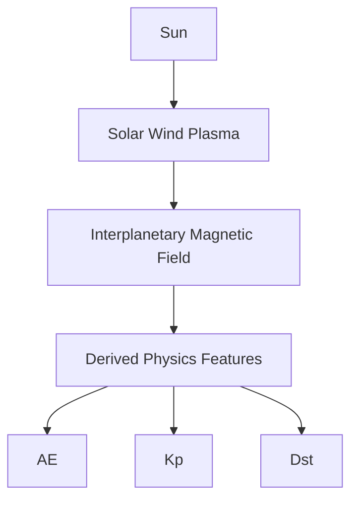

# Space Weather Dashboard

**SW-DSS — Space Weather Decision Support System**

An end-to-end data engineering, machine learning, and scientific visualization project that ingests live NOAA / NASA DONKI space weather data, analyzes Sun-Earth coupling, and runs a continuous, self-evaluating forecasting engine — all inside a custom-themed Streamlit application.

Built as a portfolio project to practice professional software development, data pipeline design, applied machine learning, and dashboard engineering using real scientific datasets.

---

## Table of Contents

* [Overview](#overview)
* [Research & Physics Foundations](#research--physics-foundations)
* [Space Weather Background](#space-weather-background)
* [Physics-Informed Features](#physics-informed-features)
* [Prediction Philosophy](#prediction-philosophy)
* [Scientific Motivation](#scientific-motivation)
* [Space Weather Prediction Pipeline](#space-weather-prediction-pipeline)
* [Key Features](#key-features)
* [Architecture](#architecture)
  * [AE Data Pipeline](#ae-data-pipeline)
  * [AE Prediction & Verification Pipeline](#ae-prediction--verification-pipeline)
  * [Operational Forecast Engine](#operational-forecast-engine)
* [Project Structure](#project-structure)
* [Live Prediction Engine](#live-prediction-engine)
  * [Combined Sun-Earth Forecasting (Analytics page)](#combined-sun-earth-forecasting-analytics-page)
* [Dashboard Pages](#dashboard-pages)
* [UI](#ui)
* [Technology Stack](#technology-stack)
* [Running the Project](#running-the-project)
  * [Testing & CI](#testing--ci)
* [Research & Exploratory Analysis](#research--exploratory-analysis)
* [Known Limitations](#known-limitations)
* [Development Roadmap](#development-roadmap)
  * [Next Milestone — Satellite Operator Module](#next-milestone--satellite-operator-module)
  * [AE Index Integration](#ae-index-integration)
* [Concepts & Skills Demonstrated](#concepts--skills-demonstrated)
* [Author](#author)

---

## ⚠️ Testing Phase Notice

**This project is currently in active testing and development.** Core features are functional and working, but the system is still being stress-tested, validated, and refined. If you're reviewing this:

- Live prediction jobs, research labs, and verification pipelines are operational but may have rough edges
- Some features (AE Quicklook, Kyoto WDC verification, Kp/AE Research Labs, and the new Bz/Kp/AE Optimization Studies) are newly built and under active validation
- Data displayed is real — pulled from NOAA SWPC, NASA DONKI, and Kyoto WDC — not mocked or simulated
- If something looks off or broken, it is likely being actively worked on

Feedback is welcome. Full public deployment is a planned next step once testing is complete.

---

## Overview

The project tracks the full Sun-to-Earth space weather chain — solar activity, solar wind, the interplanetary magnetic field, and the resulting geomagnetic response — using real NOAA SWPC and NASA DONKI data. It started as a series of exploratory Jupyter notebooks and has since grown into:

1. A **continuous ingestion pipeline** that refreshes seven independent datasets on their own real-world cadences.
2. A **multi-page Streamlit dashboard** with a deliberate retro/vintage UI, event tracing, and a heliographic event map, fronted by a Bloomberg-terminal-style **Operational Command Centre** homepage.
3. A **live, self-evaluating machine learning forecasting engine** for Solar Wind, IMF, Kp, Dst, and AE, with automatic model selection and forecast-vs-actual accuracy tracking.
4. An **Operational Forecast Engine** — an orchestration layer that turns those independent forecasts into one continuously-issued, synchronized **Forecast Package**, complete with a rule-based driver explanation and lightweight drift monitoring (see [Operational Forecast Engine](#operational-forecast-engine)).

---

## Research & Physics Foundations

Every prediction in this project sits on top of published heliophysics, not just a model fit to historical data:

**Real, cited physics — implemented and numerically validated, not paraphrased.** Burton et al. (1975)'s ring-current injection/decay equation (`dDst*/dt = a·VBz − Dst*/τ`, pressure-corrected via O'Brien & McPherron 2000, in both constant- and driving-dependent variable-τ forms) for the storm-time ring current; the Shue et al. (1998) empirical magnetopause standoff model; the Newell et al. (2007) solar wind–magnetosphere coupling function (migrated project-wide to the correct transverse-IMF-component definition per the original paper, after an internal audit found one research lab computing it differently from another); Akasofu ε energy input; and the Vršnak et al. (2013) Drag-Based Model for CME transit through the heliosphere. All of it lives in one auditable module (`src/swdss/physics/`), with its own numerical validation suite (`physics/validation.py`) that checks derived constants (e.g. plasma beta) against a first-principles derivation to 4 significant figures — see [Physics-Informed Features](#physics-informed-features) and [Operational Forecast Engine](#operational-forecast-engine) for where each formula feeds into a live forecast.

**A real research methodology, not just a model-training loop.** Day-by-day exploratory analysis (`docs/`, `notebooks/`) established this specific dataset's actual lag-correlation structure — Kp responds to a Bz change ~1 hour later, Dst ~3 hours later — *before* any model was built on top of it (see [Sun-Earth Coupling & Time-Lag Analysis](#sun-earth-coupling--time-lag-analysis)). A formal Hypothesis Testing framework (Research Lab) pairs a baseline architecture against an experimental one and reports Supported / Not Supported / Inconclusive from measured accuracy, never an assumption. A Storm Backtest suite validates every production model against real named historical storms (May 2024 "Gannon" G5, September 2017, October 2024, and others) pulled from NASA's public OMNI2 archive — because a model that only looks good on 2026's geomagnetically quiet live data hasn't actually been tested where it matters.

**Honesty over a good-looking number.** Every non-trivial modeling attempt here is gated on genuinely clearing a bar, and reported either way — not just when it wins. The physics-based Burton hybrid Dst model is real, working, backtested code that still isn't wired into production, because it doesn't beat the frozen production model on the most extreme storm in the test set. The AE Optimization Study's 10-experiment sweep found candidates with better raw R²/MAE at 4 of 5 horizons but withheld every one of them from promotion because they failed an overfitting-gap check. A real confidence-calibration inversion was found, root-caused to one specific, quantified mechanism, partially fixed, and reported as *partial*, not claimed as solved. See [Known Limitations](#known-limitations) and [Development Roadmap](#development-roadmap) for the full, dated log of every finding — good, bad, and mixed.

---

## Space Weather Background

Geomagnetic activity on Earth is the end of a physical chain that starts at the Sun:

```text
Sun
  ↓
Solar Wind + Interplanetary Magnetic Field (IMF)
  ↓
Magnetic Reconnection (Southward Bz)
  ↓
Energy Transfer (Ey, VBz)
  ↓
Auroral Electrojets (AE)
  ↓
Global Geomagnetic Activity (Kp)
  ↓
Ring Current Development (Dst)
```

The Sun continuously ejects charged plasma (the solar wind), carrying an embedded magnetic field (the IMF) outward. When that field points southward at Earth, it can reconnect with Earth's own magnetic field, opening a pathway for solar wind energy to pour into the magnetosphere. That energy first shows up in the fast-reacting auroral electrojets (AE, within minutes), then in the broader geomagnetic index Kp (within hours), and finally in the slower-building ring current measured by Dst. This dashboard ingests the real-time observations at every link in that chain and uses machine learning to forecast where it's headed next.

---

## Physics-Informed Features

This isn't a generic time-series forecasting app pointed at space weather data — several of its engineered inputs are established heliophysical quantities, not arbitrary statistical transforms:

* **Solar Wind Electric Field (Ey)** — the interplanetary dawn-dusk electric field driving reconnection.
* **VBz Coupling Function** — Speed × southward Bz (Burton et al. 1975), the standard proxy for how much solar wind energy is actually available to couple into the magnetosphere.
* **Solar Wind Dynamic Pressure** — the ram pressure the solar wind exerts on the magnetopause, which compresses or expands it.
* **Lag Features (1h/3h/6h/12h/24h)** — the Sun-Earth chain has real physical delay, not an instant response. This project's own lag-correlation analysis (see [Research & Exploratory Analysis](#research--exploratory-analysis)) found Kp responds most strongly to a Bz change after ~1 hour and Dst after ~3 hours — lag features let the models see exactly the delayed values that actually correlate with the target.
* **Rolling Mean / Rolling Standard Deviation (24h)** — a single instantaneous reading doesn't say whether conditions are trending up, trending down, or unusually volatile; rolling statistics give the model that recent context.
* **Rate-of-Change (first difference)** — a sudden southward turn in Bz is far more geoeffective than a slow drift to the same value — rate-of-change captures how fast conditions are changing, not just where they currently are.

These variables represent known mechanisms for how solar wind energy actually gets transferred into Earth's magnetosphere — the models are given physics-motivated inputs, not just raw numbers.

---

## Prediction Philosophy

The dashboard deliberately separates two concerns that are easy to accidentally blend together:

**Production Models** (Analytics page)
* Independent prediction pipelines per variable
* Stable, operational workflow
* Observed variables only — no predicted value is ever fed into another model

**Research Lab**
* Cascaded prediction architectures (a predicted value feeding forward as another model's input)
* Formal physics hypothesis testing (Supported / Not Supported / Inconclusive, from measured data)
* Experimental model comparison, explainability, and rule-based physics interpretation

This separation means a new forecasting idea can be built, run, and evaluated against real data in the Research Lab without ever touching — or risking — the operational Production system.

---

## Scientific Motivation

The project exists to investigate a concrete question: **does incorporating established space weather physics actually improve machine learning forecasts, or does it just look elegant?** Specific hypotheses under active or planned investigation (see [Hypothesis Testing](#dashboard-pages)):

* Does predicted AE improve Kp forecasting?
* Does Dynamic Pressure improve Dst prediction?
* Which coupling functions (VBz, Ey) contribute most to geomagnetic activity?
* Do cascaded, physics-inspired architectures outperform independent prediction models?

Every answer is required to come from measured, verified prediction accuracy — never an assumption, and never an LLM-generated claim.

---

## Space Weather Prediction Pipeline



Unlike many machine learning dashboards that treat forecasting as purely a statistical problem, this project combines real-time heliophysical observations, physics-derived coupling functions, and machine learning to investigate how physical understanding can improve space weather forecasting.

---

## Key Features

* Continuous, per-dataset live ingestion from NOAA SWPC and NASA DONKI (own cadence per dataset — see [Architecture](#architecture))
* Minute-resolution storage for Solar Wind/IMF so true extremes aren't smoothed away by hourly aggregation
* **Operational Forecast Engine** — an orchestration layer (not a new model) that turns the dashboard from ten independent prediction jobs into one continuously-issued, synchronized **Forecast Package** — see [Operational Forecast Engine](#operational-forecast-engine)
* **SW Operational Command Centre** — the homepage's Bloomberg-terminal-style operational console (Forecast / Current / Physics / Timeline / Verification / Logs / Downloads / Alerts / System / Search), reading only pre-computed engine products, never calling a model itself — Current tab carries the plain-language Meaning + Risk per variable that used to be a standalone status terminal
* Forward + reverse **Event Explorer** tracing a Sun-to-Earth causal chain, plus an auto-playing **Event Storyboard**
* **Heliomap** — real heliographic Solar Event / CME positions plotted over an NASA SDO solar-disk image
* 6-panel synced **Sun-to-Earth Overview** chart with click-to-inspect readout
* Saved Events bookmarking and a Space Weather Concepts document library, both JSON-backed
* **Live Prediction Engine**: continuous, self-refining forecasting jobs for Solar Wind and IMF, with automatic model selection, live drift tracking, and forecast-vs-actual accuracy evaluation (see below)
* **Combined Sun-Earth Forecasting (Analytics page)**: Kp and Dst predicted from a single physics-informed model spanning Solar Wind + IMF + geomagnetic history (including observed AE) + derived coupling features (VBz, Ey, Dynamic Pressure) — Kp follows NOAA's real 3-hour publishing cadence rather than an arbitrary hourly horizon
* **AE Predictor**: AE forecast independently from Solar Wind + IMF + derived physics, with delayed official verification against Kyoto WDC and an approximate, immediate Quicklook cross-check
* **Experimental (Physics Cascaded) Predictor**: a research-only model that feeds *predicted* AE forward into Kp/Dst as an extra feature, benchmarked live against the production model
* **Research Lab**: an isolated environment for comparing forecasting architectures, rule-based physics interpretation, model explainability, and formal hypothesis testing
* **Bz / Kp / AE Optimization Studies**: one-button AutoML pipelines (8-10 structured experiments each, AE run independently across all 5 production horizons) that reproduce the production baseline, benchmark it against persistence, search feature sets and coupling physics, sweep all 12 model types, extract feature importance/SHAP/permutation importance, and issue a guarded, human-confirmed promote-to-production recommendation
* Retro/vintage UI theme applied consistently across every table, chart, dialog, and button

---

## Architecture

### Data Pipeline

```text
NOAA SWPC / NASA DONKI
        ↓
raw JSON snapshots (data/raw/)
        ↓
per-dataset cleaning (src/swdss/features/build_master.py)
        ↓
processed parquet (data/processed/) — minute-level for Solar Wind/IMF,
                                       native cadence for everything else
        ↓
master_df_v1.parquet — hourly-merged Sun-Earth feature table
        ↓
dashboard/home.py
```

`src/swdss/features/live_update.py` keeps every dataset refreshed independently, on its own real-world cadence:

| Dataset | Cadence | Notes |
| --- | --- | --- |
| Solar Wind | 1 minute | retained at native minute resolution |
| IMF | 1 minute | retained at native minute resolution |
| Dst | 5 minutes | NOAA publishes updates roughly every few minutes; polling at 5 min catches new values quickly |
| Kp | 15 minutes | NOAA publishes a new official Kp every 3 hours; 15-min polling reduces the delay before a freshly-published value is fetched |
| Solar Events | 30 minutes | appended + deduplicated (NOAA only returns a recent snapshot per call) |
| CME (DONKI) | 1 hour | rolling 30-day fetch each cycle |
| F10.7 | 24 hours | NOAA's own file already covers a monthly window |
| AE | No live NOAA cadence | NOAA/DONKI publish no AE product at all — "live" AE is a forward-filled historical value; official verification instead comes from Kyoto WDC once daily, ~10-20 day publication lag (see [AE Prediction & Verification Pipeline](#ae-prediction--verification-pipeline)) |

**Design note:** `master_df_v1.parquet` resamples Solar Wind/IMF to hourly means so they can be merged with the inherently-hourly Kp/Dst series for combined Earth-response analysis. That averaging is necessary for that purpose, but it quietly smooths away genuine short-lived spikes. Anywhere the dashboard reports a "true extreme" (Strongest Value cards, Current Analysis tabs, the prediction engine's live features), it reads from the **minute-level processed file directly**, never from the hourly-merged table.

### AE Data Pipeline

AE follows a different path than every other dataset above, because it has no live NOAA/DONKI feed at all:

```text
Kyoto World Data Center
        ↓
official digital AE (swdss.ingest.kyoto_ae)         real-time graph (swdss.ingest.kyoto_ae_quicklook)
        ↓                                                    ↓
checked once/day, ~10-20 day publication lag         approximate pixel-read estimate, available immediately
        ↓                                                    ↓
authoritative "Verified" result                      non-official "Quicklook" cross-check
```

Both branches are read-only verification sources — neither ever feeds into or overwrites the other, and neither is NOAA. See [AE Prediction & Verification Pipeline](#ae-prediction--verification-pipeline) for how this pairs with the live prediction side.

**Minute-resolution AE archival (additive, non-production).** Every Kyoto WDC day-file actually contains 60 one-minute AE values per hour, plus a trailing hourly mean — but until this addition, only that trailing mean was ever kept; the 60 minute values were parsed into memory and discarded the instant the parser moved to the next line, so every day that passed before this change is lost permanently (Kyoto's real-time page is continuously overwritten, not a permanent archive). `swdss.ingest.kyoto_ae` now also archives, on every fetch: the raw day-file text verbatim (`data/raw/kyoto_ae_minute/`) and a parsed, deduplicated minute-resolution parquet (`data/processed/kyoto_ae_minute/`), via the same append-and-deduplicate convention already used for Solar Events/CME. This is purely additive — `fetch_kyoto_ae_hour()`'s return value, used by the AE verification workflow above, is completely unchanged, and any failure while archiving minute data is swallowed rather than raised, so it can never break hourly verification. Nothing in Production or any Research Lab Optimization Study reads this archive yet; it exists so a genuinely different future research question — substorm onset timing, minute-scale AE dynamics, event detection — is *answerable* later, without deciding now whether minute-scale AE forecasting is even worthwhile.

### Live Prediction Pipeline

```text
NOAA live minute-level data
        ↓
hourly resample + interpolation (matches training preprocessing exactly)
        ↓
lag / rolling-mean / rolling-std / rate-of-change feature generation
        ↓
trained model lookup (best algorithm per variable × horizon)
        ↓
forecast + drift logging (SQLite)
        ↓
forecast-vs-actual evaluation once the target hour is observed
```

### AE Prediction & Verification Pipeline

AE reuses the same job engine above (checkpoints, SQLite persistence, live console) but splits "prediction" and "verification" into two fully independent processes, since there's no live AE observation to evaluate against directly:

```text
Live NOAA (Solar Wind + IMF) + last known historical AE
        ↓
AE model inference, refined every NOAA minute (same engine as Live Prediction Pipeline)
        ↓
Job completes once the reference feed's own live data reaches the target hour —
not pure wall-clock, which could otherwise skip the final pre-target minutes
        ↓
   ┌─────────────────────────────┴─────────────────────────────┐
   ↓                                                            ↓
Kyoto WDC official digital AE                        Kyoto WDC Quicklook graph
checked once/day (swdss.ingest.kyoto_ae)             read immediately (swdss.ingest.kyoto_ae_quicklook)
   ↓                                                            ↓
"Verified" — Official AE, Absolute Error,            "Quicklook Estimated AE" — approximate,
Percentage Error (authoritative)                     never overwrites the Verified result
```

Prediction never waits on either verification branch, and the two branches never influence each other — see [AE Data Pipeline](#ae-data-pipeline) and [AE Index Integration](#ae-index-integration) for the data sources and staged rollout behind this.

### Operational Forecast Engine

Everything above (`jobs.py`, `predict.py`) is the prediction *mechanism* — a real, continuously-ticking job per (dataset, variable, horizon). The **Operational Forecast Engine** (`src/swdss/engine/`, 2026-07) is a thin orchestration layer on top of it that turns those independent mechanisms into one issued, synchronized operational product. It changes nothing about how any individual forecast is computed — no production model, physics formula, or evaluation methodology was touched — it only decides what to automatically start, how to package what already exists, and what to show as "the forecast."

```text
run_forecast_cycle()          — ensures every (dataset, variable, horizon) has an active job
        ↓                        (no more manual "Start Prediction" click required)
evaluate_due_forecasts()      — advances every active job (thin wrapper around jobs.tick_all_active_jobs)
        ↓
refresh_dashboard_products()  — reads current job state, derives confidence/physics/outlook/
        ↓                        explanations/drift/package, writes every stored product below
   ┌────────────────────────────────────────┴────────────────────────────────────────┐
   ↓                                        ↓                                        ↓
current/forecast_snapshot.json   current/forecast_package.json         history/*.parquet + logs/engine_log.jsonl
(per-variable forecast detail)   (the synchronized Forecast Package)   (permanent history, never overwritten)
```

All three functions are independently callable (manual/dev use) and are also chained once per `live_update.py` loop iteration (~60s) — the same continuous background process that already refreshes live data, with each stage fault-isolated exactly like every ingestion job in that file, so one failing stage never blocks the others.

**Locked forecasts.** `jobs.py`'s tick history is a genuine continuous refinement — right for research and drift-tracking, wrong for an operational display an analyst needs to act on without it silently changing underneath them. The engine shows each forecast exactly as it stood at the moment it was generated (the job's first tick, or for Kp the frozen production value) — never the latest tick — while `jobs.py` itself is completely unchanged and keeps refining internally for the Research Labs and Quicklook tracking.

**Forecast Packages** (`swdss.engine.packages`) bundle the 10 operational headline forecasts (Speed/Density/Temperature/Bt/Bx/By/Bz/Dst/Kp/AE, each at its 1h horizon except Kp's next official NOAA interval) into one issued product with its own identity (`FC-YYYYMMDD-HHMM`), an incrementing cycle counter, and a six-stage lifecycle — `CREATED → LIVE → ACTIVE → WAITING FOR VERIFICATION → VERIFIED → ARCHIVED`. Two physical realities are handled deliberately rather than glossed over:

* **Kp's 3-hour NOAA cadence** can't literally synchronize with the other nine hourly variables — a package's Kp slot is marked `kp_carried_over` on cycles where NOAA hasn't published a new official interval since the last package, and that alone never counts against the package's completeness.
* **AE's ~10-20 day Kyoto WDC verification lag** means gating the whole package's `VERIFIED` status on AE would leave every package "unverified" for weeks. The package instead verifies on its nine timely core members, with AE's own verification tracked and reported separately (`evaluation_status: "Verified (AE Pending Kyoto Data)"`).

A `PARTIALLY COMPLETE` completeness flag fires only when a headline member is genuinely missing (an errored or not-yet-created job) — never for Kp's normal cadence. A **Package Verification Summary** (Variables Verified, Average Error, Worst/Best Variable, Overall Package Accuracy — reusing the exact "within 1.5x the model's own MAE" success definition already used dataset-wide) is computed and permanently stored the first cycle every core member has a real observation to check against.

**Forecast Explanation Engine** (`swdss.engine.explanation`) connects the Physics Engine's live readings to the Kp/Dst/AE forecasts they drive — until this, the Forecast and Physics tabs were isolated views with no stated causal link. Every physics quantity that can plausibly explain a Kp/Dst/AE forecast (southward IMF, Newell Coupling, Dynamic Pressure, VBz, Ey, Southward Duration, Akasofu ε, Magnetopause Compression) is scored 0-3 against thresholds already established elsewhere in this codebase (`physics_interpretation.py`'s VBz/AE bands, `alerts.py`'s southward-duration/compression thresholds, `swdss.physics.*`'s own documented expected ranges) — never invented for this module — and the top three become a Primary/Secondary/Supporting driver ranking plus a generated sentence (e.g. *"Expected Kp increase primarily driven by elevated Newell Coupling, with increasing dynamic pressure as a secondary factor."*). Genuine per-forecast SHAP attribution against the actually-deployed model is layered on top of this, not blended into it (`attach_shap_attribution`, see Development Roadmap) — reusing the same Shapley-value machinery already exposed on-demand in each job dialog, computed once per engine cycle so it shows up on the banner without a user needing to open a dialog to see it. The rule-based ranking stays the deterministic account of upstream physics conditions; the attached "shap" data is the model's own statistically exact feature attribution for the current prediction — two distinct, clearly-labeled sources of "why," not one pretending to be the other.

**Drift monitoring** (`swdss.engine.drift`) compares each model's recent live evaluated-forecast error against its own training-time MAE (a minimum of 8 evaluated forecasts required before ever declaring anything, the same "don't guess off a handful of points" discipline used elsewhere in this project) and raises a `MODEL DRIFT DETECTED` alert once recent error sustains at 1.5x or more of the training baseline. Notifies only — nothing in this engine ever retrains a model automatically; that stays a deliberate, human-triggered action in the Research Labs.

**Confidence** (`swdss.engine.confidence`) is a documented, deterministic weighted heuristic — never a fitted model — over the model's own held-out R²/CV stability, forecast horizon, in-session prediction stability, and recent evaluated-forecast error trend, collapsed into five operational categories (Very High → Very Low). Every one of the 10 headline variables is shown as a range (`predicted_value ± the model's own MAE`), not just Bz and Kp as in the original version — a point forecast with no uncertainty band is scientifically incomplete regardless of which variable it is. Every evaluated forecast also logs its confidence score and a coarse Quiet/Active/Storm activity-regime tag (`swdss.engine.outlook.classify_activity_regime`); both are now actively analyzed (not just collected) by the verification-science layer below.

**Verification science** (`swdss.engine.skill`, `swdss.engine.calibration`) turns accumulated evaluation history into three real checks on the engine's own trustworthiness, none of which feed back into any live scoring — they only report. **Persistence-based skill score**: `1 − (model MSE / persistence MSE)`, the standard "does this actually beat assuming no change" operational-forecasting question, gated on 8+ evaluated samples per (dataset, variable, horizon); AE is excluded (no live feed, no valid persistence anchor). **Confidence calibration**: empirical success rate per confidence category, checking whether "Very High" forecasts really do succeed more often than "Moderate" ones. **Activity-regime error bands**: MAE segmented by the Quiet/Active/Storm tag a forecast was issued under, targeting the classic failure mode of a model that looks strong on a quiet-time-dominated aggregate and quietly degrades during a storm. All three surface in the Verification tab, split into headline vs. extended-horizon sub-tables (see [Development Roadmap](#development-roadmap) for the full detail, including the calibration inversion this already found).

**Continuous re-issue for 1h/Kp-interval jobs.** The diagram above understates one nuance: for the 10 headline (1h / Kp-interval) forecasts specifically, a new job is issued the moment a new target hour is reachable, without waiting for the previous hour's job to finish being evaluated — closing a gap where the wall-clock hour that evaluation happened to resolve in would otherwise never get its own forecast. Every other horizon (3h/6h/12h/24h) still waits for the previous job to resolve before starting the next.

The **SW Operational Command Centre** (see [Dashboard Pages](#dashboard-pages)) is the sole reader of everything this engine produces — the dashboard itself never calls a prediction model or touches `jobs.py`'s SQLite database directly, with one narrow, explicit exception: the Search tab's 7-Day Extremes table reads minute-level processed data directly, since those are observed values rather than a forecast product this engine owns.

---

## Project Structure

```text
Space Weather Dashboard V2/
│
├── data/
│   ├── raw/                            # Exact NOAA / DONKI API responses, one file per dataset per fetch
│   │   ├── omni_refresh_2026.csv       # Parsed NASA OMNI2 2026 hourly data (Jan–Jun); input to the refresh pipeline
│   │   └── kyoto_ae_minute/            # Raw Kyoto WDC day-file text, one file per UT day (verbatim archival copy)
│   ├── processed/                      # Cleaned per-dataset parquet (minute-level for Solar Wind/IMF,
│   │   │                               #   native cadence for everything else)
│   │   ├── solar_wind/
│   │   ├── imf/
│   │   ├── kp/
│   │   ├── dst/
│   │   ├── ae/                         # Historical AE from Kyoto WDC — no live NOAA feed exists
│   │   ├── kyoto_ae_minute/            # NEW: parsed minute-resolution AE archive (see AE Data Pipeline) —
│   │   │                               #   purely additive, not read by Production or any Optimization Study
│   │   ├── f107/
│   │   ├── cme/
│   │   ├── solar_events/
│   │   ├── master_omni.csv             # Original versioned OMNI2 archive (2023–2025, 26,304 rows)
│   │   └── master_omni_v2.csv          # Extended versioned archive (2023–Jun 2026, 30,648 rows)
│   ├── features/
│   │   ├── master_df_v1.parquet        # Hourly-merged Sun-Earth feature table (rebuilt by live_update.py)
│   │   ├── training/                   # Active training CSVs — what production models and research labs read
│   │   │   ├── solar_wind_features.csv
│   │   │   ├── imf_features.csv
│   │   │   ├── kp_features.csv
│   │   │   ├── dst_features.csv
│   │   │   ├── analytics_features.csv      # Solar Wind + IMF + Kp + Dst + observed AE; used by Analytics production models
│   │   │   ├── ae_analytics_features.csv   # Solar Wind + IMF + AE (no Kp/Dst); used by AE V1 production model + AE Research Lab
│   │   │   └── experimental_features.csv   # Solar Wind + IMF + Kp + Dst + Predicted AE (from frozen AE 1h model); used by Experimental production models + Experimental Predictions tab
│   │   └── training_v2/                # v2 versions of all 7 training CSVs (2023–Jun 2026); produced by the refresh pipeline
│   │       ├── solar_wind_features.csv
│   │       ├── imf_features.csv
│   │       ├── kp_features.csv
│   │       ├── dst_features.csv
│   │       ├── analytics_features.csv
│   │       ├── ae_analytics_features.csv
│   │       └── experimental_features.csv
│   ├── predictions/
│   │   ├── predictions.db              # SQLite: live forecast jobs, tick history, hypothesis records
│   │   ├── imf_research_runs.json / imf_hypothesis_tests.json / imf_optimization_studies.json
│   │   ├── kp_research_runs.json / kp_hypothesis_tests.json / kp_optimization_studies.json
│   │   └── ae_research_runs.json / ae_hypothesis_tests.json / ae_optimization_studies.json
│   │       # Per-lab JSON registries for the Research Lab engines and their Optimization Study
│   │       # runs — entirely separate from models/{dataset}/metrics.json; created on first use
│   ├── forecasts/                      # NEW: Operational Forecast Engine's stored products (swdss.engine.storage) —
│   │   │                               #   the ONLY thing dashboard/lib/command_centre.py reads
│   │   ├── current/
│   │   │   ├── forecast_snapshot.json  # Latest per-variable forecast/physics/outlook/alerts/system-health state
│   │   │   ├── forecast_package.json   # The current synchronized Forecast Package
│   │   │   ├── skill_scores.json       # Persistence-based skill score per (dataset, variable, horizon) — swdss.engine.skill
│   │   │   └── calibration_report.json # Confidence-reliability + activity-regime error bands — swdss.engine.calibration
│   │   ├── history/                    # Permanent, append-only — never pruned
│   │   │   ├── forecast_snapshot_history.parquet     # One row per (dataset, variable, horizon) per cycle
│   │   │   ├── evaluation_history.parquet            # One row per completed, evaluated forecast
│   │   │   ├── package_history.parquet               # One row per cycle-observation of a Forecast Package
│   │   │   └── package_verification_history.parquet  # One row per package, once its core members verify
│   │   └── logs/
│   │       └── engine_log.jsonl        # Structured per-stage engine log, trimmed to the most recent 5,000 lines
│   └── saved_events.json / library_index.json
│
├── src/swdss/
│   ├── paths.py                        # Centralized path constants
│   ├── ingest/
│   │   ├── noaa_client.py              # NOAA SWPC + NASA DONKI API client
│   │   ├── kyoto_ae.py                 # Kyoto WDC official digital AE — the sole authoritative AE verification source;
│   │   │                               #   also archives the full minute-resolution AE data every fetch discards down
│   │   │                               #   to an hourly mean (raw text + parsed parquet), purely for future research
│   │   └── kyoto_ae_quicklook.py       # Kyoto WDC real-time graph — pixel-based approximate AE estimate (immediate cross-check)
│   ├── transform/                      # Per-dataset raw-JSON → cleaned-DataFrame stubs (all currently empty —
│   │   │                               #   the real cleaning logic lives in swdss.features.build_master's
│   │   │                               #   clean_solar_wind/clean_imf/clean_kp/clean_dst; kept here as the
│   │   │                               #   documented eventual home if that logic is ever split out)
│   │   ├── solar_wind.py
│   │   ├── imf.py
│   │   ├── kp.py
│   │   └── dst.py
│   ├── features/
│   │   ├── build_master.py             # One-shot fetch + clean + merge all datasets; to_numeric() also converts
│   │   │                               #   NOAA's -9999 "no valid measurement" fill value to NaN for every dataset
│   │   └── live_update.py              # Continuous per-dataset updater (own cadences); also runs the Operational
│   │                                   #   Forecast Engine's 3 stages and ticks active prediction jobs each cycle
│   ├── engine/                         # NEW: Operational Forecast Engine — orchestration layer, not a new model
│   │   ├── matrix.py                   # PRODUCTION_MATRIX — the fixed (dataset, variable, horizons) forecast matrix
│   │   ├── orchestrator.py             # run_forecast_cycle() / evaluate_due_forecasts() / refresh_dashboard_products()
│   │   ├── storage.py                  # JSON/Parquet/JSONL read-write for every engine-produced product (data/forecasts/)
│   │   ├── confidence.py               # Deterministic confidence scoring (weighted heuristic, not ML)
│   │   ├── physics_snapshot.py         # Live Physics Engine snapshot builder + physics_completeness() input-health check
│   │   ├── outlook.py                  # Overall Space Weather Outlook + Quiet/Active/Storm activity-regime classifier
│   │   ├── alerts.py                   # Rule-based operational alerts (Physics/Data Feed/CME/Outlook/Drift sourced)
│   │   ├── labels.py                   # Current-reading Meaning/Risk labels (engine-safe port of home.py's, no Streamlit import)
│   │   ├── explanation.py              # Forecast Explanation Engine — rule-based physics driver ranking + real SHAP attribution for Kp/Dst/AE
│   │   ├── drift.py                    # Lightweight model drift monitoring (notify only, never retrains)
│   │   ├── skill.py                    # NEW: Persistence-based forecast skill score (model MSE vs. naive no-change MSE)
│   │   ├── calibration.py              # NEW: Confidence-reliability check + activity-regime-conditioned error bands
│   │   └── packages.py                 # Forecast Package construction + 6-stage lifecycle — see
│   │                                   #   Operational Forecast Engine
│   └── models/                         # Prediction engine — training, inference, research, and job lifecycle
│       ├── registry.py                 # Shared config: dataset keys, variables, horizons, model paths, scale factors
│       ├── features.py                 # Lag / rolling-mean / rolling-std / rate-of-change + derived physics feature engineering
│       ├── train.py                    # Multi-algorithm training (LR / RF / XGBoost) + automatic best-model selection
│       ├── predict.py                  # Live feature pipeline + single-point inference for all datasets
│       ├── jobs.py                     # Continuous forecast job lifecycle: create / tick / complete / verify (SQLite-backed);
│       │                               #   `source` column ('manual' vs 'engine') keeps Production-tab and engine-started jobs separate
│       ├── experimental.py             # One-time Predicted_AE column generation from frozen AE 1h model (cascade training data)
│       ├── explainability.py           # SHAP (TreeExplainer / LinearExplainer) + permutation-sensitivity fallback
│       ├── physics_interpretation.py   # Rule-based (no LLM) Sun-Earth coupling narrative from live readings
│       ├── hypothesis.py               # Hypothesis Testing: CRUD, statistics, auto-conclusion engine (Supported/Not Supported/Inconclusive)
│       ├── imf_research.py             # IMF Research Lab engine: multi-horizon, multi-model, physics experiments, run
│       │                               #   tracking, + the 8-experiment Bz Optimization Study AutoML orchestrator
│       ├── imf_research_keras_worker.py  # Isolated subprocess for LSTM/GRU training — prevents scikit-learn / Keras import collision
│       ├── imf_physics_features.py     # IMF-specific physics features for the Research Lab (Clock Angle, IMF Rotation, etc.)
│       ├── kp_research.py              # Kp Research Lab engine: model comparison, feature ablation, physics experiments,
│       │                               #   hypothesis testing, + the 10-experiment Kp Optimization Study AutoML orchestrator
│       ├── kp_physics_features.py      # Kp-specific physics features (Southward Duration, Integrated Ey/VBz, Storm Phase, etc.)
│       ├── ae_research.py              # AE Research Lab engine: model comparison, multi-horizon, physics experiments,
│       │                               #   hypothesis testing, + the 10-experiment × 5-horizon AE Optimization Study
│       │                               #   (the flagship cross-horizon scientific study — see Development Roadmap)
│       ├── ae_physics_features.py      # AE-specific physics features (Newell Coupling, Akasofu ε, Boyle Index, Alfvén Mach Number,
│       │                               #   Strong Southward Duration, etc.)
│       ├── storm_data.py               # NEW: named historical-storm registry (Gannon 2024, Oct 2024, Apr 2023,
│       │                               #   Sep 2017, Aug 2018, Mar 2015) + NASA OMNI2 downloader/parser generalized
│       │                               #   to any year, feeding both tools below
│       ├── storm_backtest.py           # NEW: Storm Backtest — scores the FROZEN production model against real
│       │                               #   historical storm windows, no retraining; see Development Roadmap
│       └── storm_learning.py           # NEW: Storm Learning — trains a genuinely new model on quiet-time data +
│                                       #   real storms (one held out for testing), compared against production
│                                       #   via storm_backtest.run_storm_backtest
│
├── dashboard/
│   ├── home.py                         # Streamlit entry point (~2,200 lines): page routing/dispatch, top-of-file
│   │                                   #   styling, Current Analysis renderers, Overview chart — everything else
│   │                                   #   below was extracted into its own module (see dashboard/lib/ below)
│   ├── lib/                            # Extracted verbatim from home.py (no behavior/formula change) across two
│   │   │                               #   passes — the three Research Laboratories first (home.py was ~10,900
│   │   │                               #   lines, cut to ~6,200), then a second pass (this one ~6,000 -> ~2,200)
│   │   │                               #   splitting what remained into topic-scoped modules by subsystem
│   │   ├── data_helpers.py             # NEW: dependency-free data-loading/lookup/formatting helpers shared by
│   │   │                               #   home.py and every module below — the foundation the second split pass
│   │   │                               #   needed so modules could import shared utilities without importing home.py
│   │   ├── library.py                  # NEW: Saved Events + Space Weather Concepts Library (two independent
│   │   │                               #   JSON-backed CRUD features, each with its own dialog)
│   │   ├── event_explorer.py           # NEW: the Sun-to-Earth event causal-chain trace, the News Feed's inline
│   │   │                               #   detail panel, the reverse lookup, the animated storyboard, and the
│   │   │                               #   Saved Events dialog — everything built on one shared chain-building helper
│   │   ├── forecast_dialogs.py         # NEW: the four per-dataset forecast dialogs (Kp/Dst/AE/Experimental) and
│   │   │                               #   the prediction-job dispatcher — the single largest extracted module
│   │   ├── solar_activity.py           # NEW: Solar Events/CME statistical analysis, the two Heliomap tabs, and
│   │   │                               #   F10.7 classification/analysis — pure analysis + Plotly, no CRUD/dialogs
│   │   ├── shared_ui.py                # Retro chart/dialog styling + auto-refresh helpers shared by home.py and every lab
│   │   ├── command_centre.py           # SW Operational Command Centre — the homepage's terminal-style UI,
│   │   │                               #   reads ONLY swdss.engine.storage, never calls a model or touches jobs.py's DB;
│   │   │                               #   Search tab is the one exception, reading data/processed/ parquet directly for the 7-Day Extremes table
│   │   ├── imf_research_lab.py         # IMF Research Laboratory + Bz Optimization Study
│   │   ├── kp_research_lab.py          # Kp Research Laboratory + Kp Optimization Study
│   │   ├── ae_research_lab.py          # AE Research Laboratory + AE Optimization Study, Hypothesis Testing tab/dialog
│   │   └── storm_lab.py                # NEW: Storm Backtest + Storm Learning tabs (UI only — the actual logic
│   │                                   #   lives in swdss.models.storm_backtest/storm_learning/storm_data)
│   └── assets/                         # Static imagery (magnetosphere background, NASA SDO solar disk)
│
├── models/                             # Trained model artifacts (.joblib + metrics.json per dataset)
│   ├── solar_wind/                     # Production Solar Wind models (Speed / Density / Temperature × 5 horizons)
│   ├── solar_wind_v2/                  # v2 Solar Wind models — versioned backup from the July 2026 refresh
│   ├── imf/                            # Production IMF models (Bt / Bx / By / Bz × 5 horizons)
│   ├── imf_v2/                         # v2 IMF models — versioned backup
│   ├── kp/                             # Standalone self-referential Kp model — baseline only, not exposed in UI
│   ├── kp_v2/                          # v2 standalone Kp model — versioned backup
│   ├── dst/                            # Standalone self-referential Dst model — baseline only, not exposed in UI
│   ├── dst_v2/                         # v2 standalone Dst model — versioned backup
│   ├── analytics/                      # Production combined Sun-Earth models (Kp / Dst × 5 horizons + kp_interval)
│   │   └── kp_interval.joblib          # Single model targeting NOAA's next official 3-hour Kp interval
│   ├── analytics_v2/                   # v2 analytics models — versioned backup
│   ├── ae/                             # Production AE V1 models (Solar Wind + IMF + physics only, × 5 horizons)
│   ├── ae_v2/                          # v2 AE models — versioned backup
│   ├── experimental/                   # Production AE V3 cascaded models (Predicted AE → Kp/Dst, × 5 horizons); trained on 2023–Jun 2026
│   ├── experimental_v2/                # v2 experimental models — versioned backup from the July 2026 refresh
│   ├── imf_research/                   # IMF Research Lab run artifacts (UUID per run, .joblib + run metadata)
│   ├── kp_research/                    # Kp Research Lab run artifacts (UUID per run)
│   └── ae_research/                    # AE Research Lab run artifacts (UUID per run)
│
├── scripts/
│   └── refresh/                        # Production Model Refresh pipeline (run every ~6 months)
│       ├── 01_download_parse_2026.py   # Step 1: download + parse NASA OMNI2 annual file, save to data/raw/
│       ├── 02_build_v2_datasets.py     # Step 2: merge with existing archive, build all 7 v2 training CSVs
│       ├── 03_train_v2.py              # Step 3: retrain all 62 production models, write to models/{dataset}_v2/
│       ├── 04_benchmark.py             # Step 4: compare v1 vs v2 R²/MAE/RMSE, write reports/refresh_v2/report.txt
│       └── run_all.py                  # Master runner — calls all 4 steps in sequence
│
├── reports/
│   └── refresh_v2/
│       ├── report.txt                  # Human-readable v1 vs v2 benchmark (PROMOTE / KEEP CURRENT / LARGE SWING per model)
│       └── benchmark.json              # Machine-readable full benchmark results
│
├── notebooks/                          # Original exploratory research notebooks
├── docs/                               # Day-by-day research notes
│
├── tests/                              # pytest: physics formulas, feature engineering, registry config,
│   │                                   #   dashboard/*.py compile-check (see Testing & CI below)
│   ├── test_physics_core.py
│   ├── test_physics_geometry_coupling.py
│   ├── test_features.py
│   ├── test_registry.py
│   └── test_dashboard_syntax.py
│
├── .github/workflows/ci.yml            # GitHub Actions: ruff + pytest on every push/PR
├── pyproject.toml                      # ruff / pytest / mypy configuration
├── requirements.txt                    # Runtime dependencies
├── requirements-dev.txt                # + pytest, ruff, mypy
├── .env.example                        # Template for NASA_API_KEY (copy to .env, which is gitignored)
└── README.md
```

`data/`, `models/`, and `catboost_info/` are gitignored — they're fetched/generated by the pipelines above (`build_master.py`, `live_update.py`, `train.py`, `scripts/refresh/`), not source. A fresh clone regenerates them by running the project as described below; nothing in git history is required to reproduce them.

---

## Live Prediction Engine

The Heliosphere page's **Solar Wind** and **IMF** tabs each have a Predictions sub-tab backed by a real, continuously-running forecasting system — not a one-shot "click to predict" demo.

### How a prediction works

1. **Pick a variable and horizon, click Start Prediction.** Solar Wind supports Speed, Density, and Temperature; IMF supports Bt, Bx, By, and Bz — each at 1, 3, 6, 12, or 24-hour horizons.
2. **A forecast job starts**, anchored to a fixed target time (e.g. start at 17:15, horizon 3h → target 20:00).
3. **The job keeps refining its forecast** every time a new NOAA minute-level reading arrives, for as long as it takes the target time's actual observation to be published — not a fixed window. Since only five discrete horizon models are trained (1/3/6/12/24h), a long-horizon job refines at "checkpoints": the moments when the remaining time to target exactly matches one of those trained horizons (e.g. a 24h job refines at remaining = 24, 12, 6, 3, and 1 hour before target), switching to the correspondingly-trained model each time.
4. **The job completes automatically** once NOAA publishes the actual value for the target hour, and is immediately evaluated against it.

### Model training and selection

For each variable, at each horizon, three algorithms are trained and benchmarked on a held-out time-ordered split — **Linear Regression**, **Random Forest**, and **XGBoost** — and the best performer (by R²) is automatically selected and saved. The user never picks an algorithm.

Training features (identical between training and live inference, by construction — both call the same `swdss.models.features` functions):

* Lag features at 1h, 3h, 6h, 12h, 24h
* 24-hour rolling mean and rolling standard deviation
* Rate-of-change (first difference)

### What each job shows

* **Live cards** — current NOAA reading, model confidence (derived from the model's R²), expected change & trend, and a prediction-stability indicator (variance across recent ticks)
* **Pipeline-style terminal log** — every tick rendered as `NOAA reading → Features Generated → Model Loaded → Prediction → Waiting for Next Update`, newest first
* **Drift chart** — how the forecast for the fixed target has moved over time
* **Job Summary** — initial vs. final prediction, actual NOAA observation, mean error across all ticks, model used, and R²
* **Final accuracy block** (once completed) — Absolute Error and a qualitative accuracy label (Excellent / Good / Fair / Poor)

Multiple jobs (any mix of variables and horizons) can run concurrently, each as its own card. Completed jobs can be **saved** (kept permanently, exempt from the recent-jobs display cap) or **deleted**. A **Prediction Queue** widget summarizes Running jobs, jobs Completed Today, and Average MAE across every completed job for that dataset.

### Persistence

All jobs and their full tick history are stored in `data/predictions/predictions.db` (SQLite) — chosen over JSON specifically because tick history accumulates indefinitely (a job can run for 24+ hours, logging a tick roughly every NOAA-update minute during each checkpoint window), and SQLite supports incremental writes without rewriting a growing file on every update. Jobs, ticks, and saved/completed state all survive a dashboard restart.

A job can also be stopped manually at any time (`⏹ Stop Prediction`), which marks it `stopped` rather than `completed` — an honest distinction, since a stopped job never got compared against a real NOAA observation.

### Combined Sun-Earth Forecasting (Analytics page)

Kp and Dst aren't predicted as isolated, self-referential time series. Instead, the **Analytics → Combined Earth Analysis → Prediction** tab runs a single physics-informed model per target, trained on the full causal chain:

```text
Sun → Solar Wind → IMF → Earth Response (Dst, Kp)
```

**Inputs** (all engineered with lag-1h/3h/6h/12h/24h, 24h rolling mean, 24h rolling std, and rate-of-change):

* Solar Wind: Speed, Density, Temperature
* IMF: Bt, Bx, By, Bz
* Geomagnetic history: previous Kp, previous Dst, **previous AE** (observed only — see [AE Index Integration, Version 2](#ae-index-integration); AE has no live NOAA feed, so this is the last known historical value, forward-filled — never the AE Predictor's own predicted output)
* Derived coupling features, computed in memory from the merged frame (never as separate datasets, so training and live inference can never drift apart):
  * **VBz** = Speed × min(Bz, 0) — the geoeffective driver (Burton et al. 1975); positive Bz is clipped to 0
  * **Ey** = −Speed × Bz × 1e-3 (mV/m) — interplanetary dawn-dusk electric field
  * **Dynamic Pressure** = 1.6726e-6 × Density × Speed² (nPa) — solar wind ram pressure on the magnetopause

**Dst** keeps the familiar 1h/3h/6h/12h/24h horizon dropdown, same checkpoint-based drift mechanism as the standalone engine.

**Kp** is handled differently on purpose: NOAA only publishes an official Kp value every 3 hours (00, 03, 06, ... UTC), so the model always targets the *next official interval* rather than an arbitrary hourly horizon — e.g. starting at 16:10 UTC (inside the 15:00–18:00 interval) continuously refines a forecast for 18:00–21:00 UTC as new Solar Wind/IMF minutes arrive, with no horizon to pick.

Both share a dedicated dialog UI distinct from the standalone engine's pipeline-style log:

* **Live Forecast Console** — a real scrolling terminal table (black background, monospace, green-on-black), one row per NOAA minute, columns for every live input plus a dynamic `Forecast (target time)` column — never preloads historical rows; the first row is always timestamped at job start
* **Forecast Summary** (once completed or stopped) — Final Prediction (the operational forecast — last tick before the target arrived) vs. Average Prediction (mean across the whole session, a stability indicator only), both compared against the actual observation with separate error metrics, plus Forecast Drift (how far the prediction moved from first tick to last) and Model Quality

---

## Dashboard Pages

* **Home** — the **SW Operational Command Centre** (2026-07 redesign, replacing the previous live status terminal + six Strongest Value cards): one large, always-visible terminal window dominating the page, with a collapsed-by-default **Forecast Package** summary bar directly beneath the header (Package ID, cycle #, issued/valid time, lifecycle status, completeness, confidence — visible with zero scrolling) and ten fixed tabs — **Forecast** (the synchronized Forecast Package report, with rule-based "why" explanations for Kp/Dst/AE), **Current** (live Meaning + Risk per variable, the old status terminal's successor), **Physics** (an engineering-readout view of every live Physics Engine quantity), **Timeline** (forecast lifecycle history), **Verification** (prediction-vs-observed accuracy, including the Package Verification Summary, with its growing tables tucked into labeled expanders), **Logs** (searchable engine journal), **Downloads** (JSON/CSV/Parquet exports of every engine product), **Alerts** (rule-based operational bulletins, including drift warnings), **System** (service health for every upstream data source and internal component, also collapsed into expanders), and **Search** (look up what was forecast for any past date/hour by variable, plus a 7-Day Extremes reference table of the highest/lowest readings recorded across the last week). Below the terminal: the Sun-to-Earth Overview chart, a single severity-marked Solar Activity News Feed next to a live event-detail terminal panel, the Event Storyboard, and side-by-side Solar Events / CME Heliomaps — see [Operational Forecast Engine](#operational-forecast-engine) for the backend this terminal reads from.
* **Photosphere** — Solar Events / CME / F10.7 tabs, each with Current Analysis + Predictions sub-tabs and an Event Animations grid.
* **Heliosphere** — Solar Wind and IMF Current Analysis (true-extreme cards) and the **Live Prediction Engine**, plus Dynamic Pressure.
* **Geospace** — Kp and Dst Current Analysis. (Prediction lives exclusively on the Analytics page now — see below — since the combined model strictly outperforms each variable's standalone, self-referential version.)
* **Analytics** — Combined Earth Analysis, with **Current Analysis** (correlation explorer across Solar Wind, IMF, Kp, and Dst), **Prediction** (the combined Sun-Earth forecasting engine for Kp and Dst — see [Combined Sun-Earth Forecasting](#combined-sun-earth-forecasting-analytics-page)), **AE Predictions** (the independent AE V1 forecasting engine), and **Experimental Predictions** (the AE V3 cascaded research pipeline, with a live Production-vs-Experimental comparison) — see [AE Index Integration](#ae-index-integration) — as four sub-tabs.
* **Research Lab** — an experimental environment, fully isolated from the production pipeline, for comparing forecasting architectures. **Forecasting Architectures** reuses the existing AE/Kp/Dst and Experimental prediction infrastructure across four sub-tabs: **Independent Models**, **Physics Cascaded Models**, **Model Comparison** (aggregated MAE/success-rate comparison with a per-variable verdict), and **Prediction Pipeline** (a live diagram of both architectures, nodes highlighting green while a matching job runs). **Physics Interpretation** is a rule-based (no LLM) narrative of current Sun-Earth coupling — Solar Wind state, IMF orientation, magnetic coupling, auroral activity, ring current response, geomagnetic activity — each a reproducible function of live readings (`swdss.models.physics_interpretation`). **Hypothesis Testing** is a full experiment-management system: researchers create hypotheses pairing a baseline architecture against an experimental one; the dashboard automatically computes MAE/RMSE/R²/MAPE/Bias/Max Error/Median Error/Drift/Stability/Storm-vs-Quiet performance from every verified prediction and reports **Supported / Not Supported / Inconclusive** with a confidence level that scales with sample size — never a claim of "true," and never an LLM (`swdss.models.hypothesis`). Every prediction job dialog (production and Research Lab alike) also has a **"Why did the model predict this?"** explainability section — SHAP (TreeExplainer/LinearExplainer, covering every algorithm this project trains) with a permutation-sensitivity fallback (`swdss.models.explainability`).

### Key dashboard features

* **Event Explorer** — given a solar event, finds its nearest associated CME (if any), estimates Earth-arrival via a constant-speed transit heuristic, and reports the actual recorded Solar Wind/IMF/Kp/Dst response at that time. A **reverse mode** starts from an effect (e.g. the week's lowest Dst) and traces back to a plausible solar cause.
* **Event Storyboard** — an auto-playing, step-by-step animated retelling of one event's Sun-to-Earth journey.
* **Heliomap** — Solar Events and CMEs at their real heliographic positions over an actual NASA SDO solar-disk image.
* **Saved Events & Space Weather Concepts Library** — JSON-backed local persistence for bookmarking events and organizing reference documents.

---

## UI

A round of UI-only changes (2026-07) — no data, model, or pipeline behavior touched by anything in this section:

* **Site-wide NOAA SWPC-style masthead + top navigation bar** — replaced the per-page `st.radio` page selector (rendered as Streamlit's default circular buttons, next to the title only on the Home page) with a persistent white masthead (title, one-line subtitle, live UTC clock) and a dark-navy horizontal nav bar shown identically above every page, with the active page highlighted — matching the fixed masthead + nav bar every page of NOAA's own Space Weather Prediction Center site shares. `↻ Refresh` and `📚 Space Weather Concepts` (previously Home-page-only) now sit in a small toolbar directly under the nav bar and are available from every page.
* **Consolidated reference tables into one "📋 References" terminal window** — the rotating Range/Meaning/Risk reference-table panels previously shown inline on Photosphere, Heliosphere, and Geospace (each with its own prev/next pager) are now one dialog, opened from a `References` button beside `Space Weather Concepts`: a single scrollable, monospace terminal-style window listing every table in order (Photosphere's 6, then Heliosphere's 4, then Geospace's 2), column-aligned instead of paged one at a time.
* **Solar Activity News Feed redesign** — the Home page's two parallel lists ("By Severity" and "Latest Recorded") showed the same underlying events twice, just reordered; now one chronological list, with severity shown per-event via a colored marker (🔴 Severe / 🟠 Moderate / 🟡 Minor / ⚪ Notable) instead of a second sort. Clicking an event no longer opens a popup dialog — it updates a live detail panel in the second column in place, styled as a scrollable terminal box reusing the exact same Sun-to-Earth chain trace (event → associated CME → estimated Earth arrival → recorded Solar Wind/IMF/Kp/Dst response) the Event Explorer popup already used, via a new shared `build_event_chain_steps()`. Defaults to the most recent event with nothing selected.
* **Heliomap split into two independent panels** — Solar Events and CME heliomaps were two tabs under one "Heliomap" component; now they're two always-visible, side-by-side panels (where "Top 5 Recorded Conditions" used to sit — see below), each still with its own Region Map / Highest Activity Region sub-tabs.
* **Removed Top 5 Recorded Conditions** — covered only 3 of the 6 metrics the Strongest Value cards already track (Bz/Kp/Dst, not Speed/Density/Temperature), duplicating data available elsewhere on the same page.
* **Fixed a metric-card text-overlap bug** — the shared `metric_card()` component (used dozens of times across every page) capped its container at a hard `height`, which could make a long value overlap a long caption inside the same card instead of the card growing to fit; changed to `min-height` so the card grows instead, matching what the component's own docstring already claimed it did.
* **Removed the Research Lab / Analytics duplicate prediction controls** — Research Lab → Forecasting Architectures' "Independent Models" and "Physics Cascaded Models" tabs were rendering the exact same live "Start Prediction" panel (same jobs, same buttons) already on the Analytics page — the same feature in two navigation locations. They now show the same jobs read-only (queue stats + job tiles, pointing to Analytics to start a new one) via a new `render_architecture_status_panel()`.
* **Removed two dead Heliosphere tabs** — "Derived Parameters" and "Travel Time" were permanent stub tabs ("will be added in a future version") with nothing behind them; removed rather than left as a dead-end click. Dynamic Pressure was initially miscategorized as a third stub during the same audit — it's fully functional (a real chart) and was kept.
* **Collapsed duplicate stat-card rows on Photosphere's Solar Events and CME tabs** — each tab showed a "Statistics (7 Days)" card row further down the page repeating several numbers (Total Flares, Total Radio Bursts, X-Class Count, Most Active Region, etc.) already shown in the cards at the top; now only the genuinely new metrics from that second row remain (e.g. M-Class Count, Avg Events/Day for Solar Events; Min/Median Speed, Std Deviation for CME).

---

## Technology Stack

| Category | Tools |
| --- | --- |
| Language | Python 3.11 |
| Data Science | Pandas, NumPy |
| Machine Learning | scikit-learn (Linear/Ridge/Lasso/ElasticNet, Random Forest, SVR, MLP), XGBoost, LightGBM, CatBoost, TensorFlow/Keras (LSTM/GRU), joblib |
| Explainability | SHAP (`TreeExplainer`, `LinearExplainer`), permutation-sensitivity fallback |
| Data Acquisition | Requests, NOAA SWPC API, NASA DONKI API, Kyoto World Data Center (official + real-time AE) |
| Image Processing | Pillow, NumPy (pixel-based Kyoto Quicklook AE estimation) |
| Visualization | Plotly (Graph Objects & Subplots), Mermaid (documentation diagrams) |
| Dashboard | Streamlit, streamlit-autorefresh |
| Persistence | SQLite (prediction jobs, hypotheses), JSON (saved events, document library) |
| Configuration | python-dotenv (`.env` — see Running the Project) |
| Testing & CI | pytest, ruff, GitHub Actions |
| Dev Tools | Git, GitHub, VS Code, Jupyter Notebook |

---

## Running the Project

**Setup** (once): `pip install -r requirements.txt`, then optionally copy `.env.example` to `.env` and set `NASA_API_KEY` (CME fetches fall back to NASA's shared, rate-limited `DEMO_KEY` if unset).

Open two terminal windows from the project root.

**Terminal 1 — Live data updater** (keep this running at all times):
```bash
PYTHONPATH=src venv/bin/python3 -m swdss.features.live_update
```

Refreshes all 7 datasets on their own cadences (Solar Wind/IMF every 60s, Dst every 5 min, Kp every 15 min, Solar Events every 30 min, CME every 1h, F10.7 every 24h), rebuilds the master feature table, then runs the **Operational Forecast Engine**'s three stages (`run_forecast_cycle` → `evaluate_due_forecasts` → `refresh_dashboard_products` — see [Operational Forecast Engine](#operational-forecast-engine)) every cycle — jobs advance and the Forecast Package refreshes in the background even if the dashboard is on a different page or closed entirely.

Since nothing previously restarted this process if it died, `scripts/run_live_update.sh` wraps it in a restart-on-crash loop (5s cooldown, logs to `logs/live_update_supervisor.log`) — run that instead of the bare command above for anything longer than a quick local session. An optional macOS `launchd` plist (`scripts/launchd/`, not installed automatically) additionally auto-starts it at login.

**Terminal 2 — Dashboard**:
```bash
venv/bin/python3 -m streamlit run dashboard/home.py
```

To (re)train the prediction models from scratch:

```bash
PYTHONPATH=src venv/bin/python3 -m swdss.models.train
```

This retrains all 62 production models (Solar Wind × 3, IMF × 4, Kp, Dst, AE, Analytics, Experimental — all 5 horizons each), benchmarks Linear Regression / Random Forest / XGBoost per combination, and writes the selected models plus `metrics.json` into `models/<dataset>/`.

**Docker** (packaging only, no orchestration): `docker build -t swdss .` then `docker run -p 8501:8501 --env-file .env -v $(pwd)/data:/app/data -v $(pwd)/models:/app/models swdss` runs the dashboard; swap the image's default command for `python -m swdss.features.live_update` to run the live updater in its own container instead. Not yet verified to actually build on this project's own machine (no local Docker install) — treat as unverified until built once.

### Testing & CI

```bash
pip install -r requirements-dev.txt
ruff check src/ tests/ dashboard/
pytest
```

`tests/` covers the physics formulas (VBz, Ey, Dynamic Pressure, Newell Coupling, Akasofu ε, Boyle Index, Clock Angle, Southward Duration, etc.), the lag/rolling/rate-of-change feature engineering, and the dataset registry — all pure, deterministic logic with no dependency on live data, network access, or trained models, so the suite runs in under a second. `dashboard/home.py` and every `dashboard/lib/*.py` module are guarded two ways: a `py_compile`-based syntax check (catches typos/indentation with no Streamlit runtime needed), and a real import-based smoke test for everything under `dashboard/lib/` (catches `NameError`s, bad import lists, and circular imports that syntax-checking alone can't — `home.py` itself is deliberately only syntax-checked, never imported directly, since it executes live page-routing logic at module level). `.github/workflows/ci.yml` runs `ruff` (now including `dashboard/`, not just `src/`+`tests/`) and `pytest` on every push/PR to `main`.

---

## Production Model Refresh (run every ~6 months)

The production models are trained on a static historical archive (NASA OMNI2 hourly data). Every ~6 months, run the refresh pipeline to incorporate new historical observations and retrain all models.

**Last refresh:** July 2026 — models now cover 2023–2025 + Jan–Jun 2026.
**Next refresh:** December 2026.

### How to run the refresh

```bash
# Run all steps in sequence (download → merge → retrain → benchmark)
PYTHONPATH=src venv/bin/python3 scripts/refresh/run_all.py
```

Or run individual steps:

```bash
# Step 1 — Download and parse new OMNI2 data
PYTHONPATH=src venv/bin/python3 scripts/refresh/01_download_parse_2026.py

# Step 2 — Merge with existing archive, build v2 training CSVs
PYTHONPATH=src venv/bin/python3 scripts/refresh/02_build_v2_datasets.py

# Step 3 — Retrain all production models (can specify datasets)
PYTHONPATH=src venv/bin/python3 scripts/refresh/03_train_v2.py
PYTHONPATH=src venv/bin/python3 scripts/refresh/03_train_v2.py solar_wind imf  # specific datasets only

# Step 4 — Benchmark v1 vs v2 and generate promotion report
PYTHONPATH=src venv/bin/python3 scripts/refresh/04_benchmark.py
```

### Before the December 2026 refresh

Open `scripts/refresh/01_download_parse_2026.py` and update one line:

```python
# Change this:
DOY_MAX = 181   # June 30 (day 181 of 2026)

# To this for full-year 2026:
DOY_MAX = 365   # December 31
```

Everything else runs identically. The pipeline will automatically download the full 2026 annual file, merge it with the existing 2023–Jun 2026 archive, retrain all 62 models, and produce a benchmark report at `reports/refresh_v2/report.txt`.

After December 2026, update the script filename and URL for the 2027 file:
```python
OMNI_URL = "https://spdf.gsfc.nasa.gov/pub/data/omni/low_res_omni/omni2_2027.dat"
DOY_MAX = 181  # or 365 depending on how far into 2027 data is available
```

---

## Research & Exploratory Analysis

The notebooks in `notebooks/` and the day-by-day notes in `docs/` capture the exploratory research that preceded the live dashboard. Highlights from that analysis (NOAA data, mid-June 2026 observation window):

### Solar Wind

| Metric | Speed (km/s) | Density (p/cm³) | Temperature (K) |
| --- | ---: | ---: | ---: |
| Average | ~435 | ~6.53 | ~112,257 |
| Maximum | ~607 | ~17.49 | ~552,298 |
| Minimum | ~357 | ~0.09 | ~2,000 |

Correlations: Speed↔Temperature **0.522** (moderate positive), Density↔Speed **-0.189** (weak inverse).

### Interplanetary Magnetic Field (IMF)

| Metric | Bz (nT) | Bt (nT) |
| --- | ---: | ---: |
| Average | ~0.56 | ~6.00 |
| Maximum | 11.40 | 12.00 |
| Minimum | -7.51 | 0.62 |

~56% of observations were northward (Bz > 0), ~44% southward. Southward Bz is the classic trigger for magnetic reconnection and remained the strongest single forecasting variable identified.

### Geomagnetic Indices

| Index | Average | Max | Min | Interpretation |
| --- | ---: | ---: | ---: | --- |
| Kp | 1.63 | 3.00 | 0.33 | Quiet throughout; no storm conditions |
| Dst (nT) | 2.33 | 22 | -14 | Quiet; never approached the -50 nT minor-storm threshold |

### Sun-Earth Coupling & Time-Lag Analysis

Merging Solar Wind, IMF, Kp, and Dst on shared timestamps surfaced the expected causal sequence:

```text
Negative Bz → Magnetic Reconnection → Kp Increase → Dst Decrease
```

| Lag (Bz → Kp) | Correlation | Lag (Bz → Dst) | Correlation |
| --- | ---: | --- | ---: |
| Current | -0.190 | Current | 0.242 |
| 1 Hour | **-0.284** | 1 Hour | 0.374 |
| 3 Hours | -0.218 | **3 Hours** | **0.534** |
| 6 Hours | 0.009 | 6 Hours | 0.321 |

Kp responds most strongly ~1 hour after a Bz change; Dst responds most strongly ~3 hours after — a delay consistent with established magnetospheric physics, and the basis for choosing the 1h–24h horizon set used in the live forecasting engine.

### Solar Activity, CME, and F10.7

* 1,427 recorded solar events across 29 descriptive variables; 501 X-ray events, 129 optical flares (1 X-class, 22 M-class); activity peaked 2026-06-03; AR4455 was the most active region (153 events).
* 124 CME events (avg speed 618 km/s, max 1,692 km/s); AR14464 was the most productive CME-producing region.
* F10.7 solar flux averaged 125.7 (range 101–148), moderately active and consistent with the observed flare/CME activity.

---

## Known Limitations

* CME-to-Earth arrival timing uses a constant-speed transit heuristic, not a validated propagation model (e.g. WSA-Enlil) — useful for ordering and context, not precision forecasting.
* Event-to-CME linking is time-proximity based, not physically confirmed causality.
* True cross-panel hover-tooltip merging isn't supported by Plotly across separate y-axes within one figure; the Overview chart uses click-to-inspect instead of continuous hover.
* Live "confidence" and "stability" metrics on prediction cards are explicitly-labeled heuristics (R²-derived confidence, tick-variance-derived stability) — not calibrated statistical prediction intervals.
* `edited_events.json` field parsing (flare class, radio burst type, heliographic location) is defensive/best-effort against NOAA's live schema and hasn't been cross-validated against an independent source.
* Prediction jobs only advance while the dashboard process is open and the relevant page has been rendered; closing the app for an extended period doesn't backfill missed minute-level ticks (checkpoints still fire correctly on resume since they're time-based, not tick-count-based).
* VBz, Ey, and Dynamic Pressure are standard space-weather coupling formulas (Burton et al. 1975 and conventional solar-wind electrodynamics), but haven't been independently cross-validated against published reference values for this specific dataset.
* The Kp interval model picks a single best algorithm across the full 1–3 hour variable lookahead inherent in "next official interval" (rather than one model per fixed lookahead, like the discrete-horizon variables) — this is a deliberate simplification, not a bug, but means its accuracy is somewhat coarser than a horizon-matched model would be.
* Drift monitoring (`swdss.engine.drift`) is a fixed 1.5x-training-MAE threshold with an 8-sample minimum — a reasonable operational heuristic, not a statistical process-control chart (e.g. CUSUM/EWMA), and hasn't yet been exercised against a real drift event.
* Every evaluated forecast's activity-regime tag (`swdss.engine.outlook.classify_activity_regime`) reflects the *current* engine cycle's Kp/Dst/AE outlook at logging time, not necessarily the actual conditions when that specific forecast was originally issued — a coarse approximation, collected now specifically so it can be refined later (see [Development Roadmap](#development-roadmap)).
* A Forecast Package's `VERIFIED` status is gated on its nine timely core members only — AE's own ~10-20 day Kyoto WDC lag means a package can show `VERIFIED` while its AE member is still genuinely pending (surfaced explicitly as `evaluation_status: "Verified (AE Pending Kyoto Data)"`, never hidden).
* The confidence heuristic's calibration (`swdss.engine.confidence`) still does not hold up cleanly for the headline (1h/interval) forecasts. The dominant cause has now been root-caused (see Development Roadmap → "Confidence calibration inversion — root-caused and partially fixed"): `analytics/dst_1h`'s flat training MAE (2.82 nT) is far tighter than its real regime-conditioned live error (4.26 nT Quiet / 8.26 nT Active), so it was rated "Very High"/"High" almost unconditionally while frequently failing its own too-tight success bar. Using each slot's own regime-conditioned MAE as the success threshold once enough samples exist moved category success rates from Very High 79.3% / High 75.9% / Moderate 84.5% / Low 86.2% (inverted) to Very High 82.6% / High 75.0% / Moderate 81.6% / Low 86.2% — a real, verified improvement, but still not fully monotonic (Moderate still edges out High). Remaining drag: Dst's 3h/6h horizons carry the same structural issue but don't yet have enough regime-specific samples to correct for it, plus a couple of very-small-n (4, 1) outlier slots. Reported honestly rather than hidden (see Verification tab → Confidence Calibration).
* **Production error bands did not fully hold during a storm — now partially fixed, see Development Roadmap** — every model's MAE and confidence range was calibrated against a mostly-quiet training/evaluation history (see Storm Backtest, above). Backtested against real historical storms, error roughly doubles-to-triples versus normal conditions for several variables (Dst: 2.82 → 9.24 nT during the Gannon storm; IMF Bz: 1.64 → 3.90 nT; Solar Wind Temperature: 21,933 → 113,970 K), and only 37-71% of storm-hours stayed within the model's own "normal" 1.5x-MAE band depending on the variable — well below the ~90%+ this band implies during quiet conditions. Every model still beat a naive persistence forecast even during the storm (skill scores 0.07-0.96 across every tested variable/horizon), so this isn't "the models don't work" — it's "the models' own stated confidence overstates itself specifically during the conditions that matter most operationally." The Forecast tab's displayed range now uses the current-regime-conditioned MAE where enough history exists (see below) — this fixes the *displayed* band, not the underlying point-forecast accuracy itself, which is a separate, still-open question (see the model-selection and physics-feature ideas also in Development Roadmap).

---

## Development Roadmap

### Next Milestone — Satellite Operator Module

**Status: proposed and phased, not started — the deliberate next step after everything below.** The May 2024 Gannon storm cost US corn farmers an estimated $500-565M through GPS outages, pushed SpaceX's 24-hour orbit predictions off by more than 20 km, and forced nearly half of all active LEO satellites to maneuver at once. This project already forecasts the exact variables that drive atmospheric drag — Kp, Dst, AE, solar wind speed/density, F10.7, and the physics features (VBz, Ey, clock angle, Boyle Index) that explain them; what it doesn't yet forecast is what an actual satellite operator needs: how much extra drag a satellite will feel, and how far it will drift because of it. The plan reuses the exact physics-baseline-plus-residual-ML architecture already proven by the Burton Dst hybrid below, phased so the core science is validated cheaply before any new heavy dependency is taken on:

| Phase | Duration | Scope |
| --- | --- | --- |
| **Phase 0** | ~1-2 weeks | **Prove the science, cheaply.** Pull the MIT STORM-AI benchmark dataset directly (no new data pipeline needed). Run NRLMSIS 2.1 via `pymsis`. Train a first residual-ML model on this project's existing driver features. Pure Python throughout — no Orekit yet. **Go/no-go gate: does the residual model beat NRLMSIS specifically during storm-regime hours, not just on average?** |
| **Phase 1** | ~4-6 weeks | **Real training data, real validation.** Pull ESA Swarm's Gannon-storm window — the same storm already in this project's own `NAMED_STORMS` registry, reusing the existing Storm Backtest infrastructure directly. Extend with GRACE-FO / CHAMP+GOCE for broader storm coverage. Same walk-forward CV and promotion-gating discipline used everywhere else in this project. |
| **Phase 2** | ~3-4 weeks | **Density → position error.** Integrate Orekit (the one non-pure-Python dependency in this plan) to translate a validated density forecast into drag force and along-track position error for representative LEO orbits — the first point where the output is something an operator can actually act on. |
| **Phase 3** | ~2-3 weeks | **The product surface.** A single composite "risk today" score per mission type, surfaced as a new Satellite Operator view wired into the Command Centre's existing Alerts tab. |

Phases 0-1 are deliberately pure Python and need no new heavy dependency — they answer the question that matters most (does this beat the standard baseline specifically during storms) before any time is spent on orbit mechanics or a product surface, the same "prove it before you build on top of it" discipline behind every model shipped in this project so far (see [Research & Physics Foundations](#research--physics-foundations)). The honest caveat going in: in the 2025 MIT STORM-AI challenge (139 teams, 973 submissions), the winning model cut error 50.8% against the JB2008 baseline on average, but only 6.1% during the Gannon storm specifically — the same pattern this project already found with its own Burton hybrid tying or losing specifically during the most extreme storm in its own test set (see below). Storm-time accuracy is the real, unsolved problem here, not a solved one being caught up on.

---

### Completed

* Continuous, per-dataset live data pipelines (NOAA SWPC + NASA DONKI)
* Minute-resolution vs. hourly-aggregate data architecture
* Multi-page dashboard (Home, Photosphere, Heliosphere, Geospace, Analytics)
* Event Explorer, Event Storyboard, Heliomap, Sun-to-Earth Overview chart
* Saved Events + Space Weather Concepts library
* Solar Wind & IMF feature engineering (lag, rolling, rate-of-change)
* Multi-algorithm training with automatic best-model selection, 5 horizons × 7 variables
* Live, self-refining, self-evaluating prediction engine with SQLite-backed job history
* Standalone Kp and Dst forecasting models trained (kept as a self-referential baseline, not exposed in the UI)
* **Cross-dataset (integrated Sun-to-Earth) forecasting** for Kp and Dst — combined Solar Wind + IMF + geomagnetic history + derived coupling features (VBz, Ey, Dynamic Pressure), with Kp following NOAA's real 3-hour publishing cadence instead of an arbitrary hourly horizon
* Manual job control (Stop) and a dedicated live-console dialog UI for the combined forecasting engine
* **AE index forecasting, Version 1** — AE trained and predicted as its own independent target (Solar Wind + IMF + VBz/Ey/Dynamic Pressure only, no Kp/Dst inputs), with a dedicated **AE Predictions** tab on the Analytics page — see [AE Index Integration](#ae-index-integration) below
* **AE index forecasting, Version 2** — observed AE added to the production Kp/Dst combined model's own feature pool (`ANALYTICS_FEATURE_VARIABLES`), same lag/rolling/rate-of-change mechanism already used for Kp/Dst cross-feeding — only historical/observed AE, never predicted AE
* **AE index forecasting, Version 3 (research/experimental)** — a cascaded pipeline (Solar Wind + IMF + Derived Physics → frozen AE model → Predicted AE → Kp/Dst) in its own **Experimental Predictions** tab, completely separate models/training data from production, with a live Production-vs-Experimental side-by-side comparison — see [AE Index Integration](#ae-index-integration) below
* **Delayed AE verification against Kyoto WDC** — prediction and verification run as two fully independent engines: a job completes purely on wall-clock time reaching its target hour, while a separate daily check (`swdss.ingest.kyoto_ae`) looks for Kyoto World Data Center's official digital AE values (never NOAA, which publishes no AE product) and marks a job Verified once they arrive — expected lag ~10-20 days, never blocking the prediction itself
* **Quicklook Verification** — an approximate, image-based cross-check (`swdss.ingest.kyoto_ae_quicklook`) that reads the AE value directly off pixels of Kyoto's continuously-updating real-time graph, for immediate visual feedback while the official digital data is still pending; reports graph coverage %, a coverage-derived confidence label (Low/Moderate/High), and titles the result Partial vs. Complete Quicklook Estimate depending on how much of the hour is actually drawn, auto-recomputing every 5 minutes as Kyoto draws more of it; clearly labeled non-official and never overwrites the Kyoto digital verification
* **Research Lab** — a page fully isolated from the production pipeline for comparing forecasting architectures: **Forecasting Architectures** (Independent Models, Physics Cascaded Models, an aggregated Model Comparison view, and a live Prediction Pipeline diagram), a rule-based (no LLM) **Physics Interpretation** panel, and a full **Hypothesis Testing** engine — researchers create hypotheses pairing a baseline architecture against an experimental one, and the dashboard automatically computes MAE/RMSE/R²/MAPE/Bias/Max Error/Median Error/Drift/Stability/Storm-vs-Quiet performance from every verified prediction and reports Supported/Not Supported/Inconclusive with a confidence level that scales with sample size
* **Model Explainability** — a "Why did the model predict this?" section on every prediction job dialog (production and Research Lab alike), using SHAP (`TreeExplainer` for XGBoost/RandomForest, `LinearExplainer` for LinearRegression — covering every algorithm this project trains) with a permutation-sensitivity fallback
* **Consolidated Research Laboratory** — the Bz/IMF, Kp, and AE research labs — formerly three separate, near-identical copies scattered across `Heliosphere → IMF → Prediction`, `Analytics → Research & Experiments`, and `Analytics → AE Predictions` — now live in one place: a single **Research Laboratory** tab on the **Research Lab** page, selected by a `Variable` dropdown (Bz / IMF, Kp, AE) instead of by which page a researcher happened to be on. Only the entry point moved — the three underlying engines (`swdss.models.imf_research`, `kp_research`, `ae_research`) and their independent JSON run/hypothesis registries are unchanged. All three expose the same shared capability set: **Model Comparison** across 12 model types (Linear/Ridge/Lasso/ElasticNet, Random Forest, XGBoost, LightGBM, CatBoost, SVR, MLP, LSTM, GRU) with per-run R²/MAE/RMSE/MAPE/Bias and Load/Promote/Delete; **Feature Ablation** (leave-one-out sweeps over each variable's own feature groups); a **Physics Experiments** panel of individually-toggleable, strictly-causal derived features (VBz/Ey/Dynamic Pressure/Clock Angle throughout, plus Storm Phase/Southward Duration for Kp and Newell Coupling/Akasofu ε/Boyle Index/Alfvén Mach Number for AE); **Sequence Models** (LSTM/GRU, trained in an isolated subprocess so Keras never shares a process with the tabular-model libraries — found to hang indefinitely otherwise); **Hypothesis Testing** (fixed, reproducible baseline-vs-experimental pairs with an Accept/Reject verdict); full **Experiment Tracking**/**Visualization**; and a one-button **Optimization Study** AutoML pipeline (see below). Bz reproduces production's own R² on genuinely comparable Hourly granularity (≈0.495 vs. production's 0.4997) — the lab's Minute granularity solves a different, faster-cadence problem and isn't meant to be compared directly. Kp reproduces production's R² exactly (0.6812) on identical features and target logic. AE trains on the identical `ae_analytics_features.csv` production uses, with sequence models spanning production's own 1h/3h/6h/12h/24h horizons. Every run in any of the three remains fully isolated from production — "Promote" only labels a run for tracking, never overwrites a live model.
* **Kp Production Pipeline Audit** — a full, read-only trace of the Kp forecasting system end to end (training in `train.py`'s `train_kp_interval_model`, live inference in `predict.py`'s `predict_kp_interval`/`predict_kp_rolling`, and evaluation in `jobs.py`), confirming training and live inference are mathematically consistent: the same 117-feature set, the same "next official 3-hour NOAA interval" target definition, and features always drawn from strictly before the target interval for the frozen production forecast.
* **Kp live-updater polling interval shortened** from 3 hours to 30 minutes (`src/swdss/features/live_update.py`) so a freshly-published NOAA Kp value is picked up sooner — NOAA itself still only publishes a new official Kp value every 3 hours, so this doesn't create new data, it just reduces how long a genuinely-published value can sit unfetched.
* **Live updater cadence refinements** — Kp polling shortened to 15 minutes; Dst polling at 5 minutes (aligned with NOAA's actual publication frequency); startup now prints a full, aligned cadence table for every dataset so it's immediately clear what's running and at what rate.
* **Research Lab auto-refresh suppression** — the dashboard's 15-second global auto-refresh fires normally on all live-data pages (Home, Photosphere, Heliosphere, Geospace, Analytics) but is suppressed entirely on the Research Lab page, where the consolidated Research Laboratory tab (and its three variable-specific labs) now live; each lab's own "⏸ Pause Live Refresh" toggle predates that page-level suppression and is now redundant with it, but is left in place since it's harmless.

* **Production Model Refresh — v2 (July 2026)** — first official production model refresh expanding every training dataset from 2023–2025 to 2023–June 2026. A versioned, fully automated pipeline (`scripts/refresh/`) downloads the NASA OMNI2 hourly archive for Jan–Jun 2026, merges it with the existing 3-year historical corpus, rebuilds all training CSVs, retrains all 62 production models (Solar Wind × 3 variables, IMF × 4 variables, Kp, Dst, AE, Analytics, Experimental — all 5 horizons each), benchmarks v2 vs v1, and promotes winners. All 62 models were promoted on the basis that more training data is preferable to retaining stale models on 6-month-old data. Research labs (Kp, AE, IMF) also now train on the extended dataset — the training CSVs they read are the same ones refreshed by this pipeline. v1 model artifacts remain in `models/{dataset}_v2/`. Next refresh scheduled for December 2026.

* **Bz Optimization Study** — an 8-experiment AutoML pipeline (`swdss.models.imf_research.run_complete_optimization_study`) inside the consolidated Research Laboratory tab (`Research Lab → Research Laboratory → Variable: Bz / IMF → 🔬 Bz Optimization Study`), the first of this project's "one button, full study" research tools: Exp 1 Baseline (reproduce production's Bz 1h Linear Regression exactly), Exp 2 Persistence Benchmark, Exp 3 Solar Wind Inputs (IMF Only → +Speed → +Speed+Density → +All Solar Wind), Exp 4 Short-Term Dynamics (rolling min/max, slope, acceleration), Exp 5 Physics Variables (Ey, VBz, Dynamic Pressure, Clock Angle, Southward Hours), Exp 6 full 12-model sweep on the winning feature set, Exp 7 Feature Importance, and Exp 8 a guarded Promote-to-Production workflow (archive + install + `metrics.json` update + rollback). A dual-layer UI sits alongside the automated run: the same button-driven study, plus 8 manual Exp tabs calling the identical underlying functions for hands-on investigation. Every run is tracked in `data/predictions/imf_research_runs.json`; every full study run in `imf_optimization_studies.json`. Establishes the template the Kp and AE Optimization Studies below both extend.

* **Kp Optimization Study** — a 10-experiment AutoML pipeline (`swdss.models.kp_research.run_complete_kp_optimization_study`) inside the consolidated Research Laboratory tab (`Research Lab → Research Laboratory → Variable: Kp → 🔬 Kp Optimization Study`), extending the Bz study's pattern with Kp's Earth-**response** nature (Solar Wind → IMF → magnetosphere-ionosphere coupling → geomagnetic activity, rather than Bz's upstream-only forecasting problem): Exp 1 Production Baseline, Exp 2 Persistence Benchmark, Exp 3 Solar Wind Inputs, Exp 4 IMF Inputs, Exp 5 Geomagnetic History (Previous Kp/Dst/AE), Exp 6 Physics Optimization (26 coupling-function groups tested individually against the baseline, added or removed depending on whether each is already a production column, so a uniformly-signed ΔR² always means "this variable helps"), Exp 7 Model Optimization (all 12 model types on a structured combination of the top-contributing physics groups), Exp 8 Feature Importance, Exp 9 SHAP Analysis, and Exp 10 an Optimization Summary + guarded Promote-to-Production workflow. Same dual-layer UI (AutoML button + 10 manual Exp tabs), same per-run JSON tracking (`kp_research_runs.json`, `kp_optimization_studies.json`).

* **AE Optimization Study** — the flagship scientific component of the project: a 10-experiment study run **independently at all 5 of AE's production horizons** (1h/3h/6h/12h/24h — AE, unlike Bz/Kp, has 5 separately-trained production models rather than one), inside the consolidated Research Laboratory tab (`Research Lab → Research Laboratory → Variable: AE → 🔬 AE Optimization Study`, `swdss.models.ae_research.run_complete_ae_optimization_study`). The objective is explicitly not "maximize R²" but to understand *where AE's predictability comes from* and whether that balance shifts as the horizon grows: Exp 1 Production Baseline (reproduced per horizon using a toggle set verified column-for-column against `models/ae/metrics.json` — a real gap was found and fixed here, since this lab's broader default feature toggles include 3 Derived Physics columns Production never actually trained on); Exp 2 Persistence Benchmark per horizon; Exp 3 Solar Wind + IMF Raw Explanatory Floor (no persistence, no coupling, no geomagnetic memory); Exp 4 Coupling Physics — 14 variables (Ey, VBz, Dynamic Pressure, Clock Angle + Rate, Southward/Strong-Southward Duration, Integrated Southward Bz/Ey/VBz/Energy Input, Newell Coupling, Akasofu ε, Boyle Index) each tested fully in isolation; Exp 5 Physics Engine Ablation — a structured *cumulative* addition on top of Production (Production → +Newell → +Newell+Akasofu → +...+Boyle → +...+Dynamic Pressure → +...+Ey → +...+VBz → +All Coupling), deliberately testing "do not assume more variables are better" since several of those steps are provable no-ops; Exp 6 Geomagnetic Memory (Previous AE/Kp/Dst, individually and combined — Kp/Dst merged in from `analytics_features.csv`, the only dataset in this project with Kp, Dst, and AE on the same hourly index, since AE's own training CSV has neither); Exp 7 Best Combined Feature Sets per horizon; Exp 8 a full 12-model comparison on each horizon's winning feature set; Exp 9 Feature Importance, SHAP (with a fix for a known TreeExplainer/RandomForest additivity false-positive), **and** a new model-agnostic Permutation Importance fallback for SVR/MLP (which expose neither `.feature_importances_` nor `.coef_`); and Exp 10 — the centerpiece — a **Cross-Horizon Scientific Synthesis** comparing all 5 horizons together (Persistence Importance vs. Horizon, Physics Importance vs. Horizon, Model Skill vs. Horizon, Feature Group Importance vs. Horizon) that explicitly checks for a measurable persistence→physics crossover as the horizon grows, and reports honestly if none is found rather than forcing one. Promotion is per-horizon (`models/ae/ae_{1,3,6,12,24}h.joblib`, independent archive/install/rollback for each). The complete study trains ~230-250 models across all 5 horizons — realistically **an hour or more** on this project's own hardware, not a quick run. The minute-resolution Kyoto AE archive plays no role anywhere in this study by design (see AE Data Pipeline) — every experiment trains and evaluates against the same hourly `ae_analytics_features.csv` Production itself uses. Runs tracked in `ae_research_runs.json`; full studies (with the per-horizon Cross-Horizon Synthesis and a generated scientific report — experiment summary, physics/geomagnetic-memory rankings, model rankings, production recommendation, scientific conclusions, future work) in `ae_optimization_studies.json`.

* **Kyoto AE minute-resolution archival** — see [AE Data Pipeline](#ae-data-pipeline) above for the full detail: every Kyoto WDC fetch now also permanently archives the complete 60 one-minute AE values per hour (previously parsed and immediately discarded), both as raw day-file text (`data/raw/kyoto_ae_minute/`) and a parsed, deduplicated parquet (`data/processed/kyoto_ae_minute/`). Purely additive — `fetch_kyoto_ae_hour()`'s return value is unchanged, and archival failures are swallowed rather than raised. Intentionally **not** used by Production or any Optimization Study yet; it exists to make a genuinely different future research question (substorm onset timing, minute-scale AE dynamics, event detection) answerable later.

* **Engineering hardening pass** — a set of repository-hygiene and maintainability changes made with zero functional/behavioral change to either running process (`swdss.features.live_update` and `streamlit run dashboard/home.py` were both verified against the app before and after — same pages, same tabs, same data). `data/`, `models/`, and `catboost_info/` (generated, non-source artifacts) are now gitignored rather than committed. `NASA_API_KEY` moves to a gitignored `.env` (see `.env.example`), loaded via `python-dotenv` in `swdss.paths` with a guarded fallback so behavior is unchanged if it isn't installed. `requirements.txt` now actually lists every runtime dependency the code imports (`streamlit`, `catboost`, `lightgbm`, `tensorflow`/`keras`, etc. were missing before — `pip install -r requirements.txt` alone couldn't previously reproduce a working environment). A `tests/` suite (pytest, see [Testing & CI](#testing--ci)) and a GitHub Actions CI workflow (`.github/workflows/ci.yml`, ruff + pytest on every push/PR) were added — the first automated regression coverage this project has had. `dashboard/home.py` — a single ~10,900-line file — had its three Research Laboratories (~4,700 lines: IMF, Kp, AE, plus the shared retro-styling/dialog helpers they and the core dashboard both use) extracted verbatim into `dashboard/lib/{shared_ui,imf_research_lab,kp_research_lab,ae_research_lab}.py`, cutting `home.py` to ~6,200 lines; the split surfaced and fixed one real latent cross-module dependency (`render_ae_optimization_study` was physically defined in the Kp section but called from the AE section) that a naive line-range split would have broken.

* **Walk-forward cross-validation** — every model in this project (production, all three Research Laboratories, and the 6-month refresh pipeline) was previously benchmarked with a single chronological 80/20 train/test split — a single number with no way to tell whether it was a stable estimate or an artifact of whatever happened to fall in that one slice, which matters here because the events that actually matter (geomagnetic storms) are rare. A new `swdss.models.validation.evaluate_walk_forward` (rolling-origin, 5 folds, expanding training window, no leakage) is now layered on top of that same split rather than replacing it: `swdss.models.train._fit_best` selects the production algorithm by mean walk-forward CV R² instead of single-split R² (a more robust criterion — a candidate that got lucky on one holdout window no longer out-ranks one that's consistently good across several), and every trained model's `metrics.json` gained `cv_r2_mean`/`cv_r2_std`/`cv_mae_mean`/`cv_mae_std`/`cv_rmse_mean`/`cv_rmse_std`/`cv_n_folds` alongside its unchanged original `r2`/`mae`/`rmse`. All 69 production models were retrained under this criterion; the CV surfaced real, concrete findings a single split had masked — e.g. IMF `bt` at 24h looked weakly predictive on the single split (R²=0.046) but CV revealed R²=-0.001 ± 0.034 (genuinely no skill), while Solar Wind `temperature` at 1h looked worse on the single split (R²=0.571) than its CV mean (R²=0.779 ± 0.155, a wide std flagging real instability either way). The three Research Laboratories gained an opt-in `run_cv` parameter on their core trainers (default off, so the existing Optimization Study orchestrators keep their original runtime; wired to `True` specifically on each lab's Model Comparison "Train Model" button), and `scripts/refresh/03_train_v2.py` (a separate, intentionally-duplicated pipeline — see that script's own docstring) received the identical patch for consistency. Fixed one real gap surfaced along the way: `swdss.models.predict.predict()`/`predict_kp_interval()`/`predict_kp_rolling()` were hand-picking only `r2`/`mae`/`rmse` out of each model's metrics record when snapshotting it onto a live job, which would have silently dropped the new CV fields from every prediction dialog — now passed through via `.get()` so old jobs (predating this field) render exactly as before. CV stability now shows alongside the existing R²/MAE/RMSE line in every production forecast dialog, the standalone Solar Wind/IMF job view, and each Research Lab's run-comparison rows.

* **Operational Forecast Engine** (2026-07) — a new orchestration layer (`src/swdss/engine/`), built specifically NOT to be another prediction model, another dashboard page, or another Research Lab: it's the thin coordination layer that turns the existing per-variable job system (`jobs.py`, unchanged) into a continuously self-refreshing operational product. Three entry points — `run_forecast_cycle()` (starts a job for every production `(dataset, variable, horizon)` combination that doesn't already have one active, using a cheap `jobs.has_active_job()` precheck so the expensive `predict_live()` call only runs when something genuinely needs starting), `evaluate_due_forecasts()` (a thin wrapper around the existing `jobs.tick_all_active_jobs()`), and `refresh_dashboard_products()` (reads current job state, derives confidence/physics/outlook, and writes every stored product the dashboard reads) — are chained once per `live_update.py` loop cycle (~60s), removing the "must click Start Prediction" requirement entirely, while remaining independently callable for manual/dev use. Along the way, a real pre-existing bug was found and fixed in `jobs.py`: AE's live-tick logic always re-predicted with the 1h model after a job's first tick, regardless of the job's actual horizon, so a 24h AE job's final recorded prediction was silently a 1h prediction — now uses the job's own horizon throughout. **Locked forecasts**: every forecast is displayed exactly as it stood at generation time (the job's first tick, or for Kp the frozen production value) rather than the continuously-refining latest tick `jobs.py` tracks internally for research purposes — an operational display needs one stable number to act on, not one that silently changes every cycle. Every forecast now also carries full operational context (current value, forecast, valid period, lead time, a five-stage lifecycle status, model name/training date, confidence category) rather than a bare number, with Bz and Kp shown as a range (`predicted_value ± the model's own MAE`) instead of an over-precise decimal. See [Operational Forecast Engine](#operational-forecast-engine) for the full architecture, including the Forecast Package system, the rule-based Forecast Explanation Engine, and drift monitoring built on top of this same layer.

* **SW Operational Command Centre** (2026-07) — a complete homepage redesign, replacing the previous card-and-KPI-widget dashboard aesthetic with a dense, monospace, terminal-style operational console — no rounded cards, no floating tiles, no oversized widgets, closer in spirit to a Bloomberg Terminal or mission-control console than a SaaS analytics dashboard. The old live status terminal and the six "Highest Values Recorded" extreme cards were removed; in their place, one large terminal window with ten fixed tabs (Forecast / Current / Physics / Timeline / Verification / Logs / Downloads / Alerts / System / Search) reads exclusively from the Operational Forecast Engine's stored products (`dashboard/lib/command_centre.py`) — the dashboard itself never calls a prediction model or touches `jobs.py`'s SQLite database directly. The Timeline tab's chart gained its own dark engineering-workstation Plotly theme (thin grid lines, minimal colors, monospace labels) rather than the rest of the app's light "retro" chart style, since a terminal console calls for a different visual language than the surrounding pages. The existing Sun-to-Earth Overview chart, Solar Activity News Feed, and Solar Events/CME Heliomaps are unchanged and simply render below the new terminal.

* **Forecast Packages, Forecast Explanation Engine, and Drift Monitoring** (2026-07) — the Operational Forecast Engine's second phase, evolving it from independently-completing predictions into one synchronized, professionally-issued forecast product, while deliberately preserving every existing production model, physics formula, Research Lab, and evaluation methodology untouched. **Forecast Packages** (`swdss.engine.packages`) bundle the 10 operational headline forecasts into one issued product (`FC-YYYYMMDD-HHMM`, an incrementing cycle counter, and a six-stage lifecycle `CREATED → LIVE → ACTIVE → WAITING FOR VERIFICATION → VERIFIED → ARCHIVED`), with two physical realities handled explicitly rather than glossed over: Kp's 3-hour NOAA cadence is marked "carried over" on cycles where no new interval has published, never counted against completeness; and AE's ~10-20 day Kyoto WDC verification lag means the package verifies on its nine timely core members, with AE's own verification tracked and reported as a separate async line so packages don't sit "unverified" for weeks. A **Package Verification Summary** (Variables Verified, Average Error, Worst/Best Variable, Overall Package Accuracy) is computed and permanently stored the first cycle every core member has a real observation to check against. The **Forecast Explanation Engine** (`swdss.engine.explanation`) connects the Physics Engine's live readings to the Kp/Dst/AE forecasts they drive — previously two isolated dashboard views with no stated causal link — by scoring every physics quantity that can plausibly explain a forecast (southward IMF, Newell Coupling, Dynamic Pressure, VBz, Ey, Southward Duration, Akasofu ε, Magnetopause Compression) against thresholds already established elsewhere in this codebase, ranking the top three as Primary/Secondary/Supporting drivers, and generating a human-readable sentence — a deliberately honest, rule-based v1, with true SHAP-based per-forecast attribution against the live deployed model flagged as a genuinely bigger future upgrade, not something this ranking pretends to approximate. **Drift monitoring** (`swdss.engine.drift`) compares each model's recent live evaluated-forecast error against its own training-time MAE (an 8-sample minimum before ever declaring anything) and raises a notify-only `MODEL DRIFT DETECTED` alert once sustained error reaches 1.5x the training baseline — never retrains automatically. Every evaluated forecast now also logs its confidence score and a coarse Quiet/Active/Storm activity-regime tag, collected now (not yet used to segment anything) so a future version can compute genuinely quiet-time vs. storm-time error bands without redesigning this layer. The homepage's Command Centre gained a collapsed-by-default Forecast Package summary bar directly beneath the header — Package ID, cycle #, issued/valid time, status, completeness, confidence — visible with zero scrolling, per explicit design feedback that the operational product shouldn't require scrolling into a tab to check.

* **Operational Forecast Engine — production hardening** (2026-07) — a follow-up pass isolating the engine's own automated workload from the dashboard's manually-triggered Production tabs, plus new ways to query the forecast history it has been accumulating:
  * **Job source separation** — `jobs.py` gained a `source` column (`'manual'` vs `'engine'`). `get_running_jobs` / `get_saved_jobs` / `has_active_job` all filter on it, defaulting to `'manual'` so every existing Production-tab call site needed zero changes, while `run_forecast_cycle()` / `refresh_dashboard_products()` now explicitly pass `source="engine"`. Previously the two shared one growing table with no distinction, so the engine's continuous background churn could eventually crowd a manually-started job out of the visible history window — Production tabs now only ever list what a user actually started, and stay fast regardless of how many jobs the engine itself is running.
  * **`prune_old_engine_jobs()`** — deletes engine-sourced jobs, and their ticks, once terminal (completed/stopped) and older than 7 days. Manually-started jobs are never touched by this or any other retention policy, however old.
  * A real bug the separation surfaced was fixed in the same pass: `start_job()`'s own duplicate-job check wasn't filtering by `source`, so a pre-existing manual job occupying the same `(dataset, variable, horizon)` slot could silently absorb the engine's attempt to start its own tracked job for that slot. The engine kept predicting correctly underneath, but its own job bookkeeping came up empty — the Forecast tab briefly showed zero active jobs and every value blank. Fixed by adding `source` to the dedup query.
  * **Search tab** — a tenth Command Centre tab: choose a variable and a past date/hour, and it surfaces every horizon's forecast whose valid window covered that exact moment, deduped to each horizon's latest logged state, so a 1h-ahead and a 24h-ahead prediction for the same historical event sit side by side for direct comparison. It also carries a **7-Day Extremes** reference table — highest Speed/Density/Temperature/Bt, lowest Bz, highest Kp, lowest Dst, and highest AE, each with its observation timestamp — read directly from the minute-level processed data (not the hourly-merged table) so a genuine spike isn't averaged away.
  * **Progressive disclosure for growing tables** — Service Status, Data Source Freshness, Model Versions In Use, and the Verification tab's per-forecast and per-package tables are now collapsed `st.expander` sections labeled with their current row count, rather than always-rendered tables, since several of these accumulate rows for as long as the engine keeps running.

* **Data quality fix — NOAA `-9999` sentinel values** (2026-07) — traced a recurring `invalid value encountered in sqrt` warning in the Physics Engine's Alfvén speed calculation (`swdss.physics.plasma.alfven_speed_series`) back to a real, previously-undiagnosed ingestion gap: NOAA's real-time Solar Wind plasma feed occasionally reports `-9999` for speed/density/temperature together (a standard "no valid measurement" fill value, consistent with a momentary DSCOVR instrument outage) rather than omitting the row, and nothing in the pipeline was filtering it out — it was being averaged into hourly means like a real reading, producing physically impossible values (e.g. a proton density of -165 p/cm³ for one hour). Fixed at the single shared chokepoint every dataset's cleaning routine already routes through, `build_master.to_numeric()`: any value ≤ -9990 is now converted to NaN before being interpolated over like a genuine gap. The threshold is nowhere near any real value for any variable this pipeline handles (Dst's most extreme recorded value is still far from -9990), so this can never mistake a genuine, legitimately negative reading (Bz, Dst) for a fill value. The 4 already-corrupted historical rows found in `solar_wind_processed.parquet` were cleaned directly as a one-time repair.

* **Operational Forecast Engine — verification science** (2026-07) — three additions answering the questions a rigorous forecast-verification review raised: is this actually better than doing nothing, is the confidence label trustworthy, and does accuracy hold up specifically when it matters most.
  * **Persistence-based skill score** (`swdss.engine.skill`) — the standard operational-meteorology question: `skill_score = 1 − (model MSE / persistence MSE)`, where persistence is the naive "assume the value known at issuance simply persists to the target hour" baseline. Positive means the model has genuine skill at that horizon; zero or negative means it currently doesn't. The persistence anchor is resolved once, at evaluation time, from the last known hourly-mean observation at/before the job's own creation time (reusing `jobs.resolve_actual_value`'s existing lookup, just anchored at issuance instead of the target hour) — AE is excluded everywhere here, since it has no live feed and therefore no real "value known at issuance" to persist from. Gated on a minimum 8 evaluated samples per (dataset, variable, horizon), same threshold as drift monitoring.
  * **Confidence calibration and activity-regime error bands** (`swdss.engine.calibration`) — the first real check of whether the confidence heuristic and the activity-regime tag (both collected since the Forecast Package system shipped, neither previously analyzed) actually mean anything. Confidence calibration groups evaluated forecasts by the confidence category they were issued at and reports the real empirical success rate per category (reusing the same `abs_error ≤ 1.5×MAE` definition already used dataset-wide) — a well-calibrated heuristic should show success rate decreasing monotonically from Very High down to Low. Regime error bands segment MAE by the Quiet/Active/Storm tag a forecast was issued under, directly targeting the classic space-weather ML failure mode of a model that looks strong on a quiet-time-dominated aggregate and quietly degrades exactly during a storm. Neither analysis feeds back into how confidence or activity regime are computed — both are pure reporting over already-collected history.
  * **Uncertainty ranges extended to all 10 headline variables** — previously only Bz and Kp showed a `predicted_value ± training MAE` range, with every other variable showing a bare point forecast; a point forecast with no uncertainty band is scientifically incomplete for an operational product, and the MAE was already sitting unused in every model's `metrics.json`. A per-variable decimal-precision map (`VARIABLE_DECIMALS`) was added alongside it, fixing Temperature in particular, which had been displaying fake-precision two-decimal Kelvin values.
  * **Package completeness as a fraction, and "Observations Used Through"** — the package banner now shows `9/10` (or `10/10`) alongside the existing COMPLETE/PARTIALLY COMPLETE string, and a new `observations_used_through` field reports the staleness bottleneck — the oldest "current" observation timestamp feeding any live-feed member, so a delayed NOAA feed is visible immediately rather than only showing up once verification eventually fails. Both AE and Kp are deliberately excluded from this specific calculation: AE has no live feed at all, and Kp only updates once per NOAA's official 3-hour interval — confirmed live in production that including Kp let its normal cadence permanently set a multi-hour floor on this field even when the fast-moving feeds were only minutes old, which would have silently masked a genuine delay on exactly the feeds this field exists to catch.
  * **Physics input completeness** (`physics_snapshot.physics_completeness`) — the System tab's Physics Engine row now reports `22/22 variables` (or lists what's missing) instead of a static "running" message, since a physics quantity can be silently `None` from a missing upstream input even while the snapshot builder itself completes without error.
  * **Freshness age formatting fixed** for multi-day staleness — previously reported in hours regardless of scale (`"4728.0 hr old"`); now scales to days once staleness exceeds 24 hours, so AE's realistic multi-month Kyoto WDC lag reads as `"206.9 days old"` instead of an unreadable number.
  * **Verification tab split into Operational vs. Extended Horizons** — every table in the Verification tab (Verified Forecasts, Forecast Skill vs. Persistence, Confidence Calibration, Error by Activity Regime) now shows two sub-tables, each with its own scoped Evaluated/Success Rate line: the 10 headline forecasts (`packages.HEADLINE_KEYS` — 1h for everything, Kp's 3h interval) versus the 3h/6h/12h/24h extended-horizon forecasts. Reusing the Forecast Package's own headline definition here (rather than inventing a second one) already surfaced a real finding: confidence calibration is inverted specifically among the headline forecasts (Very High succeeding *less* often than High) while the extended horizons calibrate far more sensibly — a distinction the previous single pooled table was hiding entirely.

* **Operational Forecast Engine — continuous re-issue for 1h/Kp jobs, and the evaluation regression it surfaced** (2026-07) — closes a real gap in how the engine schedules its own headline forecasts, then documents a serious regression that same change caused and fixed in the same pass.
  * **Continuous re-issue**: previously, a new job for a given (dataset, variable, horizon) could only start once the previous one had fully resolved and been evaluated — for 1h-cadence jobs (which includes Kp's interval job, tracked at horizon=1 in `jobs.py`), this meant the wall-clock hour that resolution happened to fall in never got its own forecast, since issuance was waiting on evaluation to finish first. `jobs.start_job()` now dedupes engine-sourced horizon=1 jobs by exact target hour rather than by "is anything still in progress," deliberately allowing a not-yet-evaluated job for the previous hour and a freshly issued one for the next hour to coexist; `orchestrator.run_forecast_cycle()` skips its "already active" precheck for horizon==1 so a new job is always attempted, relying on `start_job`'s own dedup to no-op when nothing's actually needed. Verified live in production, not just in isolation: at any given moment, two jobs are genuinely tracked simultaneously for the same 1h slot, and every target hour across a full day of continuous running was perfectly consecutive with zero skipped hours.
  * **The regression this caused, found the same day**: `refresh_dashboard_products()` built and logged only a single "representative" job per (dataset, variable, horizon) slot per cycle (the newest active one, or failing that, the newest completed one). Once continuous re-issue guaranteed a newer active job always exists for 1h/interval slots, the representative was permanently bound to that active job — so a completed, evaluable candidate sitting right next to it was never selected again, silently orphaning its real actual value forever. This affected both `forecast_snapshot_history` (surfaced as the Search tab showing a fully-elapsed hour frozen at `[ACTIVE]` / actual `—` even though its real completed value already existed in the jobs table) and `evaluation_history` (every skill score, calibration number, and Verified Forecasts row for 1h/interval horizons was quietly missing data from the moment continuous re-issue shipped). Fixed by processing every candidate job per slot each cycle, not just the display representative — each candidate has its own distinct valid window, so the Search tab's existing per-window dedup handles all of them correctly with no further changes needed there. A single catch-up cycle after the fix recovered 85 real evaluations that had been silently sitting orphaned in the jobs database.

* **Second dashboard split pass — `home.py` from ~6,000 lines to ~2,200** (2026-07) — the first split (see "Engineering hardening pass" above) pulled the three Research Laboratories out and stopped there; everything else — event handling, forecast dialogs, solar activity analysis — stayed in one file that had, by this point, grown back to roughly 6,000 lines across at least eight genuinely unrelated subsystems with almost no internal section markers to tell them apart. Same discipline as the first pass: verbatim extraction, zero formula/behavior change, verified by direct comparison rather than assumed.
  * **`dashboard/lib/data_helpers.py`** — the dependency-free foundation the rest of this split needed: `format_value`, `load_processed_data`, `nearest_master_row`, `status_badge_html`, and a dozen other small utilities used by home.py and every module below it. One deliberate behavior-preserving fix happened here: `nearest_master_row` previously read a bare module-level global (`master_df`) that only existed in home.py's own namespace — a real circular dependency once this function needed to live in a separate module. Since `load_master_data` is already `@st.cache_data`-decorated, `nearest_master_row` now simply calls it directly — identical data, identical caching, zero signature change for any caller.
  * **`dashboard/lib/library.py`** — Saved Events and the Space Weather Concepts Library, two independent JSON-backed CRUD features that happened to sit next to each other in the old file.
  * **`dashboard/lib/event_explorer.py`** — the Sun-to-Earth event causal-chain trace and everything built on it: the Event Explorer dialog, the News Feed's inline detail panel, the reverse lookup ("what solar event explains this Kp/Dst/Bz reading?"), the animated storyboard, and the Saved Events dialog (which imports from `library.py` for its data layer). The single largest, most interconnected extraction of the four.
  * **`dashboard/lib/forecast_dialogs.py`** — the four per-dataset forecast dialogs (Kp, Dst, AE, Experimental) and the prediction-job dispatcher, kept as four separate functions rather than one parametrized one since each dataset's dialog genuinely surfaces different fields (Kp's dual Mode 1/Mode 2 product, AE's Kyoto quicklook estimate) that don't collapse cleanly into shared branching logic. The single largest extracted module by line count.
  * **`dashboard/lib/solar_activity.py`** — Solar Events/CME statistical analysis, the two Heliomap tabs, and F10.7 classification/analysis. Pure analysis and Plotly rendering on top of `event_explorer.py`'s classification helpers, with no CRUD or dialog-dispatch surface of its own.
  * Every extraction was verified the same way: `ruff --select F821` (undefined names) and `--select F401` (unused imports) run against every touched file after each step — this is what actually caught every missing import (a stray `plotly.graph_objects as go`, `stop_job`, `VARIABLE_LABELS`, a duplicated `status_badge_html`) rather than relying on manually re-reading thousands of lines. Confirmed live in the browser afterward: the full Event Explorer causal chain (Solar Event → Associated CME → Estimated Arrival → IMF Changes), the Saved Events dialog reading real saved data, and the Photosphere page's Solar Events analysis all rendered correctly end-to-end against real data with zero console or server errors.
  * **Two lower-risk, comment-only improvements in the same pass**: `swdss.models.jobs` (1,568 lines, one cohesive domain — job lifecycle — so not a candidate for a full split) gained eight `# ==== Section ====` markers grouping its 49 functions by concern (DB setup, tick/advance lifecycle, AE quicklook, querying, management, statistics) with zero code moved. `orchestrator.refresh_dashboard_products()` (a single 280-line function central to the live engine cycle) gained seven named stage markers for the same reason — both are actively imported by the running `live_update.py` process, so the deliberate choice here was annotation over restructuring: real readability gain, zero risk to a system already mid-soak-test.

* **Forecast-tab G-scale/storm-class badges, calibration re-check, and dead-file cleanup** (2026-07) — a small honesty-focused pass following a self-review of the whole engine.
  * **G-scale badges on predicted Kp/Dst/AE**: the Command Centre's Current tab already classified *observed* Kp/Dst/AE into operator-recognizable storm classes (`swdss.engine.labels.classify_current_reading` — "G1 storm", "Moderate storm", etc.) but the Forecast tab's predicted values were bare decimals with no such context. `_forecast_value_html` (`dashboard/lib/command_centre.py`) now appends the identical classification as a colored inline badge — e.g. a predicted Kp of 6.2 now reads `6.2 (G2 storm)` — reusing the exact same thresholds and color map already established for the Current tab rather than inventing a second scale. Applies to every horizon, not just the headline row, since the badge lives inside the one shared value-formatting function both call.
  * **Confidence calibration re-checked, not patched**: rather than changing code against a metric that might have just needed more data, the calibration report was re-read after several more days of soak-test accumulation. See [Known Limitations](#known-limitations) for the updated numbers — the inversion partially resolved (Very High now beats High) but partially persists (Moderate/Low still both beat Very High/High), now on a sample 4x larger than the original finding. Documented as a real, evidence-backed finding rather than fixed blind, since the right fix depends on root-causing *why*, which the data doesn't yet show.
  * **Removed `data/features/training/ae_features.csv`**: confirmed via `swdss.models.registry` (the AE production model reads `ae_analytics_features.csv`, never this file) and a full-repo grep that nothing imports or reads it — a genuinely dead, superseded artifact rather than a config file with a non-obvious reader. Gitignored, so this is a local cleanup with no history to rewrite.

* **Storm Backtest & Storm Learning — two new Research Lab tools answering "has this ever actually been checked against a storm?"** (2026-07) — a real gap this project's own verification history couldn't answer on its own: every R², skill score, and confidence-calibration number ever reported was computed against live 2026 NOAA data, which has been geomagnetically quiet the entire time (Kp never exceeded ~3, Dst never below -14 nT). Two deliberately separate tools, since an earlier design (train a small model on the ~100 hours right before a storm, test it on the storm itself) would have conflated two different questions and answered neither honestly — that setup fails almost by construction, since those hours are quiet by definition, and proves nothing about whether the real engine works.
  * **`swdss.models.storm_data`** — pulls real historical hourly data for named, independently-documented storms (May 2024 "Gannon Storm" G5, October 2024, April 2023, September 2017, August 2018, March 2015 St. Patrick's Day) from NASA's public OMNI2 archive, the same source `scripts/refresh/` already uses, generalized from year-2026-only to any year. A `in_training_range` flag on each storm distinguishes a genuinely blind test (predates the 2023-Jun2026 production training window) from a weaker one (may have already been seen during training).
  * **`swdss.models.storm_backtest` — Storm Backtest tab**: loads the actual frozen production model — unchanged, never retrained — feeds it real historical rows from a chosen storm (reusing the exact `swdss.models.features` pipeline so feature semantics match training byte-for-byte), and scores it against both the real outcome and a persistence baseline, with results split by Quiet/Active/Storm regime (reusing `swdss.engine.outlook.classify_activity_regime`, tagged from the storm's own real simultaneous Kp/Dst/AE rather than a forecast). First real result: the production Dst model held a positive skill score against persistence even during the Gannon storm (0.65) and a genuinely blind 2017 storm (0.41) — real evidence, not assumed.
  * **`swdss.models.storm_learning` — Storm Learning tab**: trains a genuinely new model (never touching the production model files) on the existing multi-year training corpus plus several real storms, with one storm held out completely for testing, then compares it head-to-head against the actual production model's own performance on that same held-out storm (reusing `run_storm_backtest` directly for that comparison arm, rather than re-deriving it). No walk-forward CV here — a deliberate scope cut for an interactive tool that trains real RandomForest/XGBoost models in under a minute, not the multi-hour Optimization Study runtime.
  * Both tabs open with an explicit "why this exists / what we expect" panel, and both are dev-only research tools — nothing here writes to `data/forecasts/` or `predictions.db`, and nothing here is deployed.
  * **A verdict-labeling bug was caught and fixed while extending this work**: Storm Learning's improved/no-difference/worse verdict checked "did it improve at all" before checking "is the difference even meaningful," so a trivial <2% change could be mislabeled "improved." Fixed by checking the ≥5% materiality threshold first. Caught because the tool was actually re-run for real analysis, not just built and left idle — exactly the kind of bug static review alone tends to miss.
  * **Storm-hour sample weighting, tested and ruled out** (2026-07) — `run_storm_learning_experiment` gained a `sample_weight_multiplier` parameter so rows drawn from a training storm's own window count proportionally more in the fit (default 1.0 reproduces the original unweighted behavior exactly, since a uniform weight vector is mathematically a no-op for every candidate algorithm). Tested at 10x and 30x against the same blind held-out storm (September 2017) for Dst, Solar Wind Speed, and AE: **no meaningful improvement at either weight, and Dst got measurably worse at 30x** (6.334 → 7.235 MAE) while its winning algorithm stayed LinearRegression throughout. The likely reason: reweighting shifts where a single global linear fit compromises between regimes, but doesn't give it new capacity to represent the actual nonlinear storm dynamics (ring current saturation, threshold effects) — pushed too far, it just degrades the fit for the 99% of rows that are quiet, without the model gaining any real way to capture what's different about a storm. This rules out *both* data-volume and data-weighting as fixes for the underlying point-forecast accuracy gap — the next real levers are model capacity/architecture and storm-phase-aware physics features (see In Progress / Next), not more data tricks on the existing linear feature set.
  * **A fuller Storm Backtest / Storm Learning sweep** (2026-07) filled in the rest of the matrix: Dst, Solar Wind (Speed/Density/Temperature), IMF Bz, and AE (all 5 horizons) have each now been backtested against at least one real historical storm, split across an in-training-range storm (Gannon 2024) and a genuinely blind one (September 2017). Every combination beat naive persistence (skill scores 0.07-0.96); only 37-71% of storm-hours stayed within each model's own "normal" error band. Storm Learning (training on real storms, one held out blind) showed no meaningful accuracy improvement on the held-out storm for Dst, Solar Wind Speed, or AE — a real finding: the storm-time accuracy gap isn't fixed by data volume alone.

* **Regime-conditioned confidence bands** (2026-07) — the direct fix for the gap the fuller Storm Backtest sweep surfaced: every forecast's displayed `± range` was previously the model's single all-time MAE (`swdss.engine.orchestrator._build_forecast_entry`), which is quiet-dominated and understates the real error whenever conditions are actually active or stormy — exactly what the storm-time error-band finding above measured. `swdss.engine.calibration.compute_regime_error_bands` already computed a Quiet/Active/Storm-conditioned MAE per (dataset, variable, horizon) for reporting, but nothing fed it back into the live band shown on the Forecast tab. It now does: `refresh_dashboard_products()` classifies the CURRENT activity regime from live observed Kp/Dst/AE (not a forecast — a deliberately simpler choice than restructuring the cycle into two passes just to use this cycle's own predicted values, which aren't fully known until after every forecast entry is already built) and looks up that regime's own historical MAE for each variable's band, falling back to the all-time MAE whenever there isn't yet an 8-sample-minimum regime-specific history to draw from (the same "don't guess off a handful of points" floor used everywhere else in this engine). Each forecast entry now also carries a `range_source` field ("Quiet"/"Active"/"Storm"/"All-Time") so it's always visible which basis produced the shown range, never silently blended. Verified live: with current conditions Quiet, every 1h headline forecast's range shifted to reflect the Quiet-regime MAE specifically (e.g. Solar Wind Speed's 1h range moved from 432.3–453.1 to 431.1–454.4 km/s), while the extended horizons and AE — which don't yet have 8 evaluated samples in any one regime — correctly fell back to the all-time band rather than guessing. This fixes the *displayed uncertainty*, not the underlying point-forecast accuracy itself — sample weighting toward storm hours during training and storm-phase-aware physics features are the next, separate levers for that (see In Progress / Next).

* **Storm-hour sample weighting tested and ruled out** (2026-07) — `run_storm_learning_experiment` gained a `sample_weight_multiplier` parameter so training-storm rows count proportionally more in the fit than an ordinary quiet-corpus row (1.0, the default, is mathematically a no-op). Tested at 10x and 30x against the blind September 2017 storm for Dst, Solar Wind Speed, and AE: no meaningful improvement at either weight, and Dst got measurably *worse* at 30x (6.334 → 7.235 MAE) while its winning algorithm stayed LinearRegression throughout. Likely cause: reweighting shifts where a single global linear fit compromises between regimes, but doesn't give it new capacity to represent nonlinear storm dynamics — pushed too far, it just degrades the fit for the 99% of rows that are quiet. This rules out both data-volume and data-weighting as fixes for the underlying accuracy gap.

* **Kp's interval model wired into Storm Backtest and Storm Learning** (2026-07) — closes the one gap left in the storm-testing matrix. Kp's production model targets NOAA's next official 3-hour interval rather than a fixed hourly horizon (see Operational Forecast Engine), so it needed its own target/persistence definitions rather than the simple `.shift(-horizon)` every other variable uses. `swdss.models.storm_data` gained two shared helpers — `build_target_series`/`build_persistence_series` — that replicate `train.train_kp_interval_model`'s exact block-based "next official interval" target (and the matching "current block persists" baseline) when `variable == "kp"`, falling through to the ordinary shift-based logic for everything else; both `run_storm_backtest` and `run_storm_learning_experiment` now force `horizon = "interval"` whenever Kp is selected, regardless of what the UI's Horizon selector shows, with a caption explaining why. First real result: the Kp interval model backtested with a positive skill score against persistence on both the Gannon storm (0.80, actually *beating* its own quiet-time production MAE — 0.41 vs. 0.63) and the genuinely blind September 2017 storm (0.16) — real evidence Kp's interval cadence model holds up during a storm, not assumed. Verified live through the actual UI (not just the underlying functions): selecting "Geomagnetic — Kp" correctly dispatches to the interval path and renders `+interval` rather than a hallucinated horizon suffix.

* **Project Status page** (2026-07) — an internal, dashboard-native progress tracker (`dashboard/lib/project_status.py`), added as a new top-level nav tab right after Research Lab, purely to answer "where does each part of this stand" without editing this README every session. One Overview sub-tab rolling up every section at a glance, plus five section tabs (Forecast Engine, Prediction Models, Research & Optimization, Home Page/UI, Data Pipeline), each holding a status badge (Not Started/In Progress/Stable/Needs Attention), a Current Status field, a Next Milestone field, and a dated Progress Log — each independently editable and saved directly from the UI. Backed by a single local JSON file (`data/project_status.json`, gitignored like every other `data/` file — pure working notes, not repo history) that can just as easily be updated by asking Claude to "update project status" at the end of a session, since it's the same file either way. Explicitly temporary scaffolding — clearly banner-labeled as internal and meant to be deleted before public deployment, not a feature being shipped.

* **Site header redesigned as a single-row, traditional-website nav bar** (2026-07) — previously the masthead (title/date) and the dark nav bar were two separate blocks, and Refresh/Space Weather Concepts/References sat in their own plain button row underneath the nav entirely. Restructured so the page links and the three action buttons now share one continuous dark bar (`st.columns` inside the same `topnav` container, buttons restyled as ghost buttons via `style_top_nav` so they read as part of the bar rather than mismatched white Streamlit buttons floating below it) — all 7 page links plus all 3 buttons fit on one line with zero wrapping or overlap, verified via direct DOM measurement (`scrollWidth == clientWidth`, zero overflow) as well as visually. Getting there surfaced two real, non-obvious CSS bugs worth recording: (1) `stColumn` defaults to `min-width: auto` (a standard flexbox gotcha), so a column will refuse to shrink below its content's natural width no matter how the ratio is tuned, unless explicitly forced to `min-width: 0`; (2) a flex container narrower than its children's combined width, combined with `justify-content: flex-end`, doesn't clip or wrap the overflow — it bleeds it in the opposite direction of the justification, invisibly overlapping whatever sits before it, unless the container also gets an explicit `overflow: hidden` backstop. Both are now documented directly in `style_top_nav`'s CSS comments.
  * **Sticky header — since root-caused and fixed; see Development Roadmap below.** The header was also meant to be sticky via `position: sticky` — textbook-correct CSS with no interfering `overflow`/`transform` on any ancestor, yet it didn't visually stay pinned when scroll-tested. At the time, this was suspected to be specific to the automated testing browser rather than a real bug. That hypothesis turned out to be wrong: direct DOM measurement later found the real, non-browser-specific cause (Streamlit's per-container wrapper divs have no spare height for sticky positioning to use) and fixed it with `position: fixed` instead — see "Sticky header — root-caused and fixed, correcting an earlier hypothesis" below.

* **Storm-phase "hint" features tested — no improvement, and a genuinely important nonlinear-model finding** (2026-07) — the two remaining levers identified after data-volume and data-weighting were ruled out. `run_storm_learning_experiment` gained `include_storm_hints` (adds Storm Phase / Time Since Southward Turning / Previous Storm Strength — `swdss.models.storm_data.build_storm_hint_features`, delegating to the already-built `swdss.models.kp_physics_features`) and `algorithm_storm_mae` (every candidate algorithm is now fit on the full training set and scored directly against the held-out storm, not just whichever one wins the internal mostly-quiet 80/20 holdout).
  * **The hints didn't help.** Tested on Dst against the blind September 2017 storm: LinearRegression's storm MAE went from 6.334 (baseline) to 6.347 with the hints added — essentially flat — and XGBoost's got measurably *worse* (6.016 → 6.680). Giving the model better clues about storm structure didn't translate into better storm-period accuracy here, at least for these three specific hints on this variable.
  * **The real, more interesting finding came from comparing algorithms directly on the storm.** On the moderate September 2017 storm, XGBoost genuinely beat the CV-selected LinearRegression on storm-period accuracy (6.016 vs. 6.334) — a real, if modest, win for "give it a smarter brain." But tested a second way — holding out the far more extreme Gannon storm instead (training on September 2017 + three others) — the result flipped hard: LinearRegression scored 10.804 while RandomForest and XGBoost scored 19.776 and 20.014, nearly double the error. Tree-based models cannot extrapolate beyond the range of values they saw during training; a storm more extreme than anything in the training set pushes their predictions to just clip at the nearest leaf, while a straight-line model keeps extending its line, imperfect but not broken, beyond the training range. This is a genuinely important, textbook-honest result: **a "smarter," more flexible model isn't uniformly better for storms — it can be actively worse for the most extreme, most out-of-distribution events, which is arguably exactly why the production system landing on LinearRegression for Dst wasn't a naive choice.** Neither algorithm swap nor the hint features tried so far are a clean win; the next real lead is a model that can represent nonlinearity *without* losing the ability to extrapolate past its training range (e.g. a physically-motivated nonlinear form, not just "try a different off-the-shelf algorithm").

* **Drag-Based Model (DBM) CME arrival physics** (2026-07) — replaced the pure kinematic CME arrival estimate (1 AU ÷ launch speed, held constant for the whole transit) with `swdss.physics.cme_dbm`, a closed-form Vršnak et al. (2013) implementation: a CME faster than the ambient solar wind decelerates toward it, one slower accelerates toward it, solved via bisection since the transit-time equation is transcendental. Backtested against 6 named historical storms against real OMNI2 arrival times: ~21% mean-absolute-error improvement over the old kinematic formula, with the DBM ensemble's min/median/max uncertainty window bracketing the true onset in 5 of 6 storms (the one miss traced to a genuine OMNI2 data gap for that older event, not a model flaw). Wired in everywhere the old estimate was used — `dashboard/lib/event_explorer.py`'s `estimate_cme_arrival`/`estimate_cme_arrival_detailed` and `swdss.engine.alerts`' CME alert message — with zero call-site signature changes.
* **F10.7 solar flux forecasting** (2026-07) — `swdss.models.f107_forecast`, a harmonic regression exploiting F10.7's ~27-day Carrington rotation period (a handful of sin/cos Fourier terms + linear trend, refit fresh on every call rather than a persisted model artifact — cheap enough that a training pipeline would be overkill). Gated the same way every other model in this project is: the harmonic forecast is only ever surfaced once it holdout-validates a positive skill score against a seasonal-naive baseline (predict the value from one rotation ago) on this project's own data — not merely once enough history exists to compute it — falling back to the honest naive baseline otherwise. Wired into the Solar Forecast tab (Command Centre) and the previously-empty Photosphere F10.7 Predictions stub.
* **SHARP magnetogram ingestion + flare/CME occurrence classifiers** (2026-07) — `swdss.ingest.sharp` (drms/JSOC-based, cached, isolated from every other pipeline) pulls SHARP active-region magnetic parameters (USFLUX, MEANGBZ, R_VALUE, TOTPOT, MEANJZH, MEANSHR, and others) for real active regions; `swdss.models.flare_cme_features` joins them against DONKI's historical flare/CME catalog to build an hourly feature/label matrix (24h-ahead flare and Earth-directed-CME occurrence), with a right-censoring fix (the most recent 24h of any window is dropped rather than falsely labeled negative) and a real, empirically-confirmed data quirk resolved along the way: NOAA/GOES flare records use a 4-digit truncated active-region number while DONKI/SHARP use the full 5-digit convention — fixed via a `+10000` offset after confirming zero direct ID overlap became 11 overlapping regions with it applied. `swdss.models.flare_cme_predict` trains flare/CME classifiers gated on True Skill Statistic — a model is only ever labeled `"trained"` if it beats chance (`TSS > 0`); the first real run scored TSS ≈ -0.02 (flare) and 0.0 (CME) on ~2 months of available SHARP history, honestly reported as `"trained_no_measurable_skill"` in the UI rather than shipped as if it worked — see the 9-month backfill below for the follow-up that resolved this. Wired into the Solar Forecast tab as a Flare/CME Outlook section (with source-region helicity shown alongside CME arrivals, explicitly captioned as distinct from a Bz forecast, not a substitute for one).
* **9-month SHARP + DONKI FLR/CME backfill — completed, real skill achieved** (2026-07) — the direct follow-up to the "no measurable skill" result above, testing whether that was a data-volume limit rather than a modeling failure. Backfilled SHARP magnetogram history from ~2 months to 263 days (Nov 2025–Jul 2026, a handful of days legitimately uncached due to no active-region NRT data available that day) plus the complete 9-month DONKI FLR/CME catalog, then rebuilt the feature/label matrix (31,712 real hourly rows) and retrained both classifiers. **Result: flare TSS 0.59 (up from ≈-0.02), CME TSS 0.35 (up from 0.0)** — both now clear the `TSS > 0` gate by a wide margin and are labeled `"trained"` rather than `"trained_no_measurable_skill"` (Brier score 0.084 flare / 0.103 CME). Confirms the earlier "more data, not a different model" hypothesis directly rather than assuming it. No code changes were needed for this to take effect — `predict_flare_probability`/`predict_cme_probability` load the joblib artifacts fresh from disk on every call, so the live engine's Flare/CME Outlook picked up the new models automatically on its next cycle.
* **Ensemble/multi-model blending for production forecasts** (2026-07) — closes one of the two production-architecture gaps flagged by a review of the whole engine ("one algorithm wins per slot and that's the whole forecast"). `swdss.models.train.WeightedEnsembleRegressor` blends the walk-forward-CV-weighted predictions of the existing candidate algorithms (weight ∝ how well each did in CV, zero weight for negative/no-skill candidates) and conforms to the plain sklearn `.fit()`/`.predict()` contract, so it drops into the existing walk-forward CV, holdout evaluation, joblib persistence, and SHAP-explainability-fallback code paths with no changes to any of them. Gated like every other model change in this project: the ensemble is only selected over the single best individual model if it beats it by a genuine ≥5% relative margin in CV, not merely "any improvement."
* **Automated retraining + promotion pipeline** (2026-07) — closes the other flagged gap ("model refreshes are a manual, ~6-month, human-run script"). `swdss.engine.retrain` generalizes the archive/install/rollback pattern the three Research Labs already used for their own manual `promote_*_to_production` buttons into an automated cycle: retrain a candidate, compare it against the currently-deployed model's own stored metrics, and only archive-and-promote on a genuine ≥2% relative improvement — otherwise leave the deployed model untouched and log the rejection. Every decision (promoted or rejected, and why) is logged to `data/forecasts/history/retrain_log.jsonl`. Verified via monkeypatched synthetic tests (promotes and archives correctly on real improvement, correctly rejects and leaves the model untouched on a marginal one) before ever running against real models.
* **Dashboard cleanup pass** (2026-07) — three smaller fixes to reduce structural duplication and dead UI surface: the three Optimization Studies' near-identical shell UI (dataset/variable selector, run button, results layout) was consolidated into one shared `render_automl_shell()` (`dashboard/lib/shared_ui.py`), called by all three labs rather than implemented three times — the underlying per-dataset orchestrators (`run_complete_*_optimization_study`) were left untouched given real structural differences between them (AE's unique 5-horizon cross-synthesis in particular); `metric_card`'s Windows-95-era light-grey styling was retired everywhere in favor of a new `terminal_metric()` matching the Command Centre's actual dark/monospace design language, with colors sourced from a new single-source-of-truth `dashboard/lib/design_tokens.py` (created specifically to avoid a circular import, since `command_centre.py` already imports from `shared_ui.py`); and the previously-empty CME/F10.7 Predictions stub tabs on Photosphere were replaced with a pointer caption to the Solar Forecast tab, now that real content exists there instead of shipping an empty placeholder.
* **Performance & Infrastructure Review remediation** (2026-07) — the three items triaged as "do now" from a broader infrastructure review (the rest — a real API layer, auth/rate-limiting, a non-SQLite database, full cloud deployment — deliberately deferred to before actual public deployment, not worked on yet):
  * **Process supervision for `live_update.py`** — previously nothing restarted the engine's long-running process if it died, so a crash would silently go unnoticed until forecasts visibly went stale. `scripts/run_live_update.sh` is a restart-on-crash loop (5s cooldown, timestamped supervisor log at `logs/live_update_supervisor.log`) plus an optional macOS `launchd` plist template (`scripts/launchd/`, not auto-installed — a documented `launchctl load`/`unload` pair) for auto-start-at-login and OS-level `KeepAlive` as a second layer of supervision.
  * **CI extended to `dashboard/`** — previously scoped to `ruff check src/ tests/` only, leaving `dashboard/`'s ~15 modules with zero lint coverage. Extending it surfaced 35 real pre-existing violations (fixed rather than suppressed): an ambiguous-variable-name rename in `command_centre.py`, a lambda-to-`def` rewrite in `train.py`, and assorted import-sorting issues auto-fixed via `ruff --fix`; `home.py`'s 20 `E402` violations are a genuine, necessary `sys.path`-before-import bootstrap (not a real style slip — reordering would break the app), so it now has a targeted `per-file-ignores` entry in `pyproject.toml` rather than either 20 scattered `noqa` comments or a silent full-file exemption. Also caught and fixed a real regression from earlier ensemble work: one existing test's fixed-set assertion didn't yet know `all_candidates` can now legitimately include an `"Ensemble"` entry. `tests/test_dashboard_syntax.py` gained a genuine import-based smoke test (not just the pre-existing syntax-only `py_compile` check) for every `dashboard/lib/*.py` module.
  * **A basic `Dockerfile`** — `python:3.11-slim`, installs `libgomp1` (needed by xgboost/lightgbm/catboost at runtime, not just build time, and missing from the slim base image), installs `requirements.txt`, and defaults to running the Streamlit dashboard; `data/`/`models/`/`logs/` are meant to be mounted as volumes rather than baked into the image. Packaging only — no orchestration (compose/Kubernetes) — and **not yet verified to actually build**, since Docker isn't installed on the machine this was written on.
* **Visualization/chart review** (2026-07) — checked a set of raised concerns against the actual running code/browser rather than taking them at face value. Confirmed real: two Photosphere charts (CME half-angle scatter, event-duration histogram) are purely descriptive with no tie to any forecast or decision, and neither F10.7's 30-day trend nor the Correlation Explorer's Pearson r currently carry any uncertainty band — both flagged as genuine gaps, not yet built. Found one raised concern to be stale: the Sun-to-Earth Overview chart's synced-hover behavior was checked directly in the browser (DOM-level, not just visually) and confirmed already working exactly as its own code comments claim — a full-height crosshair line syncs across all 6 stacked panels on every hover, regardless of which panel is hovered; only a literal merged multi-value tooltip box (one line: `hovermode="x unified"`) remains a discretionary taste choice, not a bug to fix.
* **Physics-ML hybrid Dst model — built and backtested against real storms** (2026-07) — the "next real lever" flagged just above (a Burton-style ring-current injection/decay model), actually built and tested, with an honest result: **it doesn't yet beat production.** `swdss.physics.burton` implements Burton et al. (1975)'s ring-current ODE (`dDst*/dt = a·VBz − Dst*/τ`, pressure-corrected via O'Brien & McPherron (2000)'s published constants) with the injection coefficient `a` calibrated via OLS on this project's own 2023–2026 corpus rather than assumed from the literature. `swdss.models.storm_burton` backtests three arms — pure Burton, Burton + a residual ML correction, and the real frozen production model — issuing every forecast one hour ahead from real observed state each time (never a free-running multi-day integration), the fair comparison against production's own equally-re-anchored-every-hour forecast. First version (constant τ): tied production overall on a genuine blind-test storm (September 2017) but lost clearly during the most extreme event in this project's storm set (May 2024 "Gannon," G5) specifically in the storm regime (14.6–19.6 vs. production's 12.75 nT MAE). A second version added O'Brien & McPherron's driving-dependent variable decay time (`τ(VBs) = 2.4·exp(9.74/(4.69+VBs))`, τ ranging ~3–19h rather than one fixed ~11.5h) — genuinely improved the physics fit itself (calibration R² roughly doubled, 0.28→0.55 on both storms) and flipped September 2017 into a real win (hybrid MAE 5.98 vs. production's 6.33 overall, 8.97 vs. 10.03 in the storm regime specifically) — but still didn't rescue Gannon, where production remains clearly ahead. Per this project's own promotion discipline (a tie or a loss doesn't clear the bar), **neither version is wired into the live engine** — both are real, working research code with results recorded in `data/predictions/storm_burton_runs.json`, not a shipped feature.

* **Two real bugs found while verifying the 9-month flare/CME backfill actually reached the live dashboard** (2026-07) — the retrained models (see the backfill entry above) showed real skill in `metrics.json`, but the live Solar Forecast tab kept displaying the old `"trained_no_measurable_skill"` result no matter how long the engine ran. Root cause: `orchestrator._flare_cme_outlook_and_lean`'s 20-minute refresh throttle compared against the enclosing snapshot's own `generated_at` field — which is restamped fresh every ~60s engine cycle regardless of whether the expensive SHARP-fetch-and-classify step actually ran that cycle — so `age_minutes` was always ~0 and the throttle silently never let a refresh through again after the very first computation, forever, not just for 20 minutes. Fixed by tracking a dedicated `flare_cme_computed_at` field, stamped only on the cycles that actually attempt the computation. A second, unrelated bug surfaced restarting the engine to pick up that fix: the process-supervision wrapper added earlier this session (`scripts/run_live_update.sh`) was missing `PYTHONPATH=src`, so it crash-looped every 5 seconds the moment it was actually run for the first time — caught immediately since the restart was being watched live, not just fired and forgotten. Both fixed and verified: the Solar Forecast tab now shows real, live flare/CME risk rankings by active region.
* **AE Optimization Study run end-to-end for the first time** (2026-07) — this AutoML pipeline (see "AE Optimization Study" above) had existed since it was built but had never actually been executed in full; running it surfaced one real bug and one genuinely new scientific finding. **The bug**: Experiment 6 (Geomagnetic Memory) legitimately tests configurations like "Previous Kp alone" with zero base/physics features enabled by design — its own features arrive later, merged in by a wrapper function — but `load_ae_research_frame`'s "at least one feature must be enabled" guard fired before that merge happened, crashing the whole study partway through. Fixed with a private `_require_features` flag so the guard only fires when no later feature-merge is coming. **The finding**: a genuine persistence→physics crossover exists at the 6-hour horizon — below 6h, AE's own recent history (persistence + Kp/Dst) dominates the winning model's feature importance; beyond 6h, coupling/physics features (Boyle Index, Dynamic Pressure, Integrated Energy Input — the single strongest one shifts with horizon rather than staying fixed) explain more of it. Skill decays sharply either way: best-model R² falls from 0.746 (1h) to 0.066 (24h), while the naive persistence baseline falls all the way to **−0.453** at 24h — actively worse than guessing the mean. **Promotion recommendation: none, at any horizon** — not because nothing improved (candidates beat current production's raw R²/MAE/RMSE at 4 of 5 horizons) but because every one of those candidates failed the overfitting check (train/test R² gap exceeding the 0.15 threshold); the guardrail correctly declined to swap in a model that merely fit this particular test split better. Full results in `data/predictions/ae_optimization_studies.json`.
* **Kp Optimization Study run end-to-end, first-ever promotion** (2026-07) — the one remaining unrun Optimization Study (Bz and AE had already run; see above) was executed in full: 10 experiments culminating in a 12-model sweep (Exp 7) and SHAP analysis (Exp 9) on the winning feature set. **CatBoost won**, R²=0.6822/MAE=0.6178/RMSE=0.8048 vs. production XGBoost's R²=0.6812 — a modest but genuine improvement, and it passed every promotion gate (same objective, same methodology, non-sequence-model, no-overfitting-gap check: train/test R² gap 0.042 < the 0.15 threshold, reasonable inference time). Promoted via the lab's existing guarded `promote_kp_to_production` workflow — old XGBoost archived to `models/analytics/archive/`, new CatBoost installed, `metrics.json` updated with a `promoted_from_research`/`promoted_notes` audit trail. **Verification surfaced a real gotcha, not a bug**: the already-running `live_update.py` process kept serving predictions from the old XGBoost model in memory for several minutes after the disk swap, because `predict.py`'s model-loading functions are `@lru_cache`-decorated — a promotion only takes effect on a live engine process after that process restarts (the supervisor from the Performance & Infrastructure Review remediation above made this a clean kill-and-auto-restart rather than a manual intervention). Confirmed via direct `predict_kp_interval()` calls before and after the restart that the live engine is now genuinely serving CatBoost.
* **Confidence calibration inversion — root-caused and partially fixed** (2026-07) — the inversion flagged repeatedly above (Very High succeeding less often than High) was traced to a single dominant cause rather than left as an unexplained pattern: `analytics/dst_1h` trains on a mostly-quiet history (training R²=0.963, MAE=2.82 nT) but its real, regime-conditioned live MAE is 4.26 nT (Quiet) / 8.26 nT (Active) — 1.5-3x its own flat training MAE — so it gets rated "Very High"/"High" confidence almost unconditionally while frequently failing its own, too-tight success bar. `swdss.engine.calibration.compute_confidence_calibration` now uses each (dataset, variable, horizon, activity_regime)'s own regime-conditioned MAE (already computed by `compute_regime_error_bands`) as the success threshold once 8+ samples exist for that exact slot, falling back to the original flat training MAE otherwise — the same "don't guess off a handful of points" floor used everywhere else in this engine. Verified against real accumulated history: category success rates moved from Very High 79.3% / High 75.9% / Moderate 84.5% / Low 86.2% (inverted) to Very High 82.6% / High 75.0% / Moderate 81.6% / Low 86.2% — dst/1h's own success rate in the High bucket specifically went from 25% to 75%. **Reported honestly as a partial fix, not a full one**: the ordering still isn't fully monotonic (Moderate still edges out High), with the remaining drag traced to Dst's 3h/6h horizons carrying the same structural issue but not yet enough regime-specific samples to correct for it, plus a couple of very-small-n (4, 1) outlier slots.
* **F10.7 forecast confidence bands** (2026-07) — `swdss.models.f107_forecast.forecast_f107` previously validated its own skill only once, at horizon_days=1, then applied that single verdict to every day of its 7-day trend; it now calls `compute_f107_skill` separately for each of the 7 forecast days, so each day shows its own honestly-validated harmonic value (or the naive fallback, day-by-day) and its own walk-forward MAE-derived confidence range — resolving one of the two uncertainty-band gaps flagged in the Visualization/chart review above. Verified with real data (only 42 days of history, below the ~45-day minimum): correctly returns `confidence_range: None` for every day rather than fabricating a band it can't support; verified with a synthetic 120-day series that real bands compute correctly once enough history exists (e.g. day 1: predicted 138.1, range [135.5, 140.7]).
* **Storm-aware model selection — reporting added, selection criterion deliberately unchanged** (2026-07) — `swdss.models.train.evaluate_split` now accepts an optional `regime_labels` argument and, when supplied, tags each holdout row Quiet/Active/Storm (reusing `swdss.engine.outlook.classify_activity_regime` against `analytics_features.csv`'s Kp/Dst/AE) and reports `quiet_mae`/`active_mae`/`storm_mae` (with sample counts) alongside the existing r²/MAE/RMSE — computed once per `_fit_best` call and threaded through every candidate algorithm's evaluation, at zero extra fit/predict cost since it reuses predictions already computed for the existing metrics. Retrained live on `analytics/dst/1h`: quiet_mae=1.877 (n=1852), active_mae=2.688 (n=2851), storm_mae=5.794 (n=719) — a genuine ~3x degradation now visible in every model's own metrics record. **Deliberately scoped as reporting only**: `_fit_best`'s actual selection criterion is still pure walk-forward CV R², unchanged, across all 62 production models — the "optionally weighting storm-period performance during selection" half of this idea (see In Progress / Next) is a separate, not-yet-taken step, to avoid silently changing which algorithm wins for the entire production fleet in the same pass that added the visibility into it.
* **Burton Dst hybrid tested at longer horizons (6h/12h/24h)** (2026-07) — the "not yet tried" longer-horizon test flagged above. `storm_burton.py`'s orchestration (`_calibrate_and_predict_burton`, `run_burton_hybrid_backtest`) previously hardcoded `PRODUCTION_HORIZON_HOURS=1` in three call sites despite the underlying physics functions already accepting a `dt_hours` parameter — now threaded through as a real `horizon_hours` argument. Backtested (variable-tau mode) at h=6/12/24 against both storms in the set: **September 2017** — the hybrid beat production at 12h (29.05 vs. 31.60 MAE) and 24h (38.68 vs. 42.07), tied at 6h; **Gannon 2024** — production won clearly at all three horizons (4.24/22.96/5.70 MAE vs. the hybrid's 41.26/67.67/110.70). Confirmed genuinely non-monotonic rather than a bug via a direct sample-size check (n=48-71 per horizon, all reasonable). Consistent with the project's existing finding that the hybrid helps on moderate storms but not the most extreme one in the set — still not wired into the live engine per the same promotion discipline (a mixed result doesn't clear the bar).
* **Sticky header — root-caused and fixed, correcting an earlier hypothesis** (2026-07) — the site header's `position: sticky` failure (flagged as "honestly unresolved, may be browser-specific" in the header redesign above) was diagnosed empirically rather than re-guessed: direct `getBoundingClientRect()` measurement before/after scrolling Streamlit's actual scroll container (`section.stMain`, not `window`) showed the header's containing block was sized to exactly the header's own height — CSS sticky positioning needs the containing block to be *taller* than the sticky element to have room to hold it in place during scroll, and Streamlit's per-`st.container(key=...)` wrapper divs are sized to their own content by construction, so sticky behaved identically to static regardless of how correct the CSS was. This falsifies the earlier "may be automated-browser-specific" hypothesis with real evidence — it was never a browser quirk. Fixed with `position: fixed` instead (removes the containing-block dependency entirely, at the cost of needing compensating `padding-top` on the main content and sidebar). That surfaced a second, cascading bug only visible once the first was fixed: the header's title was clipped behind Streamlit's own sidebar, which renders at `z-index: 999991` — raised the header to `z-index: 1000000` to sit above it. Verified live via DOM scroll test (`scrollEl.scrollTop = 1200`, before/after screenshot): the header now stays genuinely pinned, full width, no clipping, with content scrolling correctly beneath it.
* **Correlation Explorer confidence interval** (2026-07) — resolves the other half of the Visualization/chart review's flagged gap: the Analytics page's Correlation Explorer reported a bare Pearson r with no uncertainty band. A closed-form Fisher z-transform CI (`z = arctanh(r)`, `SE = 1/√(n-3)`, back-transformed via `tanh(z ± z_crit·SE)`) was added rather than a bootstrap, consistent with this project's existing preference for closed-form statistics elsewhere — `n < 4` or `|r| ≥ 1` correctly returns no CI rather than a nonsensical one. Verified live (Solar Wind Speed vs. Proton Density): displays "95% CI: [0.259, 0.515] (n=169)" alongside the existing r=0.395 metric.
* **Photosphere decorative charts redesigned or dropped** (2026-07) — the two charts flagged in the Visualization/chart review as having no tie to any forecast or decision were each given an explicit, stated resolution rather than left alone. The **event-duration histogram** (CME event duration in minutes, last 7 days) was dropped outright — no honest forecast-relevant tie was found for it. The **CME half-angle scatter** was redesigned around something real: it now plots Half Angle vs. **DBM Arrival Uncertainty** (the width of the drag-based-model arrival window, `estimate_cme_arrival_detailed`'s `travel_hours_max − travel_hours_min`, reusing the DBM physics module already wired into CME arrival forecasting elsewhere — see above) rather than half-angle vs. time, sized/colored by speed — connecting CME geometry to something an operator actually reads off the Solar Forecast tab, instead of a standalone descriptive trend. Verified live: the new "CME Width vs. DBM Arrival Uncertainty (Last 7 Days)" chart renders correctly alongside the existing CME Speed and Longitude charts.
* **SHAP-based Forecast Driver Ranking wired into the live Forecast Explanation Engine** (2026-07) — resolves the gap flagged in Known Limitations and In Progress/Next above. `swdss.engine.explanation.attach_shap_attribution` layers genuine per-forecast SHAP attribution against the actually-deployed Kp/Dst/AE models directly onto the Command Centre's "Why this forecast?" banner, once per engine cycle — reusing the exact Shapley-value machinery (`swdss.models.explainability.explain_prediction`) already exposed on-demand in each job dialog, rather than duplicating it. Attached alongside, not blended into, the existing rule-based physics ranking: the driver sentence stays a deterministic account of upstream physics conditions, while a new "Model Attribution" table underneath it carries the model's own statistically exact feature contributions. Best-effort and fault-isolated per variable — a SHAP failure for one target never discards the rule-based explanation or the other two variables' attribution. Verified live against real production models: Dst (LinearRegression) and AE (XGBoost) both return real SHAP values; Kp (CatBoost, just promoted above) correctly falls back to the existing permutation-sensitivity method with an honest "SHAP unavailable for this model type" label, since CatBoost isn't one of the tree/linear explainer types SHAP is wired up for here — exactly the documented fallback behavior working as designed, not a gap.

### In Progress / Next

* **Testing phase** — systematically test every trained model (Solar Wind, IMF, Kp/Dst, AE, Kp Research Lab, AE Research Lab, and the Experimental cascade) and validate all Research Lab workflows end-to-end across real storm and quiet periods
* Cross-validation of dashboard-reported extremes and event chains against independent data
* Multi-day continuous live-updater stress testing
* Additional derived parameters (IMF clock angle, storm-sudden-commencement flags)
* A genuine use for the archived minute-resolution Kyoto AE data (substorm onset detection, minute-scale AE dynamics) — currently archived but unread by anything
* **Multi-day Operational Forecast Engine soak test — in progress** — skill scores, confidence calibration, and activity-regime error bands (see Development Roadmap above) are built and computing live, but still need real accumulated history across several days (and ideally a genuine storm period) before their output is meaningfully trustworthy: as of the first day of continuous running, most (dataset, variable, horizon) groups still sit below the 8-sample minimum for skill scores and regime bands, and the one already-reportable finding (headline confidence calibration is inverted) is itself only based on a few dozen samples. Already validated the soak test's own value twice over: a full day of continuous running surfaced two real, previously-invisible bugs (the NOAA `-9999` sentinel corruption and the continuous-re-issue evaluation regression, both above) that no amount of short manual testing had caught.
* **Fully resolve the headline confidence calibration inversion** — regime-conditioned success bars (see Development Roadmap above) closed most of the gap (Very High now genuinely beats High again), but the ordering still isn't fully monotonic since Moderate still edges out both. Remaining candidates: accumulate enough regime-specific samples for Dst's 3h/6h horizons to apply the same fix there, and investigate the couple of very-small-n outlier slots still distorting the aggregate.
* **A model that's nonlinear without losing extrapolation** — storm-phase hints, off-the-shelf nonlinear algorithms (RandomForest/XGBoost), and a physically-motivated nonlinear equation (Burton et al. 1975's ring-current injection/decay ODE, both constant- and variable-decay-time versions, now tested at 1h through 24h horizons — see Development Roadmap above) have all been tried; none is a clean win yet. The Burton hybrid came closest — it genuinely beat production on a real blind-test storm at several horizons once variable decay time was added — but still loses clearly on the most extreme event in this project's set (May 2024 Gannon, G5) at every horizon tested. Remaining candidate not yet tried: a nonlinear/saturating injection term (not just variable τ) specifically for the most extreme driving levels, which the longer-horizon testing so far hasn't addressed.
* **Storm-aware model selection — weighting, not just reporting** — `_fit_best` now reports `quiet_mae`/`active_mae`/`storm_mae` on every candidate (see Development Roadmap above) but its actual selection criterion is still pure average CV R² across mostly-quiet history, so a model that's mediocre during storms but great on average still wins; actually weighting storm-period performance into the selection decision — reusing the Storm-vs-Quiet metric the Hypothesis Testing framework already computes — is the still-open half of this idea, deliberately deferred to avoid silently changing which algorithm wins across the whole 62-model production fleet in the same pass that added the visibility into it
* **Satellite Operator module** — now the project's headline next milestone; see [Next Milestone — Satellite Operator Module](#next-milestone--satellite-operator-module) at the top of this section for the full phased plan.
* Public deployment

### AE Index Integration

AE (Auroral Electrojet index) is the next variable going into the Analytics combined model. Before writing any code, the architecture was deliberately planned out, because AE sits in a physically different — and earlier — part of the Sun-Earth chain than Kp or Dst:

```text
Solar Wind → IMF → Magnetic Reconnection → Auroral Electrojets (AE) → Ring Current → Kp / Dst
```

AE reacts to solar wind driving almost immediately (minutes), versus Kp's 3-hour cadence and Dst's hour-by-hour ring-current buildup — so AE is, physically, an early/fast signal that *could* inform Kp and Dst predictions, not just a third independent target. That created an obvious follow-up question: should AE's *predicted* value feed forward into Kp/Dst (a "stacked"/cascaded model), or should it stay a parallel, independent target?

**Decision: build it in three deliberate stages, each one earning its way into the architecture by measured improvement, not assumption.**

1. **Version 1 (built)** — AE trained and predicted as its own independent target, **parallel** to Kp and Dst, from the same Solar Wind + IMF + derived-physics feature set (VBz, Ey, Dynamic Pressure) — deliberately excluding Kp/Dst as inputs. Lives in its own **AE Predictions** tab on the Analytics page, with a dedicated live-console dialog (Speed/Density/Temperature/Bt/Bx/By/Bz/Ey/VBz/Dynamic Pressure/Latest AE columns, forecast drift chart, Job Summary), reusing the same SQLite-backed job lifecycle as Kp/Dst. Best model at 1h horizon is XGBoost (R² ≈ 0.74); accuracy drops off quickly at longer horizons (R² ≈ 0.08 at 24h), consistent with AE being a much faster/noisier index than Kp/Dst.

   **Known limitation:** NOAA/DONKI publish no real-time AE feed (unlike Kp/Dst, which do have live NOAA products) — only a historical, periodically-refreshable dataset (`data/processed/ae/ae_processed.parquet`). "Latest AE" in the live console is therefore the last known historical value, forward-filled, not a per-minute live reading.

   **Prediction and verification are two fully independent engines**, precisely because of that missing live feed. The prediction engine completes a job once its Solar Wind reference feed's own live data reaches the target hour — the same "wait for real data, not just the clock" rule every other variable's job already follows, closing a gap where the final pre-target minutes could otherwise be silently skipped if wall-clock alone decided completion — while never waiting for an AE *observation*, which may never arrive through this feed at all. It then freezes the final prediction, tick history, and NOAA input history, and marks the job **Completed / Pending Official Kyoto Data**. A separate verification engine (`swdss.models.jobs._verify_static_jobs`) checks once per day (Kyoto WDC only publishes in batches, so more frequent checks would have no value) whether **Kyoto World Data Center**'s published official digital AE data (`swdss.ingest.kyoto_ae`) now covers that target hour — never NOAA, which publishes no AE product at all. Once it does, the job flips to **Verified**, permanently recording Official AE, Absolute Error, Percentage Error, and a Verification Date. Kyoto WDC's real-time *graph* updates continuously, but the official *downloadable digital values* publish with a real lag — observed on the order of 10-20 days — so a completed job can stay "Pending Official Kyoto Data" for a while; that's expected, not stuck. AE predictions are never capped out of view or auto-deleted — every one persists (and survives a dashboard restart) until explicitly deleted.

   **Quicklook Verification** (its own sub-tab, alongside Production Prediction) offers an immediate, approximate cross-check while waiting on the above: right after a prediction completes, `swdss.ingest.kyoto_ae_quicklook` fetches Kyoto's continuously-updating real-time graph image for that day and estimates the AE value at the target hour directly from the plotted curve's pixels (calibrated against the fixed 700×450 template and cross-validated against two days of official digital data — MAE ~3-5 nT). Because Kyoto's graph is often still mid-draw for the target hour, the estimate is never presented as a finished number on its own: **Graph Coverage** reports what percentage of the hour's 60 minutes actually has a curve drawn, **Quicklook Confidence** is a direct read of that coverage (<40% Low, 40-80% Moderate, >80% High), and the result is titled **Partial Quicklook Estimate** below 60% coverage or **Complete Quicklook Estimate** once the hour is essentially fully drawn — never the same label for both. An **Estimated Range** (uncertainty band from the pixel scan) plus an **Error Classification** and **Relative Error** against the prediction round out the comparison, and the estimate keeps recomputing automatically (throttled to once every 5 minutes per job) as Kyoto draws more of the hour, with a manual **Refresh Quicklook Estimate** button also available. The graph is displayed with the target time, predicted value, and estimated point overlaid and labeled for visual comparison. This is explicitly **not** official — it's stored in separate fields and never overwrites the Kyoto digital verification above, which remains the sole authoritative source.

2. **Version 2 (built)** — feeds **observed** (historical/lagged) AE into Kp's and Dst's own feature sets, the same way Kp and Dst already cross-feed each other today via lag/rolling-mean/rolling-std/rate-of-change features. No new architecture — `ANALYTICS_FEATURE_VARIABLES` already worked as one shared pool that every combined-model target draws from, so `ae` was added to that pool the same way Kp/Dst already were. Same `static_variables`/forward-fill mechanism as the standalone AE tab supplies the "previous AE" value (NOAA has no live AE feed), and only the historical/observed value is ever used — the AE tab's own predicted output never feeds in here. Retrained results: Dst R² = 0.969 (1h) down to 0.331 (24h); Kp next-interval R² = 0.681.

3. **Version 3 (built, research/experimental)** — tests whether a **predicted** next-AE value, fed forward as an input feature into Kp/Dst ("Solar Wind → Predicted AE → Predicted Kp/Dst"), measurably improves Kp/Dst accuracy. This is a real, named ML technique (stacking / cascaded prediction), and operational forecasting centers do use it — but it carries a real risk: every prediction has error, and chaining a noisy predicted value into a downstream model propagates that error forward instead of adding clean information. Lives in its own **Experimental Predictions** tab, with completely separate training data (`experimental_features.csv`, built by freezing the trained AE 1h model and running it across history to generate a `predicted_ae` column — never observed AE) and its own models under `models/experimental/`, never touching the production `analytics` models. The dialog shows Production vs. Experimental side by side (matched by identical target hour) plus each pipeline's offline R²/MAE, so the comparison is visible per-forecast, not just in aggregate. First trained comparison: Dst R² 0.966 (experimental) vs. 0.969 (production) at 1h; Kp R² 0.688 (experimental) vs. 0.681 (production) — close enough that no clear winner has emerged yet; the rule remains: only keep the cascade if it produces a *measured* R² improvement on held-out data, not because it's architecturally elegant — and evaluate the comparison segmented by geomagnetic activity level (quiet vs. storm-time), not just one aggregate R², since a stacked feature could help disproportionately during the disturbed periods that actually matter operationally while looking flat or worse on an aggregate dominated by quiet-time data.

This staged approach also explains a deliberate non-decision already reflected elsewhere in this README: the Analytics page's existing VBz/Ey/Dynamic Pressure features were added because they're *exact, error-free* derived math (Speed × Bz, no uncertainty), which is a fundamentally different (and safer) kind of feature than a model's *predicted* output — that distinction is exactly why Version 3 is gated behind 1 and 2, not done first.

---

## Concepts & Skills Demonstrated

**Data Engineering** — REST API integration, JSON parsing, multi-cadence ingestion pipelines, raw/processed data separation, minute-vs-hourly resolution tradeoffs, time-series resampling and alignment.

**Scientific Analysis / Space & Solar Physics** — descriptive statistics, correlation and lag analysis, cross-dataset integration, hypothesis-driven event investigation; real, cited heliophysics implemented and numerically validated end to end — solar wind–magnetosphere coupling (VBz, Ey, Newell et al. 2007), magnetic reconnection and IMF clock-angle geometry, the Shue et al. (1998) magnetopause standoff model, the Burton et al. (1975) ring-current injection/decay equation for Dst (with O'Brien & McPherron 2000's driving-dependent decay time), and the Vršnak et al. (2013) Drag-Based Model for CME transit through the heliosphere (see [Research & Physics Foundations](#research--physics-foundations)).

**Machine Learning** — time-series feature engineering (lag/rolling/rate-of-change), domain-physics-informed derived features (VBz, Ey, Dynamic Pressure) computed identically across training and live inference, multi-source feature fusion, multi-horizon forecasting, model benchmarking and automatic selection across 12 algorithms (Linear/Ridge/Lasso/ElasticNet, Random Forest, XGBoost, LightGBM, CatBoost, SVR, MLP, LSTM, GRU) plus a CV-weighted ensemble, walk-forward cross-validation (rolling-origin, no leakage) as the production selection criterion, live inference pipelines with train/serve feature parity, forecast drift tracking, operational forecast verification, cascaded/stacked model architectures with disciplined train/inference parity, and local model explainability — real per-forecast SHAP attribution against the actually-deployed model, wired into the live engine, with an honest permutation-sensitivity fallback for algorithms SHAP doesn't cover.

**Research & Experimentation** — formal hypothesis structuring (motivation, physics background, expected outcome), rule-based (non-LLM) statistical conclusion generation with confidence scoring, architecture-vs-architecture comparison methodology, reproducible experiment tracking, and storm backtesting of frozen production models against real named historical geomagnetic storms (Gannon 2024, September 2017, and others) pulled from NASA's public OMNI2 archive — with every result, including negative ones, reported rather than discarded.

**Software & Application Development** — multi-page Streamlit architecture, dialog state management across reruns, SQLite for incremental time-series persistence, custom CSS theming, and iterative UI/UX design driven by direct feedback.

**Operational Systems Design** — orchestration layers built as a thin coordination layer over existing mechanisms rather than a rewrite; a synchronized product (Forecast Package) with an explicit multi-stage lifecycle, completeness tracking, and deliberate handling of asynchronous/mismatched-cadence components (Kp's 3-hour publishing cycle, AE's multi-week verification lag); a locked-vs-continuously-refined display philosophy for operational data; rule-based explainability and lightweight drift monitoring designed to notify, not act autonomously.

**Software Engineering Practice** — automated testing (pytest) of pure domain logic isolated from live data/network/UI, continuous integration (GitHub Actions), repository hygiene (gitignoring generated data/model artifacts, `.env`-based secrets management), and a verified, behavior-preserving decomposition of a 10,900-line monolithic file into cohesive modules.

---

## Author

**Manas Anumala**

Bachelor of Mechanical Engineering
Postgraduate Certificate in Space Exploration Systems

Interests: Space Systems · Space Weather · Artificial Intelligence · Machine Learning · Data Science · Scientific Computing · Software Development

Building projects at the intersection of Space Systems, Data Science, Artificial Intelligence, and Scientific Computing.
